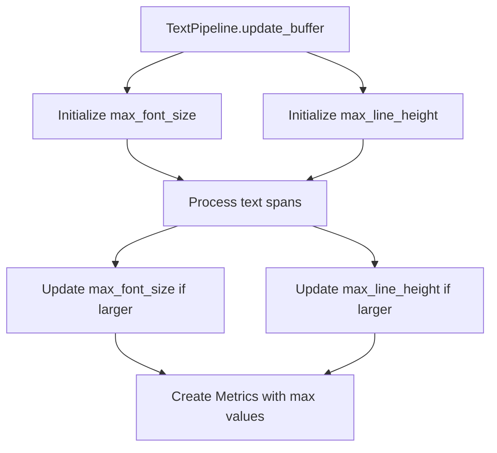

+++
title = "#20970 Rename some variables in `TextPipeline`"
date = "2025-09-11T00:00:00"
draft = false
template = "pull_request_page.html"
in_search_index = true

[taxonomies]
list_display = ["show"]

[extra]
current_language = "en"
available_languages = {"en" = { name = "English", url = "/pull_request/bevy/2025-09/pr-20970-en-20250911" }, "zh-cn" = { name = "中文", url = "/pull_request/bevy/2025-09/pr-20970-zh-cn-20250911" }}
labels = ["D-Trivial", "C-Code-Quality", "A-Text"]
+++

# Title
Variable Renaming for Clarity in TextPipeline

## Basic Information
- **Title**: Rename some variables in `TextPipeline`
- **PR Link**: https://github.com/bevyengine/bevy/pull/20970
- **Author**: ickshonpe
- **Status**: MERGED
- **Labels**: D-Trivial, C-Code-Quality, S-Ready-For-Final-Review, A-Text
- **Created**: 2025-09-11T21:03:05Z
- **Merged**: 2025-09-11T22:06:47Z
- **Merged By**: alice-i-cecile

## Description Translation
# Objective

Rename the `line_height` and `font_size` variables in `update_buffer` to `max_line_height` and `max_font_size`, for clarity.

## The Story of This Pull Request

This PR addresses a straightforward but important code clarity issue in Bevy's text rendering pipeline. The problem was in the `update_buffer` method of the `TextPipeline` struct, where two variables were named in a way that didn't accurately reflect their purpose.

The original variable names `font_size` and `line_height` suggested they were tracking individual values, but in reality, these variables were accumulating the maximum values across all text spans being processed. This discrepancy between variable names and actual functionality could lead to confusion for developers maintaining or extending the text rendering code.

The solution was simple but effective: rename the variables to more accurately describe their purpose. The developer changed `font_size` to `max_font_size` and `line_height` to `max_line_height`, making it immediately clear that these variables track the maximum values encountered during the text processing loop.

The implementation required minimal changes - just five lines modified in a single file. The variables were renamed in their declarations and in the two places where they were updated within the span processing loop. Finally, the renamed variables were passed to the `Metrics::new()` constructor, maintaining the same functionality but with clearer intent.

This change doesn't affect runtime performance or behavior - it's purely a code quality improvement. However, it significantly enhances code readability and maintainability. Future developers working on this code will immediately understand that these variables track maximum values rather than individual measurements, reducing the cognitive load required to understand the text layout logic.

The technical insight here is that good variable naming is crucial in systems that process multiple elements with similar properties. When tracking extreme values (minima or maxima), prefixing variable names with those terms provides immediate clarity about their purpose.

## Visual Representation



## Key Files Changed

### `crates/bevy_text/src/pipeline.rs`
This file contains the text processing pipeline for Bevy's text rendering system. The changes rename two variables to better reflect their purpose of tracking maximum values across text spans.

**Key Changes:**
```rust
// Before:
let mut font_size: f32 = 0.;
let mut line_height: f32 = 0.0;

// After:
let mut max_font_size: f32 = 0.;
let mut max_line_height: f32 = 0.0;
```

```rust
// Before:
font_size = font_size.max(text_font.font_size);
line_height = line_height.max(text_font.line_height.eval(text_font.font_size));

// After:
max_font_size = max_font_size.max(text_font.font_size);
max_line_height = max_line_height.max(text_font.line_height.eval(text_font.font_size));
```

```rust
// Before:
let mut metrics = Metrics::new(font_size, line_height).scale(scale_factor as f32);

// After:
let mut metrics = Metrics::new(max_font_size, max_line_height).scale(scale_factor as f32);
```

These changes make it clear that the variables track maximum values rather than individual measurements, improving code readability without changing functionality.

## Further Reading

- [Rust API Guidelines: Naming](https://rust-lang.github.io/api-guidelines/naming.html)
- [Clean Code: Meaningful Names](https://gist.github.com/wojteklu/73c6914cc446146b8b533c0988cf8d29)
- [Bevy Text Documentation](https://docs.rs/bevy_text/latest/bevy_text/)