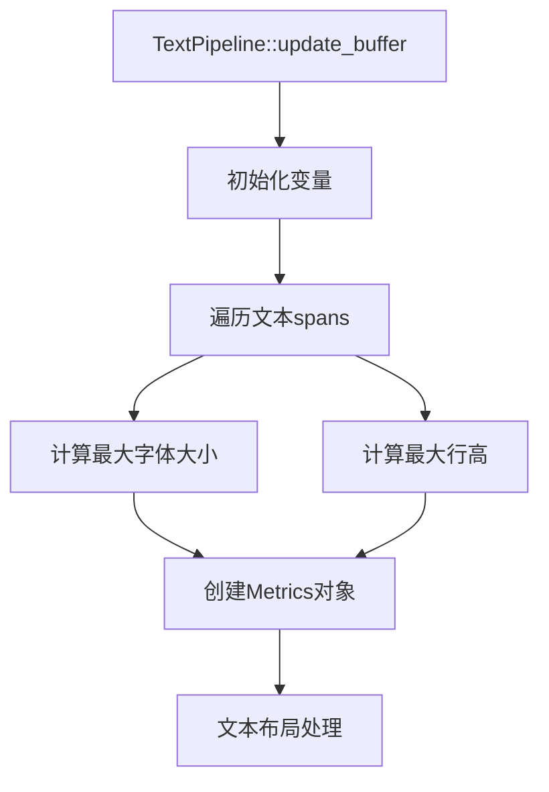

+++
title = "#20970 Rename some variables in `TextPipeline`"
date = "2025-09-11T00:00:00"
draft = false
template = "pull_request_page.html"
in_search_index = false

[extra]
current_language = "zh-cn"
available_languages = {"en" = { name = "English", url = "/pull_request/bevy/2025-09/pr-20970-en-20250911" }, "zh-cn" = { name = "中文", url = "/pull_request/bevy/2025-09/pr-20970-zh-cn-20250911" }}
labels = ["D-Trivial", "C-Code-Quality", "A-Text"]
+++

# Rename some variables in `TextPipeline`

## Basic Information
- **Title**: Rename some variables in `TextPipeline`
- **PR Link**: https://github.com/bevyengine/bevy/pull/20970
- **Author**: ickshonpe
- **Status**: MERGED
- **Labels**: D-Trivial, C-Code-Quality, S-Ready-For-Final-Review, A-Text
- **Created**: 2025-09-11T21:03:05Z
- **Merged**: 2025-09-11T22:06:47Z
- **Merged By**: alice-i-cecile

## Description Translation
# Objective

将`update_buffer`函数中的`line_height`和`font_size`变量重命名为`max_line_height`和`max_font_size`，以提高代码清晰度。

## The Story of This Pull Request

这个PR的核心问题是变量命名不够准确导致代码可读性降低。在Bevy引擎的文本处理流水线中，`TextPipeline::update_buffer`函数负责处理文本布局和渲染，其中需要计算文本段落的字体大小和行高参数。

问题出现在变量命名上：原来的`font_size`和`line_height`变量实际上存储的是遍历所有文本span后计算得到的最大值，而不是单个字体大小或行高值。这种命名方式容易让开发者误解这些变量的实际含义，特别是对于新接触代码库的开发者来说。

解决方案很直接：将变量重命名为`max_font_size`和`max_line_height`，准确反映它们存储的是最大值这一事实。这种修改属于代码质量改进，不涉及功能变更，但能显著提高代码的可读性和维护性。

从技术实现角度看，这个修改涉及以下几个关键点：

1. 变量初始化时的重命名
2. 在循环中更新最大值时的变量名同步修改
3. 使用这些变量创建Metrics对象时的参数名更新

这种修改体现了良好的编码实践：变量名应该准确描述其内容和用途。特别是在处理最大值、最小值或聚合值时，使用`max_`、`min_`等前缀能够立即传达变量的语义。

```rust
// 修改前：
let mut font_size: f32 = 0.;
let mut line_height: f32 = 0.0;

// 修改后：
let mut max_font_size: f32 = 0.;
let mut max_line_height: f32 = 0.0;
```

在循环体内，计算最大值的逻辑保持不变，只是变量名更加明确：

```rust
// 修改前：
font_size = font_size.max(text_font.font_size);
line_height = line_height.max(text_font.line_height.eval(text_font.font_size));

// 修改后：
max_font_size = max_font_size.max(text_font.font_size);
max_line_height = max_line_height.max(text_font.line_height.eval(text_font.font_size));
```

最后，在使用这些值创建Metrics对象时也相应更新了变量名：

```rust
// 修改前：
let mut metrics = Metrics::new(font_size, line_height).scale(scale_factor as f32);

// 修改后：
let mut metrics = Metrics::new(max_font_size, max_line_height).scale(scale_factor as f32);
```

这个修改虽然简单，但对于代码的可维护性有实际价值。明确的变量名减少了认知负荷，使其他开发者能够更快理解代码的意图，特别是在处理文本布局这种涉及多个参数和计算的复杂逻辑时。

## Visual Representation



## Key Files Changed

### `crates/bevy_text/src/pipeline.rs` (+5/-5)

这个文件包含了文本处理管道的核心逻辑。修改涉及变量重命名，提高了代码的可读性和明确性。

**关键修改：**

```rust
// Before:
let mut font_size: f32 = 0.;
let mut line_height: f32 = 0.0;

// After:
let mut max_font_size: f32 = 0.;
let mut max_line_height: f32 = 0.0;
```

```rust
// Before:
font_size = font_size.max(text_font.font_size);
line_height = line_height.max(text_font.line_height.eval(text_font.font_size));

// After:
max_font_size = max_font_size.max(text_font.font_size);
max_line_height = max_line_height.max(text_font.line_height.eval(text_font.font_size));
```

```rust
// Before:
let mut metrics = Metrics::new(font_size, line_height).scale(scale_factor as f32);

// After:
let mut metrics = Metrics::new(max_font_size, max_line_height).scale(scale_factor as f32);
```

这些修改确保了变量名准确反映其存储的是最大值这一事实，使代码更加自文档化。

## Further Reading

- [Rust API Guidelines: Naming](https://rust-lang.github.io/api-guidelines/naming.html)
- [Bevy Engine Text System Documentation](https://docs.rs/bevy_text/latest/bevy_text/)
- [Clean Code: Meaningful Names](https://www.oreilly.com/library/view/clean-code/9780136083238/)