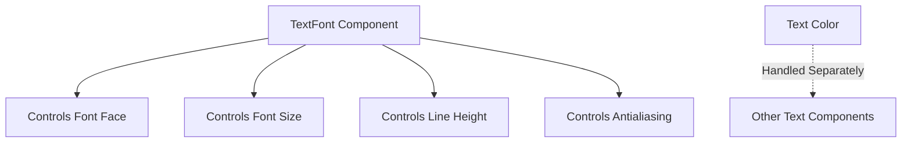

+++
title = "#20971 `TextFont` doc comment fix"
date = "2025-09-11T00:00:00"
draft = false
template = "pull_request_page.html"
in_search_index = true

[taxonomies]
list_display = ["show"]

[extra]
current_language = "en"
available_languages = {"en" = { name = "English", url = "/pull_request/bevy/2025-09/pr-20971-en-20250911" }, "zh-cn" = { name = "中文", url = "/pull_request/bevy/2025-09/pr-20971-zh-cn-20250911" }}
labels = ["C-Docs", "D-Trivial", "A-Text"]
+++

# `TextFont` doc comment fix

## Basic Information
- **Title**: `TextFont` doc comment fix
- **PR Link**: https://github.com/bevyengine/bevy/pull/20971
- **Author**: ickshonpe
- **Status**: MERGED
- **Labels**: C-Docs, D-Trivial, S-Ready-For-Final-Review, A-Text
- **Created**: 2025-09-11T21:15:39Z
- **Merged**: 2025-09-11T22:07:03Z
- **Merged By**: alice-i-cecile

## Description Translation
# Objective

Correction for `TextFont`'s doc comments, it does not determine the text's color.

## The Story of This Pull Request

This PR addresses a straightforward documentation issue in Bevy's text system. The problem was discovered during code review or usage where the documentation for the `TextFont` struct contained incorrect information about its responsibilities.

The original doc comment incorrectly stated that `TextFont` controlled text color, which could mislead developers about where to look for color-related text properties. In reality, text color is handled separately in Bevy's text rendering system, typically through materials or other text components.

The solution was a minimal but important documentation correction. The developer replaced the inaccurate claim about color control with accurate information about what `TextFont` actually controls: font face, font size, line height, and antialiasing method. This change ensures that developers reading the documentation will have correct information about the component's purpose and capabilities.

While this change is small, it's significant for maintaining accurate documentation, which is crucial for open-source projects where many contributors rely on clear and correct documentation to understand the codebase. The fix prevents potential confusion and misdirected debugging efforts that could result from the incorrect documentation.

The implementation consists of a single line change in the doc comment, demonstrating how even small documentation fixes can have meaningful impact on code clarity and developer experience.

## Visual Representation



## Key Files Changed

### `crates/bevy_text/src/text.rs` (+1/-1)

This file contains the definition of the `TextFont` struct and its documentation. The change corrects the doc comment to accurately reflect what properties the component controls.

**Before:**
```rust
/// `TextFont` determines the style of a text span within a [`ComputedTextBlock`], specifically
/// the font face, the font size, and the color.
```

**After:**
```rust
/// `TextFont` determines the style of a text span within a [`ComputedTextBlock`], specifically
/// the font face, the font size, the line height, and the antialiasing method.
```

The change removes the incorrect reference to color control and adds the correct properties (line height and antialiasing method) that `TextFont` actually manages.

## Further Reading

- [Bevy Text Documentation](https://docs.rs/bevy_text/latest/bevy_text/)
- [Rust Documentation Comments](https://doc.rust-lang.org/rustdoc/how-to-write-documentation.html)
- [Bevy Component Documentation Guidelines](https://github.com/bevyengine/bevy/blob/main/docs/plugins_guidelines.md#documentation)

# Full Code Diff
```diff
diff --git a/crates/bevy_text/src/text.rs b/crates/bevy_text/src/text.rs
index 9e2b7e6c47d51..3c04cbd1d68d1 100644
--- a/crates/bevy_text/src/text.rs
+++ b/crates/bevy_text/src/text.rs
@@ -243,7 +243,7 @@ impl From<Justify> for cosmic_text::Align {
 }
 
 /// `TextFont` determines the style of a text span within a [`ComputedTextBlock`], specifically
-/// the font face, the font size, and the color.
+/// the font face, the font size, the line height, and the antialiasing method.
 #[derive(Component, Clone, Debug, Reflect, PartialEq)]
 #[reflect(Component, Default, Debug, Clone)]
 pub struct TextFont {
```