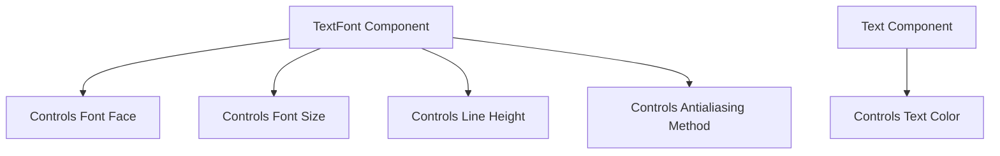

+++
title = "#20971 `TextFont` doc comment fix"
date = "2025-09-11T00:00:00"
draft = false
template = "pull_request_page.html"
in_search_index = false

[extra]
current_language = "zh-cn"
available_languages = {"en" = { name = "English", url = "/pull_request/bevy/2025-09/pr-20971-en-20250911" }, "zh-cn" = { name = "中文", url = "/pull_request/bevy/2025-09/pr-20971-zh-cn-20250911" }}
labels = ["C-Docs", "D-Trivial", "A-Text"]
+++

# `TextFont` doc comment fix

## Basic Information
- **Title**: `TextFont` doc comment fix
- **PR Link**: https://github.com/bevyengine/bevy/pull/20971
- **Author**: ickshonpe
- **Status**: MERGED
- **Labels**: C-Docs, D-Trivial, S-Ready-For-Final-Review, A-Text
- **Created**: 2025-09-11T21:15:39Z
- **Merged**: 2025-09-11T22:07:03Z
- **Merged By**: alice-i-cecile

## Description Translation
对 `TextFont` 的文档注释进行修正，它并不决定文本的颜色。

## The Story of This Pull Request

这个 PR 解决了一个简单的文档错误问题。在 Bevy 的文本系统中，`TextFont` 组件负责管理文本的字体样式属性，但原有的文档注释错误地声称该组件控制文本颜色，这可能导致开发者误解。

问题出现在 `crates/bevy_text/src/text.rs` 文件中 `TextFont` 结构体的文档注释。原始注释错误地将颜色列为 `TextFont` 控制的属性之一：

```rust
/// `TextFont` determines the style of a text span within a [`ComputedTextBlock`], specifically
/// the font face, the font size, and the color.
```

实际上，在 Bevy 的文本渲染系统中，文本颜色是由其他组件（如 `Text` 组件中的 `sections[].style.color`）控制的，而不是由 `TextFont` 组件管理。`TextFont` 真正控制的属性包括字体外观、字体大小、行高和抗锯齿方法。

这个文档错误虽然微小，但可能对开发者造成混淆，特别是那些正在学习 Bevy 文本系统的新开发者。错误的文档可能导致他们错误地尝试通过 `TextFont` 组件来设置文本颜色，而实际上应该使用正确的 API。

修复方案简单直接：更新文档注释，移除对颜色的错误引用，并准确列出 `TextFont` 实际控制的属性：

```rust
/// `TextFont` determines the style of a text span within a [`ComputedTextBlock`], specifically
/// the font face, the font size, the line height, and the antialiasing method.
```

这种类型的文档维护对于大型开源项目如 Bevy 至关重要，因为准确的文档能减少开发者的困惑和提高开发效率。虽然这个修改很小，但它体现了对项目文档质量的关注。

## Visual Representation



## Key Files Changed

### `crates/bevy_text/src/text.rs` (+1/-1)

这个文件包含了 `TextFont` 结构体的定义。修改内容仅限于文档注释的更新，纠正了关于 `TextFont` 组件功能的错误描述。

**修改前：**
```rust
/// `TextFont` determines the style of a text span within a [`ComputedTextBlock`], specifically
/// the font face, the font size, and the color.
```

**修改后：**
```rust
/// `TextFont` determines the style of a text span within a [`ComputedTextBlock`], specifically
/// the font face, the font size, the line height, and the antialiasing method.
```

## Further Reading

- [Bevy Text Documentation](https://docs.rs/bevy_text/latest/bevy_text/)
- [Rust Documentation Comments Guide](https://doc.rust-lang.org/rustdoc/how-to-write-documentation.html)
- [Bevy Component System](https://bevyengine.org/learn/book/getting-started/ecs/)