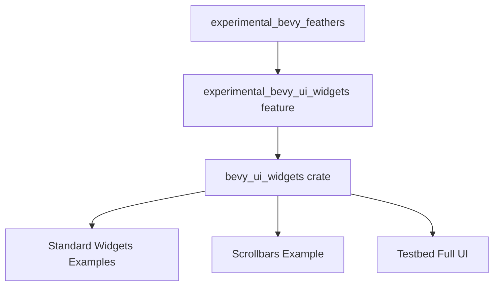

+++
title = "#20972 Mark `bevy_ui_widgets` as experimental for now"
date = "2025-09-12T00:00:00"
draft = false
template = "pull_request_page.html"
in_search_index = true

[taxonomies]
list_display = ["show"]

[extra]
current_language = "en"
available_languages = {"en" = { name = "English", url = "/pull_request/bevy/2025-09/pr-20972-en-20250912" }, "zh-cn" = { name = "中文", url = "/pull_request/bevy/2025-09/pr-20972-zh-cn-20250912" }}
labels = ["A-UI", "X-Blessed", "D-Straightforward"]
+++

# Mark `bevy_ui_widgets` as experimental for now

## Basic Information
- **Title**: Mark `bevy_ui_widgets` as experimental for now
- **PR Link**: https://github.com/bevyengine/bevy/pull/20972
- **Author**: alice-i-cecile
- **Status**: MERGED
- **Labels**: A-UI, S-Ready-For-Final-Review, X-Blessed, D-Straightforward
- **Created**: 2025-09-11T22:16:43Z
- **Merged**: 2025-09-12T16:29:29Z
- **Merged By**: mockersf

## Description Translation
# Objective

- These are still going to undergo *extensive* change: users should be aware of what they're getting into.
- Fixes #20957.

## Solution

- [x] rename the feature
- [x] remove from our default features
- [x] add warning to crate docs
- [x] add warning to release notes
- [x] add warnings to examples

## Testing

I've run both the `standard_widgets` and `standard_widgets_observers` examples succesfully.

## The Story of This Pull Request

The `bevy_ui_widgets` crate was introduced as a headless widget collection for Bevy UI, providing unstyled implementations of common UI components like buttons, sliders, and checkboxes. However, the API was still in early development and expected to undergo significant changes. This PR addresses the need to properly communicate the experimental nature of this feature to users.

The core problem was that users might inadvertently depend on an unstable API that was enabled by default, leading to breaking changes in future releases without proper warning. The solution involved a multi-faceted approach to clearly mark the feature as experimental across the entire codebase.

The implementation follows a systematic pattern: first, the feature was renamed from `bevy_ui_widgets` to `experimental_bevy_ui_widgets` to make its experimental status explicit. This naming convention follows the existing pattern used by `experimental_bevy_feathers`. Next, the feature was removed from Bevy's default features to prevent accidental inclusion.

Documentation warnings were added at multiple levels:
- The crate-level documentation now includes an explicit "Warning: Experimental" section
- Release notes were updated to clarify the experimental status
- Example files received warning comments about potential API changes
- The cargo features documentation was updated to reflect the new feature name

The technical approach ensures that users must explicitly opt-in to using the experimental widgets by enabling the `experimental_bevy_ui_widgets` feature. This prevents accidental dependencies on unstable APIs while still allowing early adopters to test and provide feedback.

The changes also include proper feature gating for examples that depend on the widgets. Each example now specifies `required-features = ["experimental_bevy_ui_widgets"]` to ensure they only compile when the experimental feature is explicitly enabled.

This approach balances the need for real-world testing and feedback with the responsibility to warn users about potential breaking changes. It follows established patterns in the Bevy ecosystem for handling experimental features while maintaining backward compatibility for existing users who explicitly opt-in.

## Visual Representation



## Key Files Changed

### `Cargo.toml` (+10/-4)
This file contains the most significant changes, including feature renaming and example configuration updates.

**Key changes:**
```toml
# Before:
bevy_ui_widgets = ["bevy_internal/bevy_ui_widgets"]

# After:
experimental_bevy_ui_widgets = ["bevy_internal/bevy_ui_widgets"]
```

```toml
# Removed from default features:
default = [
  # ...
- "bevy_ui_widgets",
  # ...
]
```

```toml
# Updated experimental_bevy_feathers dependencies:
experimental_bevy_feathers = [
  "bevy_internal/bevy_feathers",
  "experimental_bevy_ui_widgets",
]
```

```toml
# Added required-features to examples:
[package.metadata.example.standard_widgets]
required-features = ["experimental_bevy_ui_widgets"]
```

### `crates/bevy_ui_widgets/src/lib.rs` (+9/-1)
Added explicit experimental warning to crate documentation.

**Key change:**
```rust
//! ## Warning: Experimental
//!
//! This crate is currently experimental and under active development.
//! The API is likely to change substantially: be prepared to migrate your code.
//!
//! We are actively seeking feedback on the design and implementation of this crate, so please
//! file issues or create PRs if you have any comments or suggestions.
```

### `release-content/release-notes/headless-widgets.md` (+10/-0)
Added warning section to release notes explaining the experimental status.

**Key addition:**
```markdown
While these widgets are usable today, and are a solid choice for creating your own widgets for your
own game or application, they are still **experimental**.
Expect breaking changes as we continue to iterate and improve on them!
```

### `examples/ui/standard_widgets.rs` (+6/-1) and `examples/ui/standard_widgets_observers.rs` (+4/-1)
Added warning comments to example files.

**Key changes:**
```rust
//! This experimental example illustrates how to create widgets using the `bevy_ui_widgets` widget set.
//!
//! The patterns shown here are likely to change substantially as the `bevy_ui_widgets` crate
//! matures, so please exercise caution if you are using this as a reference for your own code.
```

### `docs/cargo_features.md` (+1/-1)
Updated feature documentation to reflect the new name.

**Key change:**
```markdown
# Before:
|bevy_ui_widgets|Headless widget collection for Bevy UI.|

# After:
|experimental_bevy_ui_widgets|Experimental headless widget collection for Bevy UI.|
```

## Further Reading

- [Bevy Features Documentation](https://github.com/bevyengine/bevy/blob/main/docs/cargo_features.md)
- [Cargo Features Guide](https://doc.rust-lang.org/cargo/reference/features.html)
- [Semantic Versioning and Experimental Features](https://semver.org/)
- [Bevy UI System Overview](https://bevyengine.org/learn/books/introduction/6-ui/)