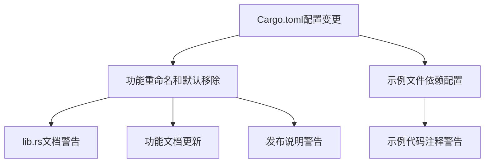

+++
title = "#20972 Mark `bevy_ui_widgets` as experimental for now"
date = "2025-09-12T00:00:00"
draft = false
template = "pull_request_page.html"
in_search_index = false

[extra]
current_language = "zh-cn"
available_languages = {"en" = { name = "English", url = "/pull_request/bevy/2025-09/pr-20972-en-20250912" }, "zh-cn" = { name = "中文", url = "/pull_request/bevy/2025-09/pr-20972-zh-cn-20250912" }}
+++

# Mark `bevy_ui_widgets` as experimental for now

## 基本信息
- **标题**: Mark `bevy_ui_widgets` as experimental for now
- **PR链接**: https://github.com/bevyengine/bevy/pull/20972
- **作者**: alice-i-cecile
- **状态**: 已合并
- **标签**: A-UI, S-Ready-For-Final-Review, X-Blessed, D-Straightforward
- **创建时间**: 2025-09-11T22:16:43Z
- **合并时间**: 2025-09-12T16:29:29Z
- **合并者**: mockersf

## 描述翻译
# Objective（目标）

- 这些组件还将经历*大量*变更：用户应该清楚他们正在使用什么。
- 修复 #20957。

## Solution（解决方案）

- [x] 重命名功能特性
- [x] 从默认功能中移除
- [x] 在crate文档中添加警告
- [x] 在发布说明中添加警告
- [x] 在示例中添加警告

## Testing（测试）

我已成功运行了 `standard_widgets` 和 `standard_widgets_observers` 两个示例。

## 本次PR的故事

这个PR处理的是一个典型的软件开发生命周期中的管理问题：当一个新功能还处于早期开发阶段，API不稳定且预计会有重大变更时，如何向用户清晰地传达这一状态。

问题的核心是`bevy_ui_widgets`这个crate虽然已经可用，但其API设计还远未稳定。开发者团队预见到未来会有大量破坏性变更(breaking changes)，如果不明确标记其实验性状态，用户可能会在不知情的情况下基于不稳定的API构建应用，导致后续升级困难。

解决方案采取了多层次的方法，从构建系统到文档全面覆盖：

首先在`Cargo.toml`中，将功能特性从`bevy_ui_widgets`重命名为`experimental_bevy_ui_widgets`，这本身就是一种明显的信号。更重要的是将其从默认功能列表中移除，这意味着用户需要显式启用这个功能，避免了无意中的使用。

```toml
# 修改前：
bevy_ui_widgets = ["bevy_internal/bevy_ui_widgets"]

# 修改后：
experimental_bevy_ui_widgets = ["bevy_internal/bevy_ui_widgets"]
```

同时更新了`experimental_bevy_feathers`的依赖关系，使其依赖于新的实验性功能名称，保持了功能依赖链的完整性。

在代码层面，`crates/bevy_ui_widgets/src/lib.rs`中添加了明确的警告段落，直接告诉用户这个crate处于实验阶段，API可能会大幅变更，并鼓励用户提供反馈：

```rust
// 新增的警告内容：
//! ## Warning: Experimental
//!
//! This crate is currently experimental and under active development.
//! The API is likely to change substantially: be prepared to migrate your code.
```

文档方面，更新了`docs/cargo_features.md`中的功能列表，反映了名称变更和从默认功能中移除的情况。发布说明`release-content/release-notes/headless-widgets.md`中也添加了详细的警告段落，解释了虽然这些组件现在可用，但预计会有破坏性变更，并明确指导用户如何启用实验性功能。

对于示例代码，在两个UI示例文件中都添加了警告注释，提醒用户这些示例中展示的模式可能会大幅变更，如果作为自己代码的参考需要谨慎使用。

从技术架构的角度看，这种处理方式体现了良好的工程实践：通过构建系统配置、文档和代码注释的多重机制来管理功能的生命周期状态。重命名功能特性并使其变为可选功能是一种非破坏性的变更方式，既给了早期采用者尝试新功能的机会，又保护了大多数用户免受不稳定API的影响。

这种模式在大型开源项目中很常见，特别是像Bevy这样活跃发展的游戏引擎。它平衡了创新迭代和稳定性保障的需求，让团队能够快速迭代新功能，同时维护项目的整体稳定性。

## 视觉表示



## 关键文件变更

**1. `Cargo.toml` (+10/-4)**
- 重命名功能特性并从默认功能中移除
- 为相关示例添加必需的功能特性声明

```toml
# 关键变更：
# 从默认功能列表中移除
default = [
  # ...
- "bevy_ui_widgets",
  # ...
]

# 重命名功能特性
- bevy_ui_widgets = ["bevy_internal/bevy_ui_widgets"]
+ experimental_bevy_ui_widgets = ["bevy_internal/bevy_ui_widgets"]

# 为示例添加必需功能
[package.metadata.example.standard_widgets]
+ required-features = ["experimental_bevy_ui_widgets"]
```

**2. `crates/bevy_ui_widgets/src/lib.rs` (+9/-1)**
- 在crate文档中添加实验性警告部分

```rust
// 新增的警告部分：
//! ## Warning: Experimental
//!
//! This crate is currently experimental and under active development.
//! The API is likely to change substantially: be prepared to migrate your code.
//!
//! We are actively seeking feedback on the design and implementation of this crate, so please
//! file issues or create PRs if you have any comments or suggestions.
```

**3. `release-content/release-notes/headless-widgets.md` (+10/-0)**
- 在发布说明中添加实验性警告和使用指导

```markdown
# 新增内容：
While these widgets are usable today, and are a solid choice for creating your own widgets for your
own game or application, they are still **experimental**.
Expect breaking changes as we continue to iterate and improve on them!

We're as excited as you are for first-party widgets,
and we've decided to ship these now precisely so people can try them out:
real-world user feedback is vital for building and improving products.

If you've read this and are still excited to try them out, enable the `experimental_bevy_ui_widgets` feature.
```

**4. `examples/ui/standard_widgets.rs` (+6/-1)**
- 在示例代码中添加实验性警告注释

```rust
//! This experimental example illustrates how to create widgets using the `bevy_ui_widgets` widget set.
//!
//! These widgets have no inherent styling, so this example also shows how to implement custom styles.
//!
//! The patterns shown here are likely to change substantially as the `bevy_ui_widgets` crate
//! matures, so please exercise caution if you are using this as a reference for your own code.
```

**5. `examples/ui/standard_widgets_observers.rs` (+4/-1)**
- 在观察者示例中添加类似的实验性警告

```rust
//! This experimental example illustrates how to create widgets using the `bevy_ui_widgets` widget set.
//!
//! The patterns shown here are likely to change substantially as the `bevy_ui_widgets` crate
//! matures, so please exercise caution if you are using this as a reference for your own code.
```

## 扩展阅读

- [Cargo Features文档](https://doc.rust-lang.org/cargo/reference/features.html) - 了解Cargo功能特性系统的工作原理
- [Semantic Versioning](https://semver.org/) - 语义化版本控制规范，理解破坏性变更的管理
- [Bevy UI系统](https://bevyengine.org/learn/books/introduction/ui) - Bevy官方文档中的UI系统介绍
- [Rust API Guidelines](https://rust-lang.github.io/api-guidelines/) - Rust API设计指南，包含稳定性相关的建议