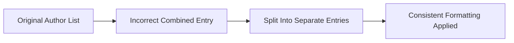

+++
title = "#20973 Update observer_overhaul.md to have more double quotes"
date = "2025-09-11T00:00:00"
draft = false
template = "pull_request_page.html"
in_search_index = true

[taxonomies]
list_display = ["show"]

[extra]
current_language = "en"
available_languages = {"en" = { name = "English", url = "/pull_request/bevy/2025-09/pr-20973-en-20250911" }, "zh-cn" = { name = "中文", url = "/pull_request/bevy/2025-09/pr-20973-zh-cn-20250911" }}
labels = ["C-Docs", "D-Trivial"]
+++

# Update observer_overhaul.md to have more double quotes

## Basic Information
- **Title**: Update observer_overhaul.md to have more double quotes
- **PR Link**: https://github.com/bevyengine/bevy/pull/20973
- **Author**: atlv24
- **Status**: MERGED
- **Labels**: C-Docs, D-Trivial, S-Ready-For-Final-Review
- **Created**: 2025-09-11T22:32:12Z
- **Merged**: 2025-09-11T23:28:46Z
- **Merged By**: alice-i-cecile

## Description Translation
# Objective

- cart and jondolf are not one person (or so they would have us believe...)

## Solution

- have two author strings for them

## Testing

- 

## The Story of This Pull Request

This PR addresses a simple but important documentation issue in Bevy's release notes. The problem was straightforward: two contributors (@cart and @Jondolf) were incorrectly listed as a single author entry in the observer overhaul documentation. While this might seem like a minor formatting issue, accurate attribution is important in open source projects for proper credit and recognition of contributors' work.

The solution implemented was a clean, surgical fix to the YAML front matter of the markdown file. The original author list contained a malformed entry where two GitHub usernames were combined into a single string: `"@cart, @Jondolf"`. This was split into two separate, properly formatted author entries: `"@cart"` and `"@Jondolf"`.

Additionally, the PR included a consistency improvement by ensuring all author entries followed the same format with @ symbols. The entries for "oscar-benderstone", "Zeophlite", and "gwafotapa" were updated to include the @ prefix, maintaining consistent formatting throughout the author list.

The change demonstrates attention to detail in documentation maintenance and shows how even small formatting issues can impact the perceived accuracy and professionalism of project documentation. The fix was minimal, targeted, and improved both the accuracy of attribution and consistency of formatting.

## Visual Representation



## Key Files Changed

### `release-content/release-notes/observer_overhaul.md` (+1/-1)

This file contains the release notes for the event/observer overhaul feature. The change modified the YAML front matter to correct author attribution and improve formatting consistency.

**Before:**
```yaml
authors: ["@cart, @Jondolf", "@alice-i-cecile", "@hukasu", "oscar-benderstone", "Zeophlite", "gwafotapa"]
```

**After:**
```yaml
authors: ["@cart", "@Jondolf", "@alice-i-cecile", "@hukasu", "@oscar-benderstone", "@Zeophlite", "@gwafotapa"]
```

The changes:
1. Split the combined `"@cart, @Jondolf"` entry into two separate entries
2. Added @ prefixes to the remaining author entries for consistency
3. Maintained the same overall structure and content of the document

## Further Reading

- [YAML Front Matter Specification](https://assemble.io/docs/YAML-front-matter.html)
- [Bevy Contribution Guidelines](https://github.com/bevyengine/bevy/blob/main/CONTRIBUTING.md)
- [Markdown Documentation Best Practices](https://www.markdownguide.org/best-practices/)

# Full Code Diff
```diff
diff --git a/release-content/release-notes/observer_overhaul.md b/release-content/release-notes/observer_overhaul.md
index 143585f798e0e..30fa00e083184 100644
--- a/release-content/release-notes/observer_overhaul.md
+++ b/release-content/release-notes/observer_overhaul.md
@@ -1,6 +1,6 @@
 ---
 title: Event / Observer Overhaul
-authors: ["@cart, @Jondolf", "@alice-i-cecile", "@hukasu", "oscar-benderstone", "Zeophlite", "gwafotapa"]
+authors: ["@cart", "@Jondolf", "@alice-i-cecile", "@hukasu", "@oscar-benderstone", "@Zeophlite", "@gwafotapa"]
 pull_requests: [20731, 19596, 19663, 19611, 19935, 20274]
 ---
 
```