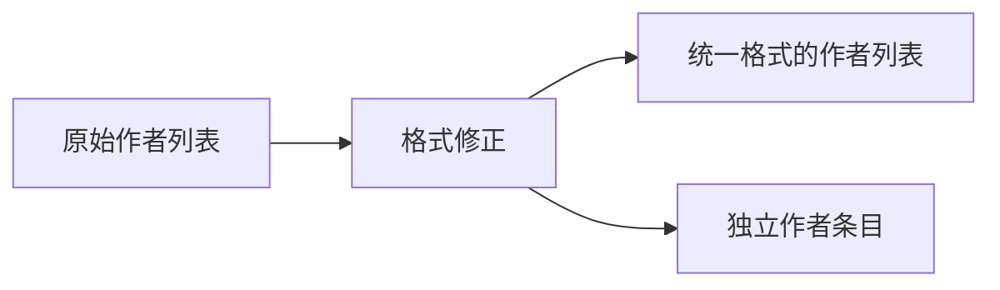

+++
title = "#20973 Update observer_overhaul.md to have more double quotes"
date = "2025-09-11T00:00:00"
draft = false
template = "pull_request_page.html"
in_search_index = false

[extra]
current_language = "zh-cn"
available_languages = {"en" = { name = "English", url = "/pull_request/bevy/2025-09/pr-20973-en-20250911" }, "zh-cn" = { name = "中文", url = "/pull_request/bevy/2025-09/pr-20973-zh-cn-20250911" }}
+++

# Update observer_overhaul.md to have more double quotes

## 基本信息
- **标题**: Update observer_overhaul.md to have more double quotes
- **PR链接**: https://github.com/bevyengine/bevy/pull/20973
- **作者**: atlv24
- **状态**: 已合并
- **标签**: C-Docs, D-Trivial, S-Ready-For-Final-Review
- **创建时间**: 2025-09-11T22:32:12Z
- **合并时间**: 2025-09-11T23:28:46Z
- **合并者**: alice-i-cecile

## 描述翻译
### 目标
- cart 和 jondolf 不是同一个人（或者他们想让我们这么认为...）

### 解决方案
- 为它们分别设置作者字符串

### 测试
- 

## 本次PR的故事

这是一个简单的文档更新PR，主要目的是修复发布说明文件中的作者列表格式问题。问题的核心在于作者列表的格式不一致，部分作者使用了GitHub用户名格式（带@前缀），而其他作者则使用了普通字符串格式。

在原始的`observer_overhaul.md`文件中，作者列表存在两个问题：
1. `@cart, @Jondolf`被错误地合并为一个字符串元素，而不是两个独立作者
2. `oscar-benderstone`和`Zeophlite`两个作者缺少了@前缀

这种格式不一致会影响文档的规范性和可读性，特别是在自动生成贡献者列表或进行作者统计时可能导致问题。

解决方案非常直接：将合并的作者字符串拆分为独立的元素，并为缺少@前缀的作者添加统一的前缀。这样做确保了作者列表格式的一致性，符合项目文档的标准格式要求。

从技术角度看，这个修改虽然简单，但体现了开源项目中文档维护的重要性。统一的格式标准有助于：
- 自动化工具正确处理贡献者信息
- 保持项目文档的专业性和一致性
- 准确反映每个贡献者的工作

修改后的作者列表现在完全遵循了统一的格式标准，每个作者都使用带@前缀的GitHub用户名表示，且每个作者都是独立的数组元素。

## 视觉表示



## 关键文件更改

### `release-content/release-notes/observer_overhaul.md` (+1/-1)

这个文件是Bevy引擎发布说明的一部分，专门记录观察者系统(Observer)的重大改进。修改内容仅限于文档front matter中的作者列表格式。

**修改前:**
```markdown
---
title: Event / Observer Overhaul
authors: ["@cart, @Jondolf", "@alice-i-cecile", "@hukasu", "oscar-benderstone", "Zeophlite", "@gwafotapa"]
pull_requests: [20731, 19596, 19663, 19611, 19935, 20274]
---
```

**修改后:**
```markdown
---
title: Event / Observer Overhaul
authors: ["@cart", "@Jondolf", "@alice-i-cecile", "@hukasu", "@oscar-benderstone", "@Zeophlite", "@gwafotapa"]
pull_requests: [20731, 19596, 19663, 19611, 19935, 20274]
---
```

这个修改确保了作者列表格式的一致性，所有作者都使用带@前缀的GitHub用户名表示，并且每个作者都是独立的数组元素。

## 延伸阅读

对于想了解更多关于Bevy项目文档标准和贡献者指南的开发者，可以参考以下资源：

1. [Bevy贡献指南](https://github.com/bevyengine/bevy/blob/main/CONTRIBUTING.md)
2. [Bevy文档标准](https://github.com/bevyengine/bevy/blob/main/docs/CODE_STYLE.md)
3. [Markdown front matter规范](https://jekyllrb.com/docs/front-matter/)

# 完整代码差异

```diff
diff --git a/release-content/release-notes/observer_overhaul.md b/release-content/release-notes/observer_overhaul.md
index 143585f798e0e..30fa00e083184 100644
--- a/release-content/release-notes/observer_overhaul.md
+++ b/release-content/release-notes/observer_overhaul.md
@@ -1,6 +1,6 @@
 ---
 title: Event / Observer Overhaul
-authors: ["@cart, @Jondolf", "@alice-i-cecile", "@hukasu", "oscar-benderstone", "Zeophlite", "@gwafotapa"]
+authors: ["@cart", "@Jondolf", "@alice-i-cecile", "@hukasu", "@oscar-benderstone", "@Zeophlite", "@gwafotapa"]
 pull_requests: [20731, 19596, 19663, 19611, 19935, 20274]
 ---
 
```