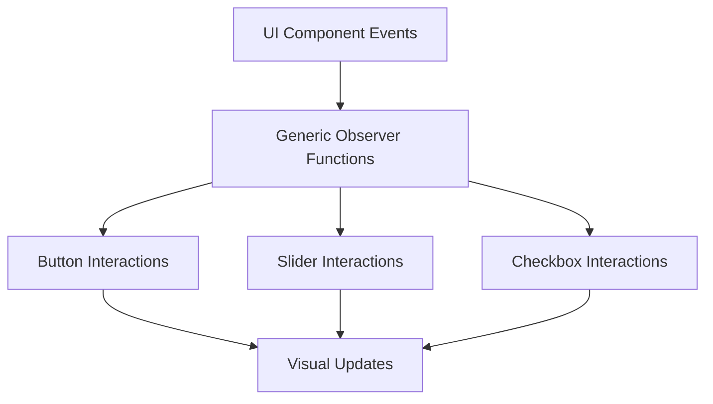

+++
title = "#20977 Improve the standard_widgets_observers example"
date = "2025-09-12T00:00:00"
draft = false
template = "pull_request_page.html"
in_search_index = true

[taxonomies]
list_display = ["show"]

[extra]
current_language = "en"
available_languages = {"en" = { name = "English", url = "/pull_request/bevy/2025-09/pr-20977-en-20250912" }, "zh-cn" = { name = "中文", url = "/pull_request/bevy/2025-09/pr-20977-zh-cn-20250912" }}
labels = ["C-Examples", "A-UI", "C-Code-Quality"]
+++

# Improve the standard_widgets_observers example

## Basic Information
- **Title**: Improve the standard_widgets_observers example
- **PR Link**: https://github.com/bevyengine/bevy/pull/20977
- **Author**: cart
- **Status**: MERGED
- **Labels**: C-Examples, A-UI, C-Code-Quality, S-Ready-For-Final-Review
- **Created**: 2025-09-12T02:13:08Z
- **Merged**: 2025-09-12T03:09:52Z
- **Merged By**: alice-i-cecile

## Description Translation
# Objective

Currently `standard_widgets_observers` is redundant / noisy to the point of being a "user quality perception liability". I think we either need to remove it completely or improve it.

## Solution

- Make the redundant observer logic generic, which allows all observers to reuse the same function

## The Story of This Pull Request

The `standard_widgets_observers` example had become a maintenance burden due to excessive code duplication. The original implementation contained numerous observer functions that followed nearly identical patterns for handling UI component interactions. This redundancy made the example difficult to maintain and understand, potentially giving users a negative impression of Bevy's UI system quality.

The solution approach focused on generic programming to eliminate code duplication. Instead of maintaining separate functions for each type of UI interaction (button presses, slider changes, checkbox toggles), the PR introduced generic observer functions that could handle multiple interaction types through type parameters. This approach significantly reduced the amount of code while maintaining the same functionality.

The implementation involved creating three main generic functions:

1. `button_on_interaction` - handles all button state changes (pressed, hovered, disabled)
2. `slider_on_interaction` - handles slider interaction states (disabled, hovered)
3. `checkbox_on_interaction` - handles checkbox states (checked, disabled, hovered)

These functions use type parameters to determine which specific interaction they're handling, with runtime type checking provided by a new `Is` trait:

```rust
trait Is {
    fn is<T: Any>() -> bool;
}

impl<A: Any> Is for A {
    #[inline]
    fn is<T: Any>() -> bool {
        TypeId::of::<A>() == TypeId::of::<T>()
    }
}
```

The key technical insight was recognizing that all the observer functions followed similar patterns - they queried for specific components and updated visual properties based on state changes. By parameterizing these patterns, the code could be consolidated without losing functionality.

The impact is substantial code reduction and improved maintainability. The example now has 111 lines added versus 362 lines removed, resulting in a net reduction of 251 lines of code. This makes the example easier to understand and maintain while demonstrating better practices for handling UI observers in Bevy.

## Visual Representation



## Key Files Changed

- `examples/ui/standard_widgets_observers.rs` (+111/-362)

This file underwent significant refactoring to replace multiple specific observer functions with generic implementations:

**Before:**
```rust
fn button_on_add_pressed(
    add: On<Add, Pressed>,
    mut buttons: Query</* ... */>,
    mut text_query: Query<&mut Text>,
) {
    // Specific implementation for add pressed
}

fn button_on_remove_pressed(
    remove: On<Remove, Pressed>,
    mut buttons: Query</* ... */>,
    mut text_query: Query<&mut Text>,
) {
    // Specific implementation for remove pressed
}
// ... 13 more similar functions
```

**After:**
```rust
fn button_on_interaction<E: EntityEvent, C: Component>(
    event: On<E, C>,
    mut buttons: Query</* ... */>,
    mut text_query: Query<&mut Text>,
) {
    // Generic implementation handling all button interactions
    let pressed = pressed && !(E::is::<Remove>() && C::is::<Pressed>());
    let disabled = disabled && !(E::is::<Remove>() && C::is::<InteractionDisabled>());
    // Handle all button states
}
```

The changes demonstrate how generics can dramatically reduce code duplication while maintaining the same functionality. The generic functions handle all the previous cases through type parameters and conditional logic based on the event and component types.

## Further Reading

- [Rust Generics Documentation](https://doc.rust-lang.org/book/ch10-00-generics.html)
- [Bevy ECS Observers](https://bevyengine.org/learn/advanced-topics/observers/)
- [TypeId and Any Trait in Rust](https://doc.rust-lang.org/std/any/index.html)

## Full Code Diff
```diff
diff --git a/examples/ui/standard_widgets_observers.rs b/examples/ui/standard_widgets_observers.rs
index 54220a0214c38..c8a8734afc542 100644
--- a/examples/ui/standard_widgets_observers.rs
+++ b/examples/ui/standard_widgets_observers.rs
@@ -15,6 +15,7 @@ use bevy::{
         UiWidgetsPlugins, ValueChange,
     },
 };
+use std::any::{Any, TypeId};
 
 fn main() {
     App::new()
@@ -26,21 +27,21 @@ fn main() {
         ))
         .insert_resource(DemoWidgetStates { slider_value: 50.0 })
         .add_systems(Startup, setup)
-        .add_observer(button_on_add_pressed)
-        .add_observer(button_on_remove_pressed)
-        .add_observer(button_on_add_disabled)
-        .add_observer(button_on_remove_disabled)
-        .add_observer(button_on_change_hover)
-        .add_observer(slider_on_add_disabled)
-        .add_observer(slider_on_remove_disabled)
-        .add_observer(slider_on_change_hover)
-        .add_observer(slider_on_change_value)
-        .add_observer(slider_on_change_range)
-        .add_observer(checkbox_on_add_disabled)
-        .add_observer(checkbox_on_remove_disabled)
-        .add_observer(checkbox_on_change_hover)
-        .add_observer(checkbox_on_add_checked)
-        .add_observer(checkbox_on_remove_checked)
+        .add_observer(button_on_interaction::<Add, Pressed>)
+        .add_observer(button_on_interaction::<Remove, Pressed>)
+        .add_observer(button_on_interaction::<Add, InteractionDisabled>)
+        .add_observer(button_on_interaction::<Remove, InteractionDisabled>)
+        .add_observer(button_on_interaction::<Insert, Hovered>)
+        .add_observer(slider_on_interaction::<Add, InteractionDisabled>)
+        .add_observer(slider_on_interaction::<Remove, InteractionDisabled>)
+        .add_observer(slider_on_interaction::<Insert, Hovered>)
+        .add_observer(slider_on_change_value::<SliderValue>)
+        .add_observer(slider_on_change_value::<SliderRange>)
+        .add_observer(checkbox_on_interaction::<Add, InteractionDisabled>)
+        .add_observer(checkbox_on_interaction::<Remove, InteractionDisabled>)
+        .add_observer(checkbox_on_interaction::<Insert, Hovered>)
+        .add_observer(checkbox_on_interaction::<Add, Checked>)
+        .add_observer(checkbox_on_interaction::<Remove, Checked>)
         .add_systems(Update, (update_widget_values, toggle_disabled))
         .run();
 }
@@ -157,99 +158,13 @@ fn button(asset_server: &AssetServer, on_click: Callback<In<Activate>>) -> impl
     )
 }
 
-fn button_on_add_pressed(
-    add: On<Add, Pressed>,
+fn button_on_interaction<E: EntityEvent, C: Component>(
+    event: On<E, C>,
     mut buttons: Query<
         (
             &Hovered,
             Has<InteractionDisabled>,
-            &mut BackgroundColor,
-            &mut BorderColor,
-            &Children,
-        ),
-        With<DemoButton>,
-    >,
-    mut text_query: Query<&mut Text>,
-) {
-    if let Ok((hovered, disabled, mut color, mut border_color, children)) =
-        buttons.get_mut(add.entity)
-    {
-        let mut text = text_query.get_mut(children[0]).unwrap();
-        set_button_style(
-            disabled,
-            hovered.get(),
-            true,
-            &mut color,
-            &mut border_color,
-            &mut text,
-        );
-    }
-}
-
-fn button_on_remove_pressed(
-    remove: On<Remove, Pressed>,
-    mut buttons: Query<
-        (
-            &Hovered,
-            Has<InteractionDisabled>,
-            &mut BackgroundColor,
-            &mut BorderColor,
-            &Children,
-        ),
-        With<DemoButton>,
-    >,
-    mut text_query: Query<&mut Text>,
-) {
-    if let Ok((hovered, disabled, mut color, mut border_color, children)) =
-        buttons.get_mut(remove.entity)
-    {
-        let mut text = text_query.get_mut(children[0]).unwrap();
-        set_button_style(
-            disabled,
-            hovered.get(),
-            false,
-            &mut color,
-            &mut border_color,
-            &mut text,
-        );
-    }
-}
-
-fn button_on_add_disabled(
-    add: On<Add, InteractionDisabled>,
-    mut buttons: Query<
-        (
-            Has<Pressed>,
-            &Hovered,
-            &mut BackgroundColor,
-            &mut BorderColor,
-            &Children,
-        ),
-        With<DemoButton>,
-    >,
-    mut text_query: Query<&mut Text>,
-) {
-    if let Ok((pressed, hovered, mut color, mut border_color, children)) =
-        buttons.get_mut(add.entity)
-    {
-        let mut text = text_query.get_mut(children[0]).unwrap();
-        set_button_style(
-            true,
-            hovered.get(),
-            pressed,
-            &mut color,
-            &mut border_color,
-            &mut text,
-        );
-    }
-}
-
-fn button_on_remove_disabled(
-    remove: On<Remove, InteractionDisabled>,
-    mut buttons: Query<
-        (
             Has<Pressed>,
-            &Hovered,
             &mut BackgroundColor,
             &mut BorderColor,
             &Children,
@@ -258,38 +173,8 @@ fn button_on_remove_disabled(
     >,
     mut text_query: Query<&mut Text>,
 ) {
-    if let Ok((pressed, hovered, mut color, mut border_color, children)) =
-        buttons.get_mut(remove.entity)
-    {
-        let mut text = text_query.get_mut(children[0]).unwrap();
-        set_button_style(
-            false,
-            hovered.get(),
-            pressed,
-            &mut color,
-            &mut border_color,
-            &mut text,
-        );
-    }
-}
-
-fn button_on_change_hover(
-    insert: On<Insert, Hovered>,
-    mut buttons: Query<
-        (
-            Has<Pressed>,
-            &Hovered,
-            Has<InteractionDisabled>,
-            &mut BackgroundColor,
-            &mut BorderColor,
-            &Children,
-        ),
-        With<DemoButton>,
-    >,
-    mut text_query: Query<&mut Text>,
-) {
-    if let Ok((pressed, hovered, disabled, mut color, mut border_color, children)) =
-        buttons.get_mut(insert.entity)
+    if let Ok((hovered, disabled, pressed, mut color, mut border_color, children)) =
+        buttons.get_mut(event.event_target())
     {
         if children.is_empty() {
             return;
@@ -297,52 +182,37 @@ fn button_on_change_hover(
         let Ok(mut text) = text_query.get_mut(children[0]) else {
             return;
         };
-        set_button_style(
-            disabled,
-            hovered.get(),
-            pressed,
-            &mut color,
-            &mut border_color,
-            &mut text,
-        );
-    }
-}
-
-fn set_button_style(
-    disabled: bool,
-    hovered: bool,
-    pressed: bool,
-    color: &mut BackgroundColor,
-    border_color: &mut BorderColor,
-    text: &mut Text,
-) {
-    match (disabled, hovered, pressed) {
-        // Disabled button
-        (true, _, _) => {
-            **text = "Disabled".to_string();
-            *color = NORMAL_BUTTON.into();
-            border_color.set_all(GRAY);
-        }
+        let hovered = hovered.get();
+        let pressed = pressed && !(E::is::<Remove>() && C::is::<Pressed>());
+        let disabled = disabled && !(E::is::<Remove>() && C::is::<InteractionDisabled>());
+        match (disabled, hovered, pressed) {
+            // Disabled button
+            (true, _, _) => {
+                **text = "Disabled".to_string();
+                *color = NORMAL_BUTTON.into();
+                border_color.set_all(GRAY);
+            }
 
-        // Pressed and hovered button
-        (false, true, true) => {
-            **text = "Press".to_string();
-            *color = PRESSED_BUTTON.into();
-            border_color.set_all(RED);
-        }
+            // Pressed and hovered button
+            (false, true, true) => {
+                **text = "Press".to_string();
+                *color = PRESSED_BUTTON.into();
+                border_color.set_all(RED);
+            }
 
-        // Hovered, unpressed button
-        (false, true, false) => {
-            **text = "Hover".to_string();
-            *color = HOVERED_BUTTON.into();
-            border_color.set_all(WHITE);
-        }
+            // Hovered, unpressed button
+            (false, true, false) => {
+                **text = "Hover".to_string();
+                *color = HOVERED_BUTTON.into();
+                border_color.set_all(WHITE);
+            }
 
-        // Unhovered button (either pressed or not).
-        (false, false, _) => {
-            **text = "Button".to_string();
-            *color = NORMAL_BUTTON.into();
-            border_color.set_all(BLACK);
+            // Unhovered button (either pressed or not).
+            (false, false, _) => {
+                **text = "Button".to_string();
+                *color = NORMAL_BUTTON.into();
+                border_color.set_all(BLACK);
+            }
         }
     }
 }
@@ -420,47 +290,14 @@ fn slider(
     )
 }
 
-fn slider_on_add_disabled(
-    add: On<Add, InteractionDisabled>,
-    sliders: Query<(Entity, &Hovered), With<DemoSlider>>,
-    children: Query<&Children>,
-    mut thumbs: Query<(&mut BackgroundColor, Has<DemoSliderThumb>), Without<DemoSlider>>,
-) {
-    if let Ok((slider_ent, hovered)) = sliders.get(add.entity) {
-        for child in children.iter_descendants(slider_ent) {
-            if let Ok((mut thumb_bg, is_thumb)) = thumbs.get_mut(child)
-                && is_thumb
-            {
-                thumb_bg.0 = thumb_color(true, hovered.0);
-            }
-        }
-    }
-}
-
-fn slider_on_remove_disabled(
-    remove: On<Remove, InteractionDisabled>,
-    sliders: Query<(Entity, &Hovered), With<DemoSlider>>,
-    children: Query<&Children>,
-    mut thumbs: Query<(&mut BackgroundColor, Has<DemoSliderThumb>), Without<DemoSlider>>,
-) {
-    if let Ok((slider_ent, hovered)) = sliders.get(remove.entity) {
-        for child in children.iter_descendants(slider_ent) {
-            if let Ok((mut thumb_bg, is_thumb)) = thumbs.get_mut(child)
-                && is_thumb
-            {
-                thumb_bg.0 = thumb_color(false, hovered.0);
-            }
-        }
-    }
-}
-
-fn slider_on_change_hover(
-    insert: On<Insert, Hovered>,
+fn slider_on_interaction<E: EntityEvent, C: Component>(
+    event: On<E, C>,
     sliders: Query<(Entity, &Hovered, Has<InteractionDisabled>), With<DemoSlider>>,
     children: Query<&Children>,
     mut thumbs: Query<(&mut BackgroundColor, Has<DemoSliderThumb>), Without<DemoSlider>>,
 ) {
-    if let Ok((slider_ent, hovered, disabled)) = sliders.get(insert.entity) {
+    if let Ok((slider_ent, hovered, disabled)) = sliders.get(event.event_target()) {
+        let disabled = disabled && !(E::is::<Remove>() && C::is::<InteractionDisabled>());
         for child in children.iter_descendants(slider_ent) {
             if let Ok((mut thumb_bg, is_thumb)) = thumbs.get_mut(child)
                 && is_thumb
@@ -471,25 +308,8 @@ fn slider_on_change_hover(
     }
 }
 
-fn slider_on_change_value(
-    insert: On<Insert, SliderValue>,
-    sliders: Query<(Entity, &SliderValue, &SliderRange), With<DemoSlider>>,
-    children: Query<&Children>,
-    mut thumbs: Query<(&mut Node, Has<DemoSliderThumb>), Without<DemoSlider>>,
-) {
-    if let Ok((slider_ent, value, range)) = sliders.get(insert.entity) {
-        for child in children.iter_descendants(slider_ent) {
-            if let Ok((mut thumb_node, is_thumb)) = thumbs.get_mut(child)
-                && is_thumb
-            {
-                thumb_node.left = percent(range.thumb_position(value.0) * 100.0);
-            }
-        }
-    }
-}
-
-fn slider_on_change_range(
-    insert: On<Insert, SliderRange>,
+fn slider_on_change_value<C: Component>(
+    insert: On<Insert, C>,
     sliders: Query<(Entity, &SliderValue, &SliderRange), With<DemoSlider>>,
     children: Query<&Children>,
     mut thumbs: Query<(&mut Node, Has<DemoSliderThumb>), Without<DemoSlider>>,
@@ -576,37 +396,8 @@ fn checkbox(
     )
 }
 
-fn checkbox_on_add_disabled(
-    add: On<Add, InteractionDisabled>,
-    checkboxes: Query<(&Hovered, Has<Checked>, &Children), With<DemoCheckbox>>,
-    mut borders: Query<(&mut BorderColor, &mut Children), Without<DemoCheckbox>>,
-    mut marks: Query<&mut BackgroundColor, (Without<DemoCheckbox>, Without<Children>)>,
-) {
-    if let Ok((hovered, checked, children)) = checkboxes.get(add.entity) {
-        set_checkbox_style(children, &mut borders, &mut marks, true, hovered.0, checked);
-    }
-}
-
-fn checkbox_on_remove_disabled(
-    remove: On<Remove, InteractionDisabled>,
-    checkboxes: Query<(&Hovered, Has<Checked>, &Children), With<DemoCheckbox>>,
-    mut borders: Query<(&mut BorderColor, &mut Children), Without<DemoCheckbox>>,
-    mut marks: Query<&mut BackgroundColor, (Without<DemoCheckbox>, Without<Children>)>,
-) {
-    if let Ok((hovered, checked, children)) = checkboxes.get(remove.entity) {
-        set_checkbox_style(
-            children,
-            &mut borders,
-            &mut marks,
-            false,
-            hovered.0,
-            checked,
-        );
-    }
-}
-
-fn checkbox_on_change_hover(
-    insert: On<Insert, Hovered>,
+fn checkbox_on_interaction<E: EntityEvent, C: Component>(
+    event: On<E, C>,
     checkboxes: Query<
         (&Hovered, Has<InteractionDisabled>, Has<Checked>, &Children),
         With<DemoCheckbox>,
@@ -614,106 +405,53 @@ fn checkbox_on_change_hover(
     mut borders: Query<(&mut BorderColor, &mut Children), Without<DemoCheckbox>>,
     mut marks: Query<&mut BackgroundColor, (Without<DemoCheckbox>, Without<Children>)>,
 ) {
-    if let Ok((hovered, disabled, checked, children)) = checkboxes.get(insert.entity) {
-        set_checkbox_style(
-            children,
-            &mut borders,
-            &mut marks,
-            disabled,
-            hovered.0,
-            checked,
-        );
-    }
-}
+    if let Ok((hovered, disabled, checked, children)) = checkboxes.get(event.event_target()) {
+        let hovered = hovered.get();
+        let checked = checked && !(E::is::<Remove>() && C::is::<Checked>());
+        let disabled = disabled && !(E::is::<Remove>() && C::is::<InteractionDisabled>());
 
-fn checkbox_on_add_checked(
-    add: On<Add, Checked>,
-    checkboxes: Query<
-        (&Hovered, Has<InteractionDisabled>, Has<Checked>, &Children),
-        With<DemoCheckbox>,
-    >,
-    mut borders: Query<(&mut BorderColor, &mut Children), Without<DemoCheckbox>>,
-    mut marks: Query<&mut BackgroundColor, (Without<DemoCheckbox>, Without<Children>)>,
-) {
-    if let Ok((hovered, disabled, checked, children)) = checkboxes.get(add.entity) {
-        set_checkbox_style(
-            children,
-            &mut borders,
-            &mut marks,
-            disabled,
-            hovered.0,
-            checked,
-        );
-    }
-}
+        let Some(border_id) = children.first() else {
+            return;
+        };
 
-fn checkbox_on_remove_checked(
-    remove: On<Remove, Checked>,
-    checkboxes: Query<(&Hovered, Has<InteractionDisabled>, &Children), With<DemoCheckbox>>,
-    mut borders: Query<(&mut BorderColor, &mut Children), Without<DemoCheckbox>>,
-    mut marks: Query<&mut BackgroundColor, (Without<DemoCheckbox>, Without<Children>)>,
-) {
-    if let Ok((hovered, disabled, children)) = checkboxes.get(remove.entity) {
-        set_checkbox_style(
-            children,
-            &mut borders,
-            &mut marks,
-            disabled,
-            hovered.0,
-            false,
-        );
-    }
-}
+        let Ok((mut border_color, border_children)) = borders.get_mut(*border_id) else {
+            return;
+        };
 
-fn set_checkbox_style(
-    children: &Children,
-    borders: &mut Query<(&mut BorderColor, &mut Children), Without<DemoCheckbox>>,
-    marks: &mut Query<&mut BackgroundColor, (Without<DemoCheckbox>, Without<Children>)>,
-    disabled: bool,
-    hovering: bool,
-    checked: bool,
-) {
-    let Some(border_id) = children.first() else {
-        return;
-    };
-
-    let Ok((mut border_color, border_children)) = borders.get_mut(*border_id) else {
-        return;
-    };
-
-    let Some(mark_id) = border_children.first() else {
-        warn!("Checkbox does not have a mark entity.");
-        return;
-    };
-
-    let Ok(mut mark_bg) = marks.get_mut(*mark_id) else {
-        warn!("Checkbox mark entity lacking a background color.");
-        return;
-    };
-
-    let color: Color = if disabled {
-        // If the checkbox is disabled, use a lighter color
-        CHECKBOX_OUTLINE.with_alpha(0.2)
-    } else if hovering {
-        // If hovering, use a lighter color
-        CHECKBOX_OUTLINE.lighter(0.2)
-    } else {
-        // Default color for the checkbox
-        CHECKBOX_OUTLINE
-    };
-
-    // Update the background color of the check mark
-    border_color.set_all(color);
-
-    let mark_color: Color = match (disabled, checked) {
-        (true, true) => CHECKBOX_CHECK.with_alpha(0.5),
-        (false, true) => CHECKBOX_CHECK,
-        (_, false) => Srgba::NONE.into(),
-    };
-
-    if mark_bg.0 != mark_color {
-        // Update the color of the check mark
-        mark_bg.0 = mark_color;
+        let Some(mark_id) = border_children.first() else {
+            warn!("Checkbox does not have a mark entity.");
+            return;
+        };
+
+        let Ok(mut mark_bg) = marks.get_mut(*mark_id) else {
+            warn!("Checkbox mark entity lacking a background color.");
+            return;
+        };
+
+        let color: Color = if disabled {
+            // If the checkbox is disabled, use a lighter color
+            CHECKBOX_OUTLINE.with_alpha(0.2)
+        } else if hovered {
+            // If hovering, use a lighter color
+            CHECKBOX_OUTLINE.lighter(0.2)
+        } else {
+            // Default color for the checkbox
+            CHECKBOX_OUTLINE
+        };
+
+        // Update the background color of the check mark
+        border_color.set_all(color);
+
+        let mark_color: Color = match (disabled, checked) {
+            (true, true) => CHECKBOX_CHECK.with_alpha(0.5),
+            (false, true) => CHECKBOX_CHECK,
+            (_, false) => Srgba::NONE.into(),
+        };
+
+        if mark_bg.0 != mark_color {
+            // Update the color of the check mark
+            mark_bg.0 = mark_color;
+        }
     }
 }
 
@@ -752,3 +490,14 @@ fn toggle_disabled(
         }
     }
 }
+
+trait Is {
+    fn is<T: Any>() -> bool;
+}
+
+impl<A: Any> Is for A {
+    #[inline]
+    fn is<T: Any>() -> bool {
+        TypeId::of::<A>() == TypeId::of::<T>()
+    }
+}
```