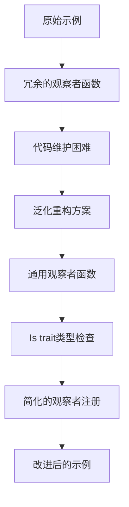

+++
title = "#20977 Improve the standard_widgets_observers example"
date = "2025-09-12T00:00:00"
draft = false
template = "pull_request_page.html"
in_search_index = false

[extra]
current_language = "zh-cn"
available_languages = {"en" = { name = "English", url = "/pull_request/bevy/2025-09/pr-20977-en-20250912" }, "zh-cn" = { name = "中文", url = "/pull_request/bevy/2025-09/pr-20977-zh-cn-20250912" }}
+++

# Improve the standard_widgets_observers example

## 基本信息
- **标题**: Improve the standard_widgets_observers example
- **PR链接**: https://github.com/bevyengine/bevy/pull/20977
- **作者**: cart
- **状态**: 已合并
- **标签**: C-Examples, A-UI, C-Code-Quality, S-Ready-For-Final-Review
- **创建时间**: 2025-09-12T02:13:08Z
- **合并时间**: 2025-09-12T03:09:52Z
- **合并人**: alice-i-cecile

## 描述翻译

# Objective

当前的 `standard_widgets_observers` 示例冗余/嘈杂到了成为"用户质量感知负担"的程度。我认为我们需要完全移除它或者改进它。

## Solution

- 将冗余的观察者逻辑泛型化，允许所有观察者重用相同的函数

## 这个PR的故事

这个PR主要解决了一个代码质量和维护性的问题。`standard_widgets_observers` 示例中存在大量重复的观察者函数，每个函数处理特定类型的UI组件事件（如按钮点击、滑块值变化、复选框状态改变等）。这种代码结构不仅冗长，而且难以维护，任何对UI交互逻辑的修改都需要在多个地方进行相同的更改。

开发者采用了泛型编程的方法来解决这个问题。核心思路是将原本针对特定事件类型的多个独立函数，重构为少量通用的泛型函数。这些泛型函数通过类型参数来区分不同的事件类型和组件类型，从而复用相同的处理逻辑。

具体实现中，开发者创建了几个关键的泛型函数：
- `button_on_interaction<E: EntityEvent, C: Component>`：处理按钮的各种交互事件
- `slider_on_interaction<E: EntityEvent, C: Component>`：处理滑块的交互事件  
- `slider_on_change_value<C: Component>`：处理滑块值变化事件
- `checkbox_on_interaction<E: EntityEvent, C: Component>`：处理复选框的交互事件

为了支持这些泛型函数，还引入了一个新的trait `Is`，用于在运行时进行类型检查：

```rust
trait Is {
    fn is<T: Any>() -> bool;
}

impl<A: Any> Is for A {
    #[inline]
    fn is<T: Any>() -> bool {
        TypeId::of::<A>() == TypeId::of::<T>()
    }
}
```

这个trait提供了类型检查的能力，使得泛型函数能够根据具体的事件类型来调整行为。特别是在处理 `Remove` 事件时，需要特殊处理组件的状态判断。

观察者的注册方式也从原来的15个独立调用简化为使用泛型函数的调用：

```rust
// 之前：15个独立的add_observer调用
.add_observer(button_on_add_pressed)
.add_observer(button_on_remove_pressed)
// ... 其他13个观察者

// 之后：使用泛型函数的调用
.add_observer(button_on_interaction::<Add, Pressed>)
.add_observer(button_on_interaction::<Remove, Pressed>)
// ... 其他观察者使用相应的类型参数
```

这种重构显著减少了代码量（从362行减少到111行），同时提高了代码的可维护性和可读性。现在如果需要修改UI交互的逻辑，只需要在一个地方进行修改，而不是在多个相似的函数中重复修改。

从技术角度看，这个PR展示了如何使用Rust的泛型和trait系统来消除代码重复，同时也体现了良好的API设计原则。通过类型参数化，保持了类型安全的同时提供了足够的灵活性。

## 可视化表示



## 关键文件更改

- `examples/ui/standard_widgets_observers.rs` (+111/-362)

这个文件是本次PR唯一修改的文件，包含了所有的重构工作。主要变化包括：

1. **移除15个独立的观察者函数**，替换为4个泛型函数
2. **添加Is trait**用于运行时类型检查
3. **简化观察者注册**，使用泛型函数和类型参数

关键代码变化示例：

```rust
// 之前：多个独立的按钮观察者函数
fn button_on_add_pressed(add: On<Add, Pressed>, ...) { ... }
fn button_on_remove_pressed(remove: On<Remove, Pressed>, ...) { ... }
fn button_on_add_disabled(add: On<Add, InteractionDisabled>, ...) { ... }

// 之后：单个泛型函数
fn button_on_interaction<E: EntityEvent, C: Component>(
    event: On<E, C>,
    mut buttons: Query<(...), With<DemoButton>>,
    mut text_query: Query<&mut Text>,
) {
    // 通用处理逻辑，通过类型参数区分不同情况
    let pressed = pressed && !(E::is::<Remove>() && C::is::<Pressed>());
    let disabled = disabled && !(E::is::<Remove>() && C::is::<InteractionDisabled>());
    // ... 其余逻辑
}
```

## 延伸阅读

- [Rust泛型文档](https://doc.rust-lang.org/book/ch10-00-generics.html)
- [Bevy ECS观察者系统](https://bevyengine.org/learn/books/0.13/ecs/observers/)
- [类型ID和Any trait](https://doc.rust-lang.org/std/any/index.html)

# 完整代码差异

```diff
diff --git a/examples/ui/standard_widgets_observers.rs b/examples/ui/standard_widgets_observers.rs
index 54220a0214c38..c8a8734afc542 100644
--- a/examples/ui/standard_widgets_observers.rs
+++ b/examples/ui/standard_widgets_observers.rs
@@ -15,6 +15,7 @@ use bevy::{
         UiWidgetsPlugins, ValueChange,
     },
 };
+use std::any::{Any, TypeId};
 
 fn main() {
     App::new()
@@ -26,21 +27,21 @@ fn main() {
         ))
         .insert_resource(DemoWidgetStates { slider_value: 50.0 })
         .add_systems(Startup, setup)
-        .add_observer(button_on_add_pressed)
-        .add_observer(button_on_remove_pressed)
-        .add_observer(button_on_add_disabled)
-        .add_observer(button_on_remove_disabled)
-        .add_observer(button_on_change_hover)
-        .add_observer(slider_on_add_disabled)
-        .add_observer(slider_on_remove_disabled)
-        .add_observer(slider_on_change_hover)
-        .add_observer(slider_on_change_value)
-        .add_observer(slider_on_change_range)
-        .add_observer(checkbox_on_add_disabled)
-        .add_observer(checkbox_on_remove_disabled)
-        .add_observer(checkbox_on_change_hover)
-        .add_observer(checkbox_on_add_checked)
-        .add_observer(checkbox_on_remove_checked)
+        .add_observer(button_on_interaction::<Add, Pressed>)
+        .add_observer(button_on_interaction::<Remove, Pressed>)
+        .add_observer(button_on_interaction::<Add, InteractionDisabled>)
+        .add_observer(button_on_interaction::<Remove, InteractionDisabled>)
+        .add_observer(button_on_interaction::<Insert, Hovered>)
+        .add_observer(slider_on_interaction::<Add, InteractionDisabled>)
+        .add_observer(slider_on_interaction::<Remove, InteractionDisabled>)
+        .add_observer(slider_on_interaction::<Insert, Hovered>)
+        .add_observer(slider_on_change_value::<SliderValue>)
+        .add_observer(slider_on_change_value::<SliderRange>)
+        .add_observer(checkbox_on_interaction::<Add, InteractionDisabled>)
+        .add_observer(checkbox_on_interaction::<Remove, InteractionDisabled>)
+        .add_observer(checkbox_on_interaction::<Insert, Hovered>)
+        .add_observer(checkbox_on_interaction::<Add, Checked>)
+        .add_observer(checkbox_on_interaction::<Remove, Checked>)
         .add_systems(Update, (update_widget_values, toggle_disabled))
         .run();
 }
@@ -157,99 +158,13 @@ fn button(asset_server: &AssetServer, on_click: Callback<In<Activate>>) -> impl
     )
 }
 
-fn button_on_add_pressed(
-    add: On<Add, Pressed>,
+fn button_on_interaction<E: EntityEvent, C: Component>(
+    event: On<E, C>,
     mut buttons: Query<
         (
             &Hovered,
             Has<InteractionDisabled>,
-            &mut BackgroundColor,
-            &mut BorderColor,
-            &Children,
-        ),
-        With<DemoButton>,
-    >,
-    mut text_query: Query<&mut Text>,
-) {
-    if let Ok((hovered, disabled, mut color, mut border_color, children)) =
-        buttons.get_mut(add.entity)
-    {
-        let mut text = text_query.get_mut(children[0]).unwrap();
-        set_button_style(
-            disabled,
-            hovered.get(),
-            true,
-            &mut color,
-            &mut border_color,
-            &mut text,
-        );
-    }
-}
-
-fn button_on_remove_pressed(
-    remove: On<Remove, Pressed>,
-    mut buttons: Query<
-        (
-            &Hovered,
-            Has<InteractionDisabled>,
-            &mut BackgroundColor,
-            &mut BorderColor,
-            &Children,
-        ),
-        With<DemoButton>,
-    >,
-    mut text_query: Query<&mut Text>,
-) {
-    if let Ok((hovered, disabled, mut color, mut border_color, children)) =
-        buttons.get_mut(remove.entity)
-    {
-        let mut text = text_query.get_mut(children[0]).unwrap();
-        set_button_style(
-            disabled,
-            hovered.get(),
-            false,
-            &mut color,
-            &mut border_color,
-            &mut text,
-        );
-    }
-}
-
-fn button_on_add_disabled(
-    add: On<Add, InteractionDisabled>,
-    mut buttons: Query<
-        (
-            Has<Pressed>,
-            &Hovered,
-            &mut BackgroundColor,
-            &mut BorderColor,
-            &Children,
-        ),
-        With<DemoButton>,
-    >,
-    mut text_query: Query<&mut Text>,
-) {
-    if let Ok((pressed, hovered, mut color, mut border_color, children)) =
-        buttons.get_mut(add.entity)
-    {
-        let mut text = text_query.get_mut(children[0]).unwrap();
-        set_button_style(
-            true,
-            hovered.get(),
-            pressed,
-            &mut color,
-            &mut border_color,
-            &mut text,
-        );
-    }
-}
-
-fn button_on_remove_disabled(
-    remove: On<Remove, InteractionDisabled>,
-    mut buttons: Query<
-        (
             Has<Pressed>,
-            &Hovered,
             &mut BackgroundColor,
             &mut BorderColor,
             &Children,
@@ -258,38 +173,8 @@ fn button_on_remove_disabled(
     >,
     mut text_query: Query<&mut Text>,
 ) {
-    if let Ok((pressed, hovered, mut color, mut border_color, children)) =
-        buttons.get_mut(remove.entity)
-    {
-        let mut text = text_query.get_mut(children[0]).unwrap();
-        set_button_style(
-            false,
-            hovered.get(),
-            pressed,
-            &mut color,
-            &mut border_color,
-            &mut text,
-        );
-    }
-}
-
-fn button_on_change_hover(
-    insert: On<Insert, Hovered>,
-    mut buttons: Query<
-        (
-            Has<Pressed>,
-            &Hovered,
-            Has<InteractionDisabled>,
-            &mut BackgroundColor,
-            &mut BorderColor,
-            &Children,
-        ),
-        With<DemoButton>,
-    >,
-    mut text_query: Query<&mut Text>,
-) {
-    if let Ok((pressed, hovered, disabled, mut color, mut border_color, children)) =
-        buttons.get_mut(insert.entity)
+    if let Ok((hovered, disabled, pressed, mut color, mut border_color, children)) =
+        buttons.get_mut(event.event_target())
     {
         if children.is_empty() {
             return;
@@ -297,52 +182,37 @@ fn button_on_change_hover(
         let Ok(mut text) = text_query.get_mut(children[0]) else {
             return;
         };
-        set_button_style(
-            disabled,
-            hovered.get(),
-            pressed,
-            &mut color,
-            &mut border_color,
-            &mut text,
-        );
-    }
-}
-
-fn set_button_style(
-    disabled: bool,
-    hovered: bool,
-    pressed: bool,
-    color: &mut BackgroundColor,
-    border_color: &mut BorderColor,
-    text: &mut Text,
-) {
-    match (disabled, hovered, pressed) {
-        // Disabled button
-        (true, _, _) => {
-            **text = "Disabled".to_string();
-            *color = NORMAL_BUTTON.into();
-            border_color.set_all(GRAY);
-        }
+        let hovered = hovered.get();
+        let pressed = pressed && !(E::is::<Remove>() && C::is::<Pressed>());
+        let disabled = disabled && !(E::is::<Remove>() && C::is::<InteractionDisabled>());
+        match (disabled, hovered, pressed) {
+            // Disabled button
+            (true, _, _) => {
+                **text = "Disabled".to_string();
+                *color = NORMAL_BUTTON.into();
+                border_color.set_all(GRAY);
+            }
 
-        // Pressed and hovered button
-        (false, true, true) => {
-            **text = "Press".to_string();
-            *color = PRESSED_BUTTON.into();
-            border_color.set_all(RED);
-        }
+            // Pressed and hovered button
+            (false, true, true) => {
+                **text = "Press".to_string();
+                *color = PRESSED_BUTTON.into();
+                border_color.set_all(RED);
+            }
 
-        // Hovered, unpressed button
-        (false, true, false) => {
-            **text = "Hover".to_string();
-            *color = HOVERED_BUTTON.into();
-            border_color.set_all(WHITE);
-        }
+            // Hovered, unpressed button
+            (false, true, false) => {
+                **text = "Hover".to_string();
+                *color = HOVERED_BUTTON.into();
+                border_color.set_all(WHITE);
+            }
 
-        // Unhovered button (either pressed or not).
-        (false, false, _) => {
-            **text = "Button".to_string();
-            *color = NORMAL_BUTTON.into();
-            border_color.set_all(BLACK);
+            // Unhovered button (either pressed or not).
+            (false, false, _) => {
+                **text = "Button".to_string();
+                *color = NORMAL_BUTTON.into();
+                border_color.set_all(BLACK);
+            }
         }
     }
 }
@@ -420,47 +290,14 @@ fn slider(
     )
 }
 
-fn slider_on_add_disabled(
-    add: On<Add, InteractionDisabled>,
-    sliders: Query<(Entity, &Hovered), With<DemoSlider>>,
-    children: Query<&Children>,
-    mut thumbs: Query<(&mut BackgroundColor, Has<DemoSliderThumb>), Without<DemoSlider>>,
-) {
-    if let Ok((slider_ent, hovered)) = sliders.get(add.entity) {
-        for child in children.iter_descendants(slider_ent) {
-            if let Ok((mut thumb_bg, is_thumb)) = thumbs.get_mut(child)
-                && is_thumb
-            {
-                thumb_bg.0 = thumb_color(true, hovered.0);
-            }
-        }
-    }
-}
-
-fn slider_on_remove_disabled(
-    remove: On<Remove, InteractionDisabled>,
-    sliders: Query<(Entity, &Hovered), With<DemoSlider>>,
-    children: Query<&Children>,
-    mut thumbs: Query<(&mut BackgroundColor, Has<DemoSliderThumb>), Without<DemoSlider>>,
-) {
-    if let Ok((slider_ent, hovered)) = sliders.get(remove.entity) {
-        for child in children.iter_descendants(slider_ent) {
-            if let Ok((mut thumb_bg, is_thumb)) = thumbs.get_mut(child)
-                && is_thumb
-            {
-                thumb_bg.0 = thumb_color(false, hovered.0);
-            }
-        }
-    }
-}
-
-fn slider_on_change_hover(
-    insert: On<Insert, Hovered>,
+fn slider_on_interaction<E: EntityEvent, C: Component>(
+    event: On<E, C>,
     sliders: Query<(Entity, &Hovered, Has<InteractionDisabled>), With<DemoSlider>>,
     children: Query<&Children>,
     mut thumbs: Query<(&mut BackgroundColor, Has<DemoSliderThumb>), Without<DemoSlider>>,
 ) {
-    if let Ok((slider_ent, hovered, disabled)) = sliders.get(insert.entity) {
+    if let Ok((slider_ent, hovered, disabled)) = sliders.get(event.event_target()) {
+        let disabled = disabled && !(E::is::<Remove>() && C::is::<InteractionDisabled>());
         for child in children.iter_descendants(slider_ent) {
             if let Ok((mut thumb_bg, is_thumb)) = thumbs.get_mut(child)
                 && is_thumb
@@ -471,25 +308,8 @@ fn slider_on_change_hover(
     }
 }
 
-fn slider_on_change_value(
-    insert: On<Insert, SliderValue>,
-    sliders: Query<(Entity, &SliderValue, &SliderRange), With<DemoSlider>>,
-    children: Query<&Children>,
-    mut thumbs: Query<(&mut Node, Has<DemoSliderThumb>), Without<DemoSlider>>,
-) {
-    if let Ok((slider_ent, value, range)) = sliders.get(insert.entity) {
-        for child in children.iter_descendants(slider_ent) {
-            if let Ok((mut thumb_node, is_thumb)) = thumbs.get_mut(child)
-                && is_thumb
-            {
-                thumb_node.left = percent(range.thumb_position(value.0) * 100.0);
-            }
-        }
-    }
-}
-
-fn slider_on_change_range(
-    insert: On<Insert, SliderRange>,
+fn slider_on_change_value<C: Component>(
+    insert: On<Insert, C>,
     sliders: Query<(Entity, &SliderValue, &SliderRange), With<DemoSlider>>,
     children: Query<&Children>,
     mut thumbs: Query<(&mut Node, Has<DemoSliderThumb>), Without<DemoSlider>>,
@@ -576,37 +396,8 @@ fn checkbox(
     )
 }
 
-fn checkbox_on_add_disabled(
-    add: On<Add, InteractionDisabled>,
-    checkboxes: Query<(&Hovered, Has<Checked>, &Children), With<DemoCheckbox>>,
-    mut borders: Query<(&mut BorderColor, &mut Children), Without<DemoCheckbox>>,
-    mut marks: Query<&mut BackgroundColor, (Without<DemoCheckbox>, Without<Children>)>,
-) {
-    if let Ok((hovered, checked, children)) = checkboxes.get(add.entity) {
-        set_checkbox_style(children, &mut borders, &mut marks, true, hovered.0, checked);
-    }
-}
-
-fn checkbox_on_remove_disabled(
-    remove: On<Remove, InteractionDisabled>,
-    checkboxes: Query<(&Hovered, Has<Checked>, &Children), With<DemoCheckbox>>,
-    mut borders: Query<(&mut BorderColor, &mut Children), Without<DemoCheckbox>>,
-    mut marks: Query<&mut BackgroundColor, (Without<DemoCheckbox>, Without<Children>)>,
-) {
-    if let Ok((hovered, checked, children)) = checkboxes.get(remove.entity) {
-        set_checkbox_style(
-            children,
-            &mut borders,
-            &mut marks,
-            false,
-            hovered.0,
-            checked,
-        );
-    }
-}
-
-fn checkbox_on_change_hover(
-    insert: On<Insert, Hovered>,
+fn checkbox_on_interaction<E: EntityEvent, C: Component>(
+    event: On<E, C>,
     checkboxes: Query<
         (&Hovered, Has<InteractionDisabled>, Has<Checked>, &Children),
         With<DemoCheckbox>,
@@ -614,106 +405,53 @@ fn checkbox_on_change_hover(
     mut borders: Query<(&mut BorderColor, &mut Children), Without<DemoCheckbox>>,
     mut marks: Query<&mut BackgroundColor, (Without<DemoCheckbox>, Without<Children>)>,
 ) {
-    if let Ok((hovered, disabled, checked, children)) = checkboxes.get(insert.entity) {
-        set_checkbox_style(
-            children,
-            &mut borders,
-            &mut marks,
-            disabled,
-            hovered.0,
-            checked,
-        );
-    }
-}
+    if let Ok((hovered, disabled, checked, children)) = checkboxes.get(event.event_target()) {
+        let hovered = hovered.get();
+        let checked = checked && !(E::is::<Remove>() && C::is::<Checked>());
+        let disabled = disabled && !(E::is::<Remove>() && C::is::<InteractionDisabled>());
 
-fn checkbox_on_add_checked(
-    add: On<Add, Checked>,
-    checkboxes: Query<
-        (&Hovered, Has<InteractionDisabled>, Has<Checked>, &Children),
-        With<DemoCheckbox>,
-    >,
-    mut borders: Query<(&mut BorderColor, &mut Children), Without<DemoCheckbox>>,
-    mut marks: Query<&mut BackgroundColor, (Without<DemoCheckbox>, Without<Children>)>,
-) {
-    if let Ok((hovered, disabled, checked, children)) = checkboxes.get(add.entity) {
-        set_checkbox_style(
-            children,
-            &mut borders,
-            &mut marks,
-            disabled,
-            hovered.0,
-            checked,
-        );
-    }
-}
+        let Some(border_id) = children.first() else {
+            return;
+        };
 
-fn checkbox_on_remove_checked(
-    remove: On<Remove, Checked>,
-    checkboxes: Query<(&Hovered, Has<InteractionDisabled>, &Children), With<DemoCheckbox>>,
-    mut borders: Query<(&mut BorderColor, &mut Children), Without<DemoCheckbox>>,
-    mut marks: Query<&mut BackgroundColor, (Without<DemoCheckbox>, Without<Children>)>,
-) {
-    if let Ok((hovered, disabled, children)) = checkboxes.get(remove.entity) {
-        set_checkbox_style(
-            children,
-            &mut borders,
-            &mut marks,
-            disabled,
-            hovered.0,
-            false,
-        );
-    }
-}
+        let Ok((mut border_color, border_children)) = borders.get_mut(*border_id) else {
+            return;
+        };
 
-fn set_checkbox_style(
-    children: &Children,
-    borders: &mut Query<(&mut BorderColor, &mut Children), Without<DemoCheckbox>>,
-    marks: &mut Query<&mut BackgroundColor, (Without<DemoCheckbox>, Without<Children>)>,
-    disabled: bool,
-    hovering: bool,
-    checked: bool,
-) {
-    let Some(border_id) = children.first() else {
-        return;
-    };
-
-    let Ok((mut border_color, border_children)) = borders.get_mut(*border_id) else {
-        return;
-    };
-
-    let Some(mark_id) = border_children.first() else {
-        warn!("Checkbox does not have a mark entity.");
-        return;
-    };
-
-    let Ok(mut mark_bg) = marks.get_mut(*mark_id) else {
-        warn!("Checkbox mark entity lacking a background color.");
-        return;
-    };
-
-    let color: Color = if disabled {
-        // If the checkbox is disabled, use a lighter color
-        CHECKBOX_OUTLINE.with_alpha(0.2)
-    } else if hovering {
-        // If hovering, use a lighter color
-        CHECKBOX_OUTLINE.lighter(0.2)
-    } else {
-        // Default color for the checkbox
-        CHECKBOX_OUTLINE
-    };
-
-    // Update the background color of the check mark
-    border_color.set_all(color);
-
-    let mark_color: Color = match (disabled, checked) {
-        (true, true) => CHECKBOX_CHECK.with_alpha(0.5),
-        (false, true) => CHECKBOX_CHECK,
-        (_, false) => Srgba::NONE.into(),
-    };
-
-    if mark_bg.0 != mark_color {
-        // Update the color of the check mark
-        mark_bg.0 = mark_color;
+        let Some(mark_id) = border_children.first() else {
+            warn!("Checkbox does not have a mark entity.");
+            return;
+        };
+
+        let Ok(mut mark_bg) = marks.get_mut(*mark_id) else {
+            warn!("Checkbox mark entity lacking a background color.");
+            return;
+        };
+
+        let color: Color = if disabled {
+            // If the checkbox is disabled, use a lighter color
+            CHECKBOX_OUTLINE.with_alpha(0.2)
+        } else if hovered {
+            // If hovering, use a lighter color
+            CHECKBOX_OUTLINE.lighter(0.2)
+        } else {
+            // Default color for the checkbox
+            CHECKBOX_OUTLINE
+        };
+
+        // Update the background color of the check mark
+        border_color.set_all(color);
+
+        let mark_color: Color = match (disabled, checked) {
+            (true, true) => CHECKBOX_CHECK.with_alpha(0.5),
+            (false, true) => CHECKBOX_CHECK,
+            (_, false) => Srgba::NONE.into(),
+        };
+
+        if mark_bg.0 != mark_color {
+            // Update the color of the check mark
+            mark_bg.0 = mark_color;
+        }
     }
 }
 
@@ -752,3 +490,14 @@ fn toggle_disabled(
         }
     }
 }
+
+trait Is {
+    fn is<T: Any>() -> bool;
+}
+
+impl<A: Any> Is for A {
+    #[inline]
+    fn is<T: Any>() -> bool {
+        TypeId::of::<A>() == TypeId::of::<T>()
+    }
+}
```