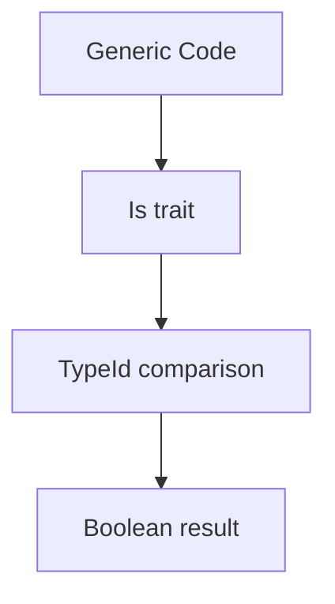

+++
title = "#20978 bevy_reflect: `Is` trait"
date = "2025-09-12T00:00:00"
draft = false
template = "pull_request_page.html"
in_search_index = true

[taxonomies]
list_display = ["show"]

[extra]
current_language = "en"
available_languages = {"en" = { name = "English", url = "/pull_request/bevy/2025-09/pr-20978-en-20250912" }, "zh-cn" = { name = "中文", url = "/pull_request/bevy/2025-09/pr-20978-zh-cn-20250912" }}
labels = ["C-Usability", "A-Reflection"]
+++

# Title
bevy_reflect: `Is` trait

## Basic Information
- **Title**: bevy_reflect: `Is` trait
- **PR Link**: https://github.com/bevyengine/bevy/pull/20978
- **Author**: cart
- **Status**: MERGED
- **Labels**: C-Usability, S-Ready-For-Final-Review, A-Reflection
- **Created**: 2025-09-12T02:31:29Z
- **Merged**: 2025-09-12T21:23:17Z
- **Merged By**: cart

## Description Translation
# Objective

It is sometimes useful to do `TypeId` equality comparisons between two types. This really only comes up in the context of generics. For a real-world example, see https://github.com/bevyengine/bevy/pull/20977.

## Solution

Add an `Is` trait to `bevy_reflect`. Explicitly do not include it in the prelude, in the interest of not suggesting it everywhere.

## The Story of This Pull Request

This PR addresses a specific need in Bevy's reflection system: the ability to perform TypeId-based type comparisons in generic contexts. The problem emerged from real-world use cases where developers needed to check if a generic type parameter matched a specific concrete type at compile time.

The solution introduces a simple but powerful `Is` trait that provides a clean API for TypeId comparisons. The implementation leverages Rust's built-in `TypeId` mechanism, which provides unique identifiers for each type at compile time. This approach is efficient since TypeId comparisons are constant-time operations performed at compile time.

The trait was deliberately excluded from the prelude to avoid encouraging overuse, as TypeId comparisons should generally be used sparingly and only when necessary for generic programming patterns. The implementation follows Rust's standard patterns for trait design with a clear, focused purpose and comprehensive documentation including practical usage examples.

## Visual Representation



## Key Files Changed

**File: crates/bevy_reflect/src/is.rs** (+31/-0)
This new file implements the core `Is` trait functionality:

```rust
use core::any::{Any, TypeId};

/// Checks if the current type "is" another type, using a [`TypeId`] equality comparison.
pub trait Is {
    /// Checks if the current type "is" another type, using a [`TypeId`] equality comparison.
    /// This is most useful in the context of generic logic.
    ///
    /// ```
    /// # use bevy_reflect::Is;
    /// # use std::any::Any;
    /// fn greet_if_u32<T: Any>() {
    ///     if T::is::<u32>() {
    ///         println!("Hello");
    ///     }
    /// }
    /// // this will print "Hello"
    /// greet_if_u32::<u32>();
    /// // this will not print "Hello"
    /// greet_if_u32::<String>();
    /// assert!(u32::is::<u32>());
    /// assert!(!usize::is::<u32>());
    /// ```
    fn is<T: Any>() -> bool;
}

impl<A: Any> Is for A {
    #[inline]
    fn is<T: Any>() -> bool {
        TypeId::of::<A>() == TypeId::of::<T>()
    }
}
```

**File: crates/bevy_reflect/src/lib.rs** (+2/-0)
This file was modified to include the new module and export the trait:

```rust
// ... existing code ...
mod is;
// ... existing code ...

pub use is::*;
// ... existing code ...
```

## Further Reading

- [Rust TypeId documentation](https://doc.rust-lang.org/std/any/struct.TypeId.html)
- [Rust Any trait documentation](https://doc.rust-lang.org/std/any/trait.Any.html)
- [Bevy Reflection documentation](https://docs.rs/bevy_reflect/latest/bevy_reflect/)