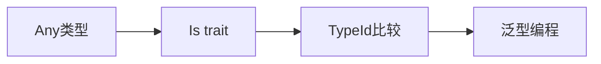

+++
title = "#20978 bevy_reflect: `Is` trait"
date = "2025-09-12T00:00:00"
draft = false
template = "pull_request_page.html"
in_search_index = false

[extra]
current_language = "zh-cn"
available_languages = {"en" = { name = "English", url = "/pull_request/bevy/2025-09/pr-20978-en-20250912" }, "zh-cn" = { name = "中文", url = "/pull_request/bevy/2025-09/pr-20978-zh-cn-20250912" }}
+++

# Title

## 基本信息
- **标题**: bevy_reflect: `Is` trait
- **PR链接**: https://github.com/bevyengine/bevy/pull/20978
- **作者**: cart
- **状态**: 已合并
- **标签**: C-Usability, S-Ready-For-Final-Review, A-Reflection
- **创建时间**: 2025-09-12T02:31:29Z
- **合并时间**: 2025-09-12T21:23:17Z
- **合并者**: cart

## 描述翻译
### 目标

有时需要在两个类型之间进行 `TypeId` 相等性比较。这主要在泛型上下文中出现。有关实际示例，请参阅 https://github.com/bevyengine/bevy/pull/20977。

### 解决方案

向 `bevy_reflect` 添加一个 `Is` trait。明确不将其包含在预导入（prelude）中，以避免在所有地方都建议使用它。

## 本次PR的故事

在泛型编程中，经常需要确定一个类型是否与另一个类型相同。虽然Rust的标准库提供了 `TypeId` 机制来进行类型标识比较，但在Bevy的反射系统中缺乏一个简洁、易用的API来执行这种操作。开发者在处理泛型代码时，特别是需要基于具体类型做出决策时，这种功能变得非常有用。

PR #20977 就是一个实际用例，它需要这种类型比较功能。开发者意识到这是一个可以抽象出来的通用需求，而不是在单个PR中特定实现。

解决方案是创建一个名为 `Is` 的新trait，它为任何实现了 `Any` 的类型提供了类型标识比较的能力。这个trait设计得非常简洁，只包含一个方法：

```rust
pub trait Is {
    fn is<T: Any>() -> bool;
}
```

实现也很直接，利用了Rust标准库的 `TypeId::of` 功能：

```rust
impl<A: Any> Is for A {
    #[inline]
    fn is<T: Any>() -> bool {
        TypeId::of::<A>() == TypeId::of::<T>()
    }
}
```

这个设计有几个关键考虑因素。首先，它使用了泛型实现，为所有 `Any` 类型自动提供这个功能，这意味着开发者不需要为他们自己的类型手动实现这个trait。其次，方法被标记为 `#[inline]`，因为这是一个简单的类型ID比较，内联可以避免函数调用开销。

一个重要的设计决策是不将这个trait包含在Bevy反射的预导入中。这是为了避免污染命名空间，因为这个功能虽然有用，但并不是每个使用反射的场景都需要它。开发者需要在明确需要时手动导入它。

从技术角度来看，这个实现利用了Rust的类型系统特性。`TypeId` 提供了每个类型的唯一标识符，在编译时生成，可以安全地进行相等性比较。这种方法比使用动态类型检查或其他反射机制更轻量级和高效。

这个改动的影响是提供了一个标准化的方式来执行类型标识检查，避免了在不同地方重复实现相同的功能。它提高了代码的一致性，并减少了潜在的错误。

## 视觉表示



## 关键文件变更

### `crates/bevy_reflect/src/is.rs` (+31/-0)
新增文件，包含了 `Is` trait的定义和实现。

```rust
use core::any::{Any, TypeId};

/// Checks if the current type "is" another type, using a [`TypeId`] equality comparison.
pub trait Is {
    /// Checks if the current type "is" another type, using a [`TypeId`] equality comparison.
    /// This is most useful in the context of generic logic.
    ///
    /// ```
    /// # use bevy_reflect::Is;
    /// # use std::any::Any;
    /// fn greet_if_u32<T: Any>() {
    ///     if T::is::<u32>() {
    ///         println!("Hello");
    ///     }
    /// }
    /// // this will print "Hello"
    /// greet_if_u32::<u32>();
    /// // this will not print "Hello"
    /// greet_if_u32::<String>();
    /// assert!(u32::is::<u32>());
    /// assert!(!usize::is::<u32>());
    /// ```
    fn is<T: Any>() -> bool;
}

impl<A: Any> Is for A {
    #[inline]
    fn is<T: Any>() -> bool {
        TypeId::of::<A>() == TypeId::of::<T>()
    }
}
```

### `crates/bevy_reflect/src/lib.rs` (+2/-0)
修改主库文件，导入新创建的 `is` 模块并重新导出 `Is` trait。

```rust
// 新增模块声明
mod is;

// 在重新导出部分新增
pub use is::*;
```

这些变更使得新的 `Is` trait 对Bevy反射系统的用户可用，同时保持了模块化的代码组织。

## 延伸阅读

- [Rust标准库中的Any trait文档](https://doc.rust-lang.org/std/any/trait.Any.html)
- [Rust中的TypeId和类型反射](https://doc.rust-lang.org/std/any/struct.TypeId.html)
- [Bevy反射系统指南](https://bevy-cheatbook.github.io/programming/reflection.html)
- [泛型编程中的类型判断模式](https://rust-unofficial.github.io/patterns/patterns/behavioural/type-state.html)

# 完整代码差异
```
diff --git a/crates/bevy_reflect/src/is.rs b/crates/bevy_reflect/src/is.rs
new file mode 100644
index 0000000000000..21cf41892eff5
--- /dev/null
+++ b/crates/bevy_reflect/src/is.rs
@@ -0,0 +1,31 @@
+use core::any::{Any, TypeId};
+
+/// Checks if the current type "is" another type, using a [`TypeId`] equality comparison.
+pub trait Is {
+    /// Checks if the current type "is" another type, using a [`TypeId`] equality comparison.
+    /// This is most useful in the context of generic logic.
+    ///
+    /// ```
+    /// # use bevy_reflect::Is;
+    /// # use std::any::Any;
+    /// fn greet_if_u32<T: Any>() {
+    ///     if T::is::<u32>() {
+    ///         println!("Hello");
+    ///     }
+    /// }
+    /// // this will print "Hello"
+    /// greet_if_u32::<u32>();
+    /// // this will not print "Hello"
+    /// greet_if_u32::<String>();
+    /// assert!(u32::is::<u32>());
+    /// assert!(!usize::is::<u32>());
+    /// ```
+    fn is<T: Any>() -> bool;
+}
+
+impl<A: Any> Is for A {
+    #[inline]
+    fn is<T: Any>() -> bool {
+        TypeId::of::<A>() == TypeId::of::<T>()
+    }
+}
diff --git a/crates/bevy_reflect/src/lib.rs b/crates/bevy_reflect/src/lib.rs
index 477c222a345ce..022fcd2a41067 100644
--- a/crates/bevy_reflect/src/lib.rs
+++ b/crates/bevy_reflect/src/lib.rs
@@ -583,6 +583,7 @@ mod fields;
 mod from_reflect;
 #[cfg(feature = "functions")]
 pub mod func;
+mod is;
 mod kind;
 mod list;
 mod map;
@@ -655,6 +656,7 @@ pub use error::*;
 pub use fields::*;
 pub use from_reflect::*;
 pub use generics::*;
+pub use is::*;
 pub use kind::*;
 pub use list::*;
 pub use map::*;
```