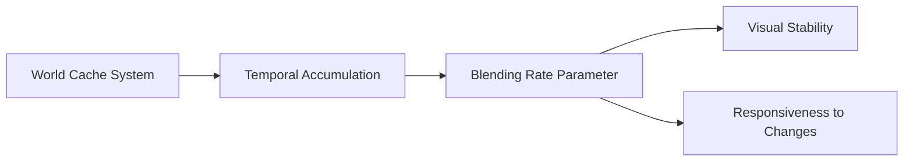

+++
title = "#20980 Stabler Solari world cache"
date = "2025-09-12T00:00:00"
draft = false
template = "pull_request_page.html"
in_search_index = true

[taxonomies]
list_display = ["show"]

[extra]
current_language = "en"
available_languages = {"en" = { name = "English", url = "/pull_request/bevy/2025-09/pr-20980-en-20250912" }, "zh-cn" = { name = "中文", url = "/pull_request/bevy/2025-09/pr-20980-zh-cn-20250912" }}
labels = ["A-Rendering", "C-Refinement"]
+++

# Stabler Solari world cache

## Basic Information
- **Title**: Stabler Solari world cache
- **PR Link**: https://github.com/bevyengine/bevy/pull/20980
- **Author**: JMS55
- **Status**: MERGED
- **Labels**: A-Rendering, S-Ready-For-Final-Review, C-Refinement
- **Created**: 2025-09-12T04:37:34Z
- **Merged**: 2025-09-12T05:28:34Z
- **Merged By**: alice-i-cecile

## Description Translation
# Objective

- Make the world cache a little more stable, with less random "blooming" of light.

## Solution

- Use a slower blending rate for world cache updates. This increases stability, at the cost of making the world cache slower to react to changes in the scene.

## Testing
- Ran the solari example before and after, and observed less artifacts.

## The Story of This Pull Request

This PR addresses a specific visual artifact in Bevy's Solari real-time global illumination system. The issue manifested as random "blooming" of light - inconsistent brightness fluctuations that degraded visual quality. The problem stemmed from the temporal accumulation rate used in the world cache update algorithm.

The world cache system uses temporal accumulation to blend lighting information across frames, reducing noise and improving stability. The key parameter controlling this behavior is `WORLD_CACHE_MAX_TEMPORAL_SAMPLES`, which determines how many frames are effectively considered when blending new lighting data with the cached values.

The original implementation used a value of 10.0 for this constant, meaning the cache would be relatively responsive to changes but also more susceptible to temporal instability and flickering artifacts. By increasing this value to 20.0, the blending rate becomes slower, resulting in more stable lighting at the cost of slightly slower adaptation to scene changes.

This change represents a classic trade-off in real-time rendering between responsiveness and stability. The author made an informed decision to prioritize visual stability, as the random blooming artifacts were likely more noticeable and distracting than slightly slower adaptation to lighting changes.

The implementation is minimal but effective - a single constant change in the shader code that controls the temporal blending behavior. This demonstrates how careful parameter tuning can significantly impact visual quality without requiring architectural changes.

## Visual Representation



## Key Files Changed

### `crates/bevy_solari/src/realtime/world_cache_query.wgsl` (+1/-1)

This file contains the WGSL shader code for the world cache query system. The change modifies a constant that controls the temporal blending behavior.

**Before:**
```wgsl
const WORLD_CACHE_MAX_TEMPORAL_SAMPLES: f32 = 10.0;
```

**After:**
```wgsl
const WORLD_CACHE_MAX_TEMPORAL_SAMPLES: f32 = 20.0;
```

This change directly addresses the stability issue by slowing down the blending rate, reducing flickering artifacts at the cost of slightly slower adaptation to scene changes.

### `release-content/release-notes/bevy_solari.md` (+1/-1)

This file contains release notes for the Solari system. The change adds this PR to the list of relevant pull requests.

**Before:**
```md
pull_requests: [19058, 19620, 19790, 20020, 20113, 20156, 20213, 20242, 20259, 20406, 20457, 20580, 20596, 20622, 20658, 20659]
```

**After:**
```md
pull_requests: [19058, 19620, 19790, 20020, 20113, 20156, 20213, 20242, 20259, 20406, 20457, 20580, 20596, 20622, 20658, 20659, 20980]
```

This is a routine administrative update to document the PR's inclusion in the release.

## Further Reading

- [Temporal Anti-Aliasing (TAA) techniques](https://en.wikipedia.org/wiki/Temporal_anti-aliasing) - The principles behind temporal accumulation
- [Real-Time Rendering](https://www.realtimerendering.com/) - Comprehensive reference on real-time graphics techniques
- [Bevy Engine documentation](https://bevyengine.org/learn/) - Official Bevy engine resources and examples