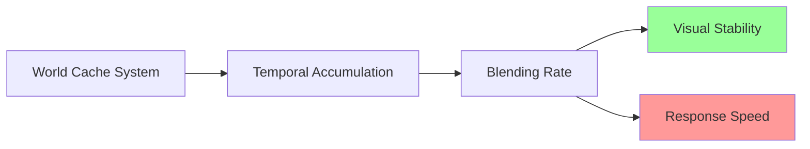

+++
title = "#20980 Stabler Solari world cache"
date = "2025-09-12T00:00:00"
draft = false
template = "pull_request_page.html"
in_search_index = false

[extra]
current_language = "zh-cn"
available_languages = {"en" = { name = "English", url = "/pull_request/bevy/2025-09/pr-20980-en-20250912" }, "zh-cn" = { name = "中文", url = "/pull_request/bevy/2025-09/pr-20980-zh-cn-20250912" }}
+++

# Stabler Solari world cache

## 基本信息
- **标题**: Stabler Solari world cache
- **PR链接**: https://github.com/bevyengine/bevy/pull/20980
- **作者**: JMS55
- **状态**: 已合并
- **标签**: A-Rendering, S-Ready-For-Final-Review, C-Refinement
- **创建时间**: 2025-09-12T04:37:34Z
- **合并时间**: 2025-09-12T05:28:34Z
- **合并者**: alice-i-cecile

## 描述翻译
# Objective

- 使世界缓存更加稳定，减少光线的随机"blooming"现象。

## Solution

- 使用更慢的混合速率来更新世界缓存。这增加了稳定性，代价是使世界缓存对场景变化的反应变慢。

## Testing
- 在修改前后运行了solari示例，观察到更少的artifacts。

## 本次PR的技术故事

这个PR解决了一个在Bevy Solari（Bevy的实时光线追踪照明系统）中遇到的具体渲染问题。问题表现为世界缓存（world cache）中的随机"blooming"现象，即光线在渲染过程中出现不稳定的闪烁或过度曝光效果。

世界缓存是Solari系统的核心组件，负责存储和累积场景中的光照信息。它使用时间性累积（temporal accumulation）技术来逐步改善渲染质量，通过多帧混合来减少噪声。原代码中使用的`WORLD_CACHE_MAX_TEMPORAL_SAMPLES`常量值为10.0，这个值控制着缓存对新光照数据的响应速度。

问题的根本原因在于混合速率过快。当缓存对新帧数据响应过于敏感时，会导致光照计算的不稳定性，表现为视觉上的闪烁或"blooming"效果。这在动态场景中尤其明显，因为缓存会过于激进地尝试适应变化。

解决方案相当直接但有效：将`WORLD_CACHE_MAX_TEMPORAL_SAMPLES`从10.0增加到20.0。这个修改意味着：

1. **更慢的混合速率**：缓存现在需要更多帧来完全适应光照变化
2. **更高的稳定性**：减少了帧间的剧烈变化，使渲染结果更加平滑
3. **权衡响应性**：代价是对动态光照变化的反应变慢

这是一个典型的工程权衡案例 - 在稳定性和响应性之间找到平衡点。通过增加采样数，系统牺牲了一些对快速变化的适应能力，换来了更稳定的视觉输出。

从技术实现角度看，这个修改虽然简单，但影响深远。世界缓存的稳定性直接影响整个渲染管道的视觉质量。在实时光线追踪系统中，这种时间性累积技术是减少噪声和提升视觉质量的关键手段。

测试结果显示这个修改有效减少了artifacts，证明了调整方向的正确性。这种基于常量调整的优化是渲染系统中常见的微调手段，通过简单的参数变化就能显著影响视觉输出质量。

## 视觉表示



## 关键文件变更

### `crates/bevy_solari/src/realtime/world_cache_query.wgsl` (+1/-1)

**变更描述**：修改了世界缓存的时间性采样常数，从10.0增加到20.0，以降低混合速率并提高稳定性。

**代码对比**：
```wgsl
// 修改前：
const WORLD_CACHE_MAX_TEMPORAL_SAMPLES: f32 = 10.0;

// 修改后：
const WORLD_CACHE_MAX_TEMPORAL_SAMPLES: f32 = 20.0;
```

这个修改直接影响了世界缓存对新光照数据的响应速度，是本次PR的核心变更。

### `release-content/release-notes/bevy_solari.md` (+1/-1)

**变更描述**：在发布说明中添加了本次PR的编号，确保变更记录被正确跟踪。

**代码对比**：
```markdown
// 修改前：
pull_requests: [19058, 19620, 19790, 20020, 20113, 20156, 20213, 20242, 20259, 20406, 20457, 20580, 20596, 20622, 20658, 20659]

// 修改后：
pull_requests: [19058, 19620, 19790, 20020, 20113, 20156, 20213, 20242, 20259, 20406, 20457, 20580, 20596, 20622, 20658, 20659, 20980]
```

这是一个维护性变更，确保发布说明准确反映所有相关的PR贡献。

## 进一步阅读

- [Bevy Solari 项目概述](https://github.com/bevyengine/bevy/pull/19058)
- [时间性抗锯齿技术](https://en.wikipedia.org/wiki/Temporal_anti-aliasing)
- [实时渲染中的累积技术](https://advances.realtimerendering.com/)
- [WGSL 着色语言规范](https://www.w3.org/TR/WGSL/)