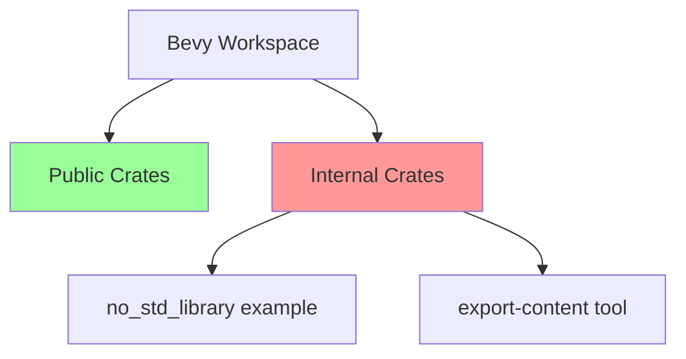

+++
title = "#20986 Disable publishing for internal crates"
date = "2025-09-12T00:00:00"
draft = false
template = "pull_request_page.html"
in_search_index = true

[taxonomies]
list_display = ["show"]

[extra]
current_language = "en"
available_languages = {"en" = { name = "English", url = "/pull_request/bevy/2025-09/pr-20986-en-20250912" }, "zh-cn" = { name = "中文", url = "/pull_request/bevy/2025-09/pr-20986-zh-cn-20250912" }}
labels = ["A-Meta"]
+++

# Disable publishing for internal crates

## Basic Information
- **Title**: Disable publishing for internal crates
- **PR Link**: https://github.com/bevyengine/bevy/pull/20986
- **Author**: mockersf
- **Status**: MERGED
- **Labels**: A-Meta, S-Ready-For-Final-Review
- **Created**: 2025-09-12T17:42:18Z
- **Merged**: 2025-09-12T18:32:03Z
- **Merged By**: mockersf

## Description Translation
# Objective

- set `publish = false` for crates that won't be published

## The Story of This Pull Request

This PR addresses a straightforward but important maintenance issue in the Bevy project's crate configuration. The problem was that several internal crates were missing explicit `publish = false` declarations in their Cargo.toml files, which could potentially lead to accidental publication attempts or confusion about which crates are intended for public distribution.

The solution approach was minimal and targeted: identify internal crates that should never be published to crates.io and explicitly mark them with `publish = false`. This is a standard Rust/Cargo practice for workspace crates that are only meant for internal use within the project.

The implementation involved adding a single line to each affected Cargo.toml file. The change is purely declarative and doesn't affect the actual functionality of the code - it simply informs Cargo that these crates should not be published to public registries.

From a technical perspective, this change helps maintain clean project boundaries and prevents potential issues with:
- Accidental publication of internal tools
- Confusion about which crates are public API surfaces
- Cargo workspace management when dealing with publish operations

The impact is primarily organizational rather than functional. It establishes clear boundaries between public-facing crates and internal tooling, which is particularly important in a large project like Bevy with multiple components and examples.

## Visual Representation



## Key Files Changed

### `examples/no_std/library/Cargo.toml`
This file defines a no_std library example that demonstrates Bevy's capabilities in constrained environments. The change ensures this example crate won't be accidentally published.

```toml
# Before:
[package]
name = "no_std_library"
version = "0.1.0"
edition = "2024"

# After:
[package]
name = "no_std_library"
version = "0.1.0"
edition = "2024"
publish = false
```

### `tools/export-content/Cargo.toml`
This file defines an internal tool for content export functionality. The change explicitly marks it as an internal utility that shouldn't be published.

```toml
# Before:
[package]
name = "export-content"
version = "0.1.0"
edition = "2024"

# After:
[package]
name = "export-content"
version = "0.1.0"
edition = "2024"
publish = false
```

## Further Reading

- [Cargo Documentation: The publish field](https://doc.rust-lang.org/cargo/reference/manifest.html#the-publish-field)
- [Cargo Workspaces documentation](https://doc.rust-lang.org/cargo/reference/workspaces.html)
- [Rust Packaging and Distribution Best Practices](https://doc.rust-lang.org/cargo/guide/creating-a-new-project.html#packaging-and-distributing)