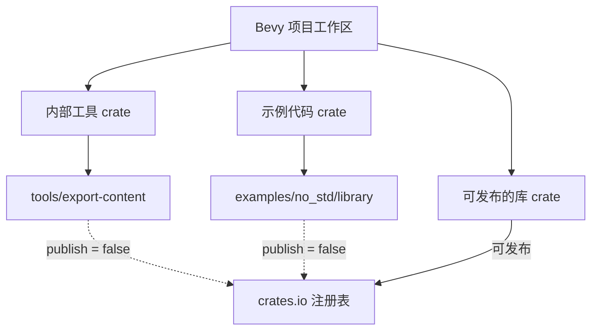

+++
title = "#20986 Disable publishing for internal crates"
date = "2025-09-12T00:00:00"
draft = false
template = "pull_request_page.html"
in_search_index = false

[extra]
current_language = "zh-cn"
available_languages = {"en" = { name = "English", url = "/pull_request/bevy/2025-09/pr-20986-en-20250912" }, "zh-cn" = { name = "中文", url = "/pull_request/bevy/2025-09/pr-20986-zh-cn-20250912" }}
+++

# Disable publishing for internal crates

## 基本信息
- **标题**: Disable publishing for internal crates
- **PR链接**: https://github.com/bevyengine/bevy/pull/20986
- **作者**: mockersf
- **状态**: 已合并
- **标签**: A-Meta, S-Ready-For-Final-Review
- **创建时间**: 2025-09-12T17:42:18Z
- **合并时间**: 2025-09-12T18:32:03Z
- **合并者**: mockersf

## 描述翻译

# 目标

- 为不会发布的 crate 设置 `publish = false`

## 本次 PR 的故事

这个 PR 解决了一个简单但重要的仓库管理问题：防止内部工具和示例代码被意外发布到公共 crate 注册表（crates.io）。

在大型 Rust 项目中，通常会有多种类型的 crate：一些是主要的库 crate，需要发布到 crates.io 供外部使用；另一些则是内部工具、示例代码或测试工具，这些不应该被发布到公共注册表。Bevy 引擎项目就包含了这样的内部 crate。

问题在于，如果开发者在运行 `cargo publish` 时没有仔细指定要发布的 crate，Cargo 可能会尝试发布工作区中的所有 crate。对于像 `no_std_library` 示例和 `export-content` 工具这样的内部组件，发布到 crates.io 是没有意义的，因为它们不是独立的库，而是项目的一部分。

解决方案很直接：在每个内部 crate 的 Cargo.toml 文件中添加 `publish = false` 字段。这是一个标准的 Cargo 特性，明确告诉 Cargo 这个 crate 不应该被发布到任何注册表。

从技术实现角度来看，这个修改非常简单但有效。它不需要复杂的逻辑或架构变更，只是利用了 Cargo 已有的功能来防止误操作。这种防御性编程的做法值得借鉴，特别是在大型协作项目中。

这个修改的影响主要体现在项目维护方面：
1. 防止了意外发布内部 crate 可能造成的混乱
2. 明确了哪些 crate 是供外部使用的，哪些是内部工具
3. 保持了仓库的整洁性和一致性

从工程实践来看，这是一个很好的习惯：对所有不应该发布的 crate 明确标记 `publish = false`，而不是依赖开发者的记忆或仔细操作。这种显式的声明减少了人为错误的风险，符合 Rust 社区强调的显式优于隐式的哲学。

## 可视化表示



## 关键文件更改

### `examples/no_std/library/Cargo.toml` (+1/-0)
这个文件是一个无标准库示例的配置，添加了 `publish = false` 来防止这个示例被意外发布。

```toml
# 修改后：
[package]
name = "no_std_library"
version = "0.1.0"
edition = "2024"
publish = false
```

### `tools/export-content/Cargo.toml` (+1/-0)
这是一个内部工具 crate，同样添加了 `publish = false` 来明确标记其为不发布项目。

```toml
# 修改后：
[package]
name = "export-content"
version = "0.1.0"
edition = "2024"
publish = false
```

## 延伸阅读

- [Cargo 文档：package.publish](https://doc.rust-lang.org/cargo/reference/manifest.html#the-publish-field) - 关于 publish 字段的官方文档
- [Cargo 工作区指南](https://doc.rust-lang.org/cargo/reference/workspaces.html) - 如何管理包含多个 crate 的项目
- [Rust 包管理最佳实践](https://doc.rust-lang.org/cargo/guide/) - Cargo 的完整使用指南

# 完整代码差异

```diff
diff --git a/examples/no_std/library/Cargo.toml b/examples/no_std/library/Cargo.toml
index 3cd07b55fbced..f7f20b645e7e1 100644
--- a/examples/no_std/library/Cargo.toml
+++ b/examples/no_std/library/Cargo.toml
@@ -2,6 +2,7 @@
 name = "no_std_library"
 version = "0.1.0"
 edition = "2024"
+publish = false
 
 # Normally we'd put all dependencies in [dependencies], but this syntax is easier to document
 [dependencies.bevy]
diff --git a/tools/export-content/Cargo.toml b/tools/export-content/Cargo.toml
index c4d1281bb00f5..3c574cd05a144 100644
--- a/tools/export-content/Cargo.toml
+++ b/tools/export-content/Cargo.toml
@@ -2,6 +2,7 @@
 name = "export-content"
 version = "0.1.0"
 edition = "2024"
+publish = false
 
 [dependencies]
 miette = { version = "7.6.0", features = ["fancy"] }
```