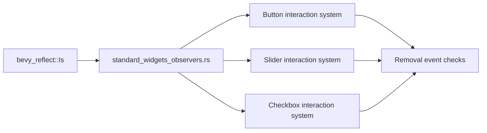

+++
title = "#20991 Use bevy_reflect::Is in standard_widgets_observers and add more comments"
date = "2025-09-13T00:00:00"
draft = false
template = "pull_request_page.html"
in_search_index = true

[taxonomies]
list_display = ["show"]

[extra]
current_language = "en"
available_languages = {"en" = { name = "English", url = "/pull_request/bevy/2025-09/pr-20991-en-20250913" }, "zh-cn" = { name = "中文", url = "/pull_request/bevy/2025-09/pr-20991-zh-cn-20250913" }}
labels = ["C-Examples", "A-UI", "C-Code-Quality"]
+++

# Title
Use bevy_reflect::Is in standard_widgets_observers and add more comments

## Basic Information
- **Title**: Use bevy_reflect::Is in standard_widgets_observers and add more comments
- **PR Link**: https://github.com/bevyengine/bevy/pull/20991
- **Author**: cart
- **Status**: MERGED
- **Labels**: C-Examples, A-UI, C-Code-Quality, S-Ready-For-Final-Review
- **Created**: 2025-09-12T21:31:04Z
- **Merged**: 2025-09-12T23:56:57Z
- **Merged By**: cart

## Description Translation
`Is` has been added to `bevy_reflect`, removing the need to inline it in our examples. I've also taken the chance to add more comments to the standard_widgets examples.

## The Story of This Pull Request

This PR addresses two related issues in Bevy's UI examples. First, it removes code duplication by leveraging a newly available utility from `bevy_reflect`. Second, it improves documentation for a non-obvious edge case in UI event handling.

The core problem was that the `standard_widgets_observers` example contained a custom implementation of the `Is` trait, which provides type checking functionality. This trait was recently added to `bevy_reflect`, making the local implementation redundant. Maintaining duplicate code in examples creates maintenance overhead and sets a poor example for users who might copy this pattern.

The solution was straightforward: replace the custom trait implementation with the official one from `bevy_reflect`. This involved:
1. Adding the import: `use bevy::reflect::Is;`
2. Removing the local trait implementation
3. Updating the Cargo.toml to ensure the reflect feature was available (though this wasn't shown in the diff)

While making these changes, the author also identified an opportunity to improve documentation. The example contained several instances of what appeared to be redundant checks for component removal:

```rust
let pressed = pressed && !(E::is::<Remove>() && C::is::<Pressed>());
```

These checks exist because of a subtle timing issue in Bevy's ECS - the `Remove` event is triggered before the component is actually removed from the entity, meaning the component still appears in queries during event processing. Without these checks, the system would incorrectly process interactions for components that are being removed.

The PR adds clarifying comments at three key locations where this pattern occurs:

```rust
// These "removal event checks" exist because the `Remove` event is triggered _before_ the component is actually
// removed, meaning it still shows up in the query. We're investigating the best way to improve this scenario.
```

These comments serve two purposes: they explain why the seemingly redundant code exists, and they acknowledge that this is a known issue with potential future improvements.

The changes to `standard_widgets.rs` are minor but important - they add a warning about "user experience" issues with the current widget API, setting appropriate expectations for developers who might use this example as reference.

From an architectural perspective, this PR demonstrates good practice in leveraging centralized utilities rather than maintaining local implementations. It also shows thoughtful attention to documentation, particularly for edge cases that might confuse other developers.

## Visual Representation



## Key Files Changed

### `examples/ui/standard_widgets_observers.rs` (+9/-13)

This file received the most significant changes:
1. Added import for `bevy::reflect::Is`
2. Removed custom `Is` trait implementation
3. Added explanatory comments for removal event checks

**Key changes:**
```rust
// Before:
use std::any::{Any, TypeId};
// ... (custom Is trait implementation at end of file)

// After:
use bevy::reflect::Is;
// ... (custom Is trait removed)

// Added comments in three functions:
// These "removal event checks" exist because the `Remove` event is triggered _before_ the component is actually
// removed, meaning it still shows up in the query. We're investigating the best way to improve this scenario.
```

### `examples/ui/standard_widgets.rs` (+2/-1)

This file received minor documentation updates:

```rust
// Before:
//! matures, so please exercise caution if you are using this as a reference for your own code.

// After:
//! matures, so please exercise caution if you are using this as a reference for your own code,
//! and note that there are still "user experience" issues with this API.
```

## Further Reading

- [Bevy Reflect documentation](https://docs.rs/bevy_reflect/latest/bevy_reflect/)
- [Bevy ECS events documentation](https://bevyengine.org/learn/ebook/ecs/events/)
- [Type checking in Rust](https://doc.rust-lang.org/book/ch19-04-advanced-types.html#using-the-newtype-pattern-for-type-safety-and-abstraction)