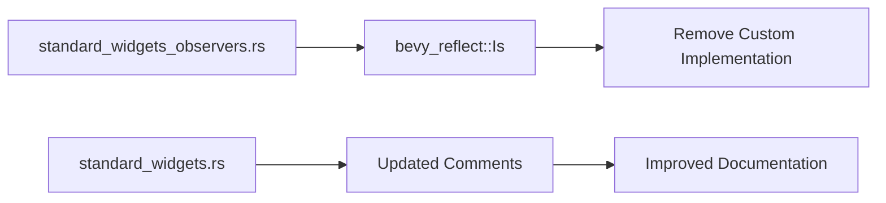

+++
title = "#20991 Use bevy_reflect::Is in standard_widgets_observers and add more comments"
date = "2025-09-13T00:00:00"
draft = false
template = "pull_request_page.html"
in_search_index = false

[extra]
current_language = "zh-cn"
available_languages = {"en" = { name = "English", url = "/pull_request/bevy/2025-09/pr-20991-en-20250913" }, "zh-cn" = { name = "中文", url = "/pull_request/bevy/2025-09/pr-20991-zh-cn-20250913" }}
labels = ["C-Examples", "A-UI", "C-Code-Quality"]
+++

# Title

## Basic Information
- **Title**: Use bevy_reflect::Is in standard_widgets_observers and add more comments
- **PR Link**: https://github.com/bevyengine/bevy/pull/20991
- **Author**: cart
- **Status**: MERGED
- **Labels**: C-Examples, A-UI, C-Code-Quality, S-Ready-For-Final-Review
- **Created**: 2025-09-12T21:31:04Z
- **Merged**: 2025-09-12T23:56:57Z
- **Merged By**: cart

## Description Translation
`Is` 已被添加到 `bevy_reflect`，无需在我们的示例中内联它。我也借此机会为 standard_widgets 示例添加了更多注释。

## The Story of This Pull Request

这个PR主要解决了一个代码重复问题并改善了示例代码的文档质量。问题的核心在于UI示例中重复实现了一个类型检查工具函数，而相同的功能现在已经在bevy_reflect中作为标准API提供。

在之前的实现中，`standard_widgets_observers.rs` 文件底部定义了一个自定义的 `Is` trait：

```rust
trait Is {
    fn is<T: Any>() -> bool;
}

impl<A: Any> Is for A {
    #[inline]
    fn is<T: Any>() -> bool {
        TypeId::of::<A>() == TypeId::of::<T>()
    }
}
```

这个trait提供了类型检查功能，用于判断泛型类型参数 `A` 是否与类型 `T` 相同。随着bevy_reflect模块的成熟，这个功能被正式纳入标准库，现在可以通过 `bevy::reflect::Is` 直接使用。

PR的作者cart做了两个主要改动：首先移除了自定义的 `Is` trait实现，改为导入和使用标准库版本；其次为三个事件处理函数添加了详细的注释，解释了代码中处理组件移除事件时的特殊逻辑。

这些注释特别重要，因为它们解释了代码中看似反直觉的逻辑：

```rust
// These "removal event checks" exist because the `Remove` event is triggered _before_ 
// the component is actually removed, meaning it still shows up in the query. 
// We're investigating the best way to improve this scenario.
```

这个注释说明了为什么需要在检查 `Pressed`、`InteractionDisabled` 和 `Checked` 状态时特别处理 `Remove` 事件 - 因为组件移除事件触发时，组件实际上还没有从实体中移除，仍然会在查询中可见。

从技术角度来看，这个PR展示了良好的代码维护实践：
1. **消除重复代码**：移除自定义实现，使用标准库功能
2. **改善文档**：为复杂的时序相关问题添加解释性注释  
3. **保持一致性**：两个UI示例文件都更新了警告注释，提醒开发者这些API仍处于实验阶段

这种改动虽然不大，但对于示例代码的质量和可维护性有重要意义。示例代码作为其他开发者的参考，应该展示最佳实践和使用标准API的方式。

## Visual Representation



## Key Files Changed

### `examples/ui/standard_widgets_observers.rs` (+9/-13)

这个文件是主要修改对象，移除了自定义的 `Is` trait 实现，改为使用标准库版本，并添加了重要的注释。

**主要变更：**
```rust
// 添加标准库导入
use bevy::reflect::Is;

// 移除自定义实现（文件底部）：
// trait Is {
//     fn is<T: Any>() -> bool;
// }
// 
// impl<A: Any> Is for A {
//     #[inline]
//     fn is<T: Any>() -> bool {
//         TypeId::of::<A>() == TypeId::of::<T>()
//     }
// }

// 在三个关键函数中添加了相同的注释：
// These "removal event checks" exist because the `Remove` event is triggered _before_ 
// the component is actually removed, meaning it still shows up in the query. 
// We're investigating the best way to improve this scenario.
```

### `examples/ui/standard_widgets.rs` (+2/-1)

这个文件只做了小的文档更新，改进了警告信息。

**变更：**
```rust
// 更新前的注释：
// matures, so please exercise caution if you are using this as a reference for your own code.

// 更新后的注释：  
// matures, so please exercise caution if you are using this as a reference for your own code,
// and note that there are still "user experience" issues with this API.
```

## Further Reading

- [Bevy Reflect Documentation](https://docs.rs/bevy_reflect/latest/bevy_reflect/)
- [Rust TypeId Documentation](https://doc.rust-lang.org/std/any/struct.TypeId.html)
- [Bevy UI Widgets Development](https://github.com/bevyengine/bevy/tree/main/crates/bevy_ui_widgets)