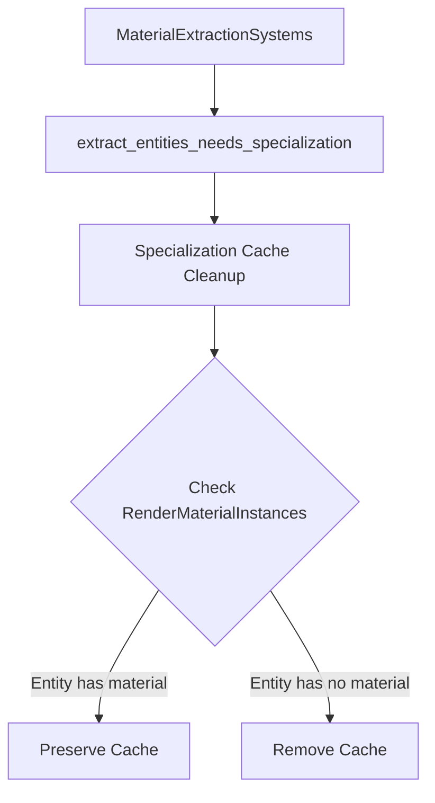

+++
title = "#20993 Make specialization cache cleanup respect material swaps"
date = "2025-09-13T00:00:00"
draft = false
template = "pull_request_page.html"
in_search_index = true

[taxonomies]
list_display = ["show"]

[extra]
current_language = "en"
available_languages = {"en" = { name = "English", url = "/pull_request/bevy/2025-09/pr-20993-en-20250913" }, "zh-cn" = { name = "中文", url = "/pull_request/bevy/2025-09/pr-20993-zh-cn-20250913" }}
labels = ["C-Bug", "A-Rendering"]
+++

# Title: Make specialization cache cleanup respect material swaps

## Basic Information
- **Title**: Make specialization cache cleanup respect material swaps
- **PR Link**: https://github.com/bevyengine/bevy/pull/20993
- **Author**: tychedelia
- **Status**: MERGED
- **Labels**: C-Bug, A-Rendering, S-Needs-Review
- **Created**: 2025-09-12T22:45:08Z
- **Merged**: 2025-09-13T06:07:52Z
- **Merged By**: mockersf

## Description Translation
# Objective

Swapping material types can break specialization caches.

Fixes #20992.

## Solution

Make sure that type erased bookkeeping (i.e. `RenderMaterialInstances`) runs first so that we can know whether the material was actually removed or just swapped.

## Testing

Example in #20992. Tested also with 2d and didn't seem to be an issue there.

## The Story of This Pull Request

The core issue addressed in this PR was a subtle bug in Bevy's material specialization system. When materials were swapped between different types (for example, from `StandardMaterial` to `CustomMaterial`), the specialization cache cleanup was incorrectly removing entries that were still valid.

The problem occurred because the system responsible for cleaning up specialization caches (`extract_entities_needs_specialization`) was processing removed material components before the type-erased bookkeeping system (`MaterialExtractionSystems`) had completed its work. This meant the cleanup system couldn't distinguish between a material being completely removed versus being swapped to a different type.

The solution involved two key changes:

1. **System Ordering Adjustment**: Modified the system ordering to ensure `extract_entities_needs_specialization` runs after `MaterialExtractionSystems`, allowing the type-erased bookkeeping to complete first.

2. **Additional Validation Check**: Added a check in the cleanup logic to verify whether an entity still has a valid material instance in the `RenderMaterialInstances` collection before removing its specialization cache.

The implementation maintains the existing cleanup logic for truly removed materials while preserving the cache when materials are simply swapped. This ensures that material specialization continues to work correctly across material type changes, preventing unnecessary recompilation of specialized shaders and maintaining rendering performance.

The changes are minimal and surgical, affecting only the specific cleanup logic without altering the broader material system architecture. This approach preserves existing functionality while fixing the edge case of material swapping.

## Visual Representation



## Key Files Changed

### `crates/bevy_pbr/src/material.rs` (+17/-1)

This file contains the core material system implementation for Bevy's PBR rendering. The changes ensure proper ordering between material extraction and specialization cleanup systems, and add validation to prevent incorrect cache invalidation during material swaps.

**Key changes:**

1. **System ordering adjustment** - Ensures specialization cleanup runs after material extraction:
```rust
// Before:
extract_entities_needs_specialization::<M>.after(extract_cameras),

// After:
extract_entities_needs_specialization::<M>
    .after(extract_cameras)
    .after(MaterialExtractionSystems),
```

2. **Additional validation check** - Prevents incorrect cache removal during material swaps:
```rust
// Added check in cleanup logic:
for entity in removed_mesh_material_components.read() {
    if material_instances
        .instances
        .contains_key(&MainEntity::from(entity))
    {
        continue;
    }
    // ... existing cleanup logic
}
```

These changes work together to ensure that when materials are swapped (not completely removed), the specialization cache is preserved, preventing unnecessary recompilation and maintaining rendering performance.

## Further Reading

- [Bevy Material System Documentation](https://bevyengine.org/learn/books/introduction/3d-rendering/concepts/materials)
- [Specialization in Bevy](https://bevyengine.org/learn/books/introduction/3d-rendering/concepts/specialization)
- [System Ordering in Bevy](https://bevyengine.org/learn/books/introduction/programming/system-order)
- [Entity Component System Pattern](https://en.wikipedia.org/wiki/Entity_component_system)