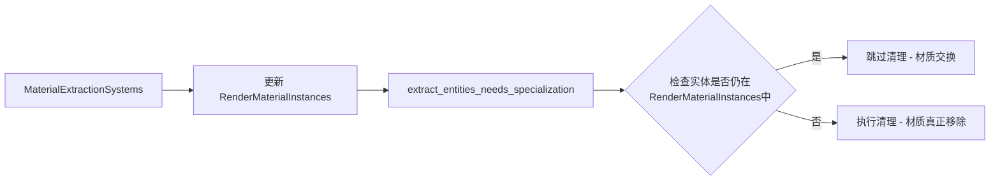

+++
title = "#20993 Make specialization cache cleanup respect material swaps"
date = "2025-09-13T00:00:00"
draft = false
template = "pull_request_page.html"
in_search_index = false

[extra]
current_language = "zh-cn"
available_languages = {"en" = { name = "English", url = "/pull_request/bevy/2025-09/pr-20993-en-20250913" }, "zh-cn" = { name = "中文", url = "/pull_request/bevy/2025-09/pr-20993-zh-cn-20250913" }}
labels = ["C-Bug", "A-Rendering"]
+++

# Make specialization cache cleanup respect material swaps

## Basic Information
- **Title**: Make specialization cache cleanup respect material swaps
- **PR Link**: https://github.com/bevyengine/bevy/pull/20993
- **Author**: tychedelia
- **Status**: MERGED
- **Labels**: C-Bug, A-Rendering, S-Needs-Review
- **Created**: 2025-09-12T22:45:08Z
- **Merged**: 2025-09-13T06:07:52Z
- **Merged By**: mockersf

## Description Translation
修复材质类型交换会破坏 specialization 缓存的问题。

修复 #20992。

## 解决方案
确保类型擦除的簿记（即 `RenderMaterialInstances`）首先运行，以便我们可以知道材质是被实际移除还是仅仅被交换。

## 测试
使用 #20992 中的示例进行测试。同时在 2D 中测试，似乎在那里不是问题。

## The Story of This Pull Request

这个 PR 解决了 Bevy 渲染系统中一个关于材质 specialization 缓存清理的边界情况问题。问题的核心在于当材质类型被交换时，系统会错误地清理 specialization 缓存，导致渲染异常。

### 问题背景
在 Bevy 的 PBR 渲染系统中，材质使用 specialization 机制来优化不同材质类型的渲染管线。系统需要跟踪每个实体的材质状态，并在材质被移除时清理对应的 specialization 缓存。然而，当材质类型被交换时（例如从 StandardMaterial 切换到 CustomMaterial），系统会将此视为材质移除事件，即使实体仍然拥有有效材质（只是类型不同）。

### 解决方案
PR 采用了两个关键修改来解决这个问题：

1. **调整系统顺序**：确保 `extract_entities_needs_specialization` 系统在 `MaterialExtractionSystems` 之后运行，这样类型擦除的簿记系统（`RenderMaterialInstances`）会先更新。

2. **添加有效性检查**：在清理 specialization 缓存前，先检查实体是否仍然存在于 `RenderMaterialInstances` 中。如果存在，说明材质只是被交换而非真正移除，跳过清理操作。

### 实现细节
主要修改在 `extract_entities_needs_specialization` 函数中。原来当检测到材质组件被移除时，会立即清理对应的 specialization 缓存：

```rust
for entity in removed_mesh_material_components.read() {
    entity_specialization_ticks.remove(&MainEntity::from(entity));
    // ... 清理缓存逻辑
}
```

现在添加了检查逻辑：

```rust
for entity in removed_mesh_material_components.read() {
    if material_instances
        .instances
        .contains_key(&MainEntity::from(entity))
    {
        continue;
    }
    // ... 只有在材质真正移除时才执行清理
}
```

### 技术洞察
这个解决方案巧妙地利用了类型擦除的 `RenderMaterialInstances` 资源作为真相来源。由于这个资源包含了所有类型的材质实例，我们可以通过检查实体是否仍然存在于这个资源中来区分"材质交换"和"真正移除"两种情况。

### 影响
这个修复确保了材质交换操作不会错误地触发 specialization 缓存清理，解决了 #20992 中报告的渲染异常问题。修改是精准且最小化的，只影响了缓存清理的逻辑，不会对性能产生负面影响。

## Visual Representation



## Key Files Changed

### `crates/bevy_pbr/src/material.rs` (+17/-1)

这个文件包含了所有的修改。主要变更包括：

1. 调整系统顺序约束，确保 `extract_entities_needs_specialization` 在 `MaterialExtractionSystems` 之后运行
2. 在清理 specialization 缓存前添加有效性检查

关键代码变更：

```rust
// 系统顺序调整
extract_entities_needs_specialization::<M>
    .after(extract_cameras)
    .after(MaterialExtractionSystems),

// 清理逻辑中添加检查
for entity in removed_mesh_material_components.read() {
    if material_instances
        .instances
        .contains_key(&MainEntity::from(entity))
    {
        continue;
    }
    // ... 原有清理逻辑
}
```

## Further Reading

- [Bevy 官方文档 - 材质系统](https://bevyengine.org/learn/books/bevy-guide/next/features/materials/)
- [Specialization 在图形编程中的应用](https://en.wikipedia.org/wiki/Specialization_(logic))
- [Bevy 系统顺序和依赖管理](https://bevyengine.org/learn/books/bevy-guide/next/features/system-order/)