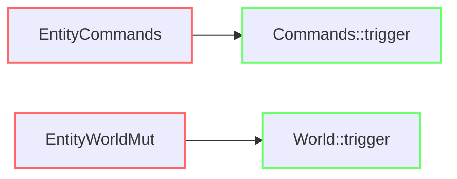

+++
title = "#20994 Add deprecated EntityCommands::trigger and EntityWorldMut::trigger"
date = "2025-09-13T00:00:00"
draft = false
template = "pull_request_page.html"
in_search_index = true

[taxonomies]
list_display = ["show"]

[extra]
current_language = "en"
available_languages = {"en" = { name = "English", url = "/pull_request/bevy/2025-09/pr-20994-en-20250913" }, "zh-cn" = { name = "中文", url = "/pull_request/bevy/2025-09/pr-20994-zh-cn-20250913" }}
labels = ["A-ECS", "C-Usability"]
+++

# Add deprecated EntityCommands::trigger and EntityWorldMut::trigger

## Basic Information
- **Title**: Add deprecated EntityCommands::trigger and EntityWorldMut::trigger
- **PR Link**: https://github.com/bevyengine/bevy/pull/20994
- **Author**: cart
- **Status**: MERGED
- **Labels**: A-ECS, C-Usability, S-Ready-For-Final-Review
- **Created**: 2025-09-13T00:08:48Z
- **Merged**: 2025-09-13T00:56:31Z
- **Merged By**: alice-i-cecile

## Description Translation
# Objective

These methods were removed in #20731. It is more helpful to deprecate them.

## Solution

- Re-add them, and print a warning that they no longer fire for the current entity.

## The Story of This Pull Request

This PR addresses a breaking change that occurred in PR #20731, where the `trigger` methods were completely removed from `EntityCommands` and `EntityWorldMut`. While removing deprecated functionality is necessary for codebase maintenance, completely removing methods without a deprecation period can create migration challenges for users.

The core issue was that these methods were removed abruptly, giving users no warning or migration path. This approach follows better software engineering practices by providing a deprecation period with clear warnings, allowing users to update their code gradually while maintaining backward compatibility.

The implementation adds back both methods with several key features:
1. **Deprecation attributes** that clearly indicate when the methods were deprecated and provide migration guidance
2. **Warning messages** that log to the console when the methods are used
3. **Forwarding functionality** that maintains the existing API surface while directing users to the new approach

For `EntityCommands::trigger`, the method now delegates to `Commands::trigger` after logging the deprecation warning. Similarly, `EntityWorldMut::trigger` uses `world_scope` to call `World::trigger`. Both methods maintain the same signature but now provide clear guidance on the preferred approach.

This change demonstrates good API evolution practices - instead of breaking existing code immediately, it provides a migration path with clear documentation and warnings. The methods will eventually be removed, but users now have time to update their codebase.

## Visual Representation



## Key Files Changed

### `crates/bevy_ecs/src/system/commands/mod.rs` (+15/-0)
Added a deprecated `trigger` method to `EntityCommands` that forwards to `Commands::trigger` with a warning.

```rust
/// Deprecated. Use [`Commands::trigger`] instead.
#[track_caller]
#[deprecated(
    since = "0.17.0",
    note = "Use Commands::trigger with an EntityEvent instead."
)]
pub fn trigger<'t, E: EntityEvent>(
    &mut self,
    event: impl EntityEvent<Trigger<'t>: Default>,
) -> &mut Self {
    log::warn!("EntityCommands::trigger is deprecated and no longer triggers the event for the current EntityCommands entity. Use Commands::trigger instead with an EntityEvent.");
    self.commands.trigger(event);
    self
}
```

### `crates/bevy_ecs/src/world/entity_ref.rs` (+14/-0)
Added a deprecated `trigger` method to `EntityWorldMut` that forwards to `World::trigger` with a warning.

```rust
/// Deprecated. Use [`World::trigger`] instead.
#[track_caller]
#[deprecated(
    since = "0.17.0",
    note = "Use World::trigger with an EntityEvent instead."
)]
pub fn trigger<'t>(&mut self, event: impl EntityEvent<Trigger<'t>: Default>) -> &mut Self {
    log::warn!("EntityWorldMut::trigger is deprecated and no longer triggers the event for the current EntityWorldMut entity. Use World::trigger instead with an EntityEvent.");
    self.world_scope(|world| {
        world.trigger(event);
    });
    self
}
```

## Further Reading

- [Rust Deprecation Attributes](https://doc.rust-lang.org/reference/attributes/diagnostics.html#the-deprecated-attribute)
- [Semantic Versioning and Breaking Changes](https://semver.org/)
- [Bevy ECS Documentation](https://bevyengine.org/learn/book/ecs/)