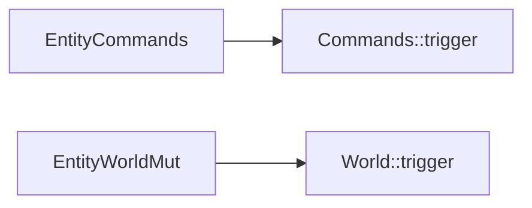

+++
title = "#20994 Add deprecated EntityCommands::trigger and EntityWorldMut::trigger"
date = "2025-09-13T00:00:00"
draft = false
template = "pull_request_page.html"
in_search_index = false

[extra]
current_language = "zh-cn"
available_languages = {"en" = { name = "English", url = "/pull_request/bevy/2025-09/pr-20994-en-20250913" }, "zh-cn" = { name = "中文", url = "/pull_request/bevy/2025-09/pr-20994-zh-cn-20250913" }}
labels = ["A-ECS", "C-Usability"]
+++

# Add deprecated EntityCommands::trigger and EntityWorldMut::trigger

## Basic Information
- **Title**: Add deprecated EntityCommands::trigger and EntityWorldMut::trigger
- **PR Link**: https://github.com/bevyengine/bevy/pull/20994
- **Author**: cart
- **Status**: MERGED
- **Labels**: A-ECS, C-Usability, S-Ready-For-Final-Review
- **Created**: 2025-09-13T00:08:48Z
- **Merged**: 2025-09-13T00:56:31Z
- **Merged By**: alice-i-cecile

## Description Translation
# 目标

这些方法在 #20731 中被移除了。将它们标记为弃用(deprecated)更有帮助。

## 解决方案

- 重新添加这些方法，并打印警告信息说明它们不再对当前实体触发事件。

## The Story of This Pull Request

这个PR处理的是一个API演进过程中的常见问题：当核心功能被重构后，如何平滑地迁移旧API。在PR #20731 中，`EntityCommands::trigger` 和 `EntityWorldMut::trigger` 方法被完全移除，但这导致了直接的用户体验问题——使用这些方法的代码会突然编译失败，没有明确的迁移指引。

开发者面临的问题是：突然移除API会破坏现有代码，给用户带来不便。更好的做法是提供过渡期，通过弃用警告来引导用户迁移到新的API。这符合语义化版本控制的最佳实践，在主要版本更新前提供向后兼容的过渡方案。

解决方案很直接：重新引入这两个方法，但添加`#[deprecated]`属性标记它们为弃用状态，同时在方法实现中添加警告日志，明确告知用户应该使用的新API路径。这样既保持了代码的向后兼容性，又提供了清晰的迁移指引。

技术实现上，两个方法都保持了原有的函数签名，但内部实现改为：
1. 输出警告日志说明方法已弃用
2. 调用新的推荐API（`Commands::trigger` 或 `World::trigger`）
3. 返回self以保持链式调用能力

这种模式是Rust生态系统中处理API弃用的标准做法，既给了用户过渡时间，又确保了代码的清晰性和可维护性。

## Visual Representation



## Key Files Changed

### `crates/bevy_ecs/src/system/commands/mod.rs` (+15/-0)
为`EntityCommands`结构体重新添加了已弃用的`trigger`方法，提供向后兼容性和迁移指引。

```rust
/// Deprecated. Use [`Commands::trigger`] instead.
#[track_caller]
#[deprecated(
    since = "0.17.0",
    note = "Use Commands::trigger with an EntityEvent instead."
)]
pub fn trigger<'t, E: EntityEvent>(
    &mut self,
    event: impl EntityEvent<Trigger<'t>: Default>,
) -> &mut Self {
    log::warn!("EntityCommands::trigger is deprecated and no longer triggers the event for the current EntityCommands entity. Use Commands::trigger instead with an EntityEvent.");
    self.commands.trigger(event);
    self
}
```

### `crates/bevy_ecs/src/world/entity_ref.rs` (+14/-0)
为`EntityWorldMut`结构体重新添加了已弃用的`trigger`方法，提供向后兼容性。

```rust
/// Deprecated. Use [`World::trigger`] instead.
#[track_caller]
#[deprecated(
    since = "0.17.0",
    note = "Use World::trigger with an EntityEvent instead."
)]
pub fn trigger<'t>(&mut self, event: impl EntityEvent<Trigger<'t>: Default>) -> &mut Self {
    log::warn!("EntityWorldMut::trigger is deprecated and no longer triggers the event for the current EntityWorldMut entity. Use World::trigger instead with an EntityEvent.");
    self.world_scope(|world| {
        world.trigger(event);
    });
    self
}
```

## Further Reading

- [Rust #[deprecated] attribute documentation](https://doc.rust-lang.org/reference/attributes/diagnostics.html#the-deprecated-attribute)
- [Semantic Versioning guidelines](https://semver.org/)
- [Bevy ECS Commands documentation](https://docs.rs/bevy_ecs/latest/bevy_ecs/system/struct.Commands.html)
- [API Evolution Best Practices](https://rust-lang.github.io/rfcs/1105-api-evolution.html)

# Full Code Diff
```diff
diff --git a/crates/bevy_ecs/src/system/commands/mod.rs b/crates/bevy_ecs/src/system/commands/mod.rs
index 13967a46ddf61..2348c12ba1b20 100644
--- a/crates/bevy_ecs/src/system/commands/mod.rs
+++ b/crates/bevy_ecs/src/system/commands/mod.rs
@@ -2258,6 +2258,21 @@ impl<'a> EntityCommands<'a> {
     pub fn move_components<B: Bundle>(&mut self, target: Entity) -> &mut Self {
         self.queue(entity_command::move_components::<B>(target))
     }
+
+    /// Deprecated. Use [`Commands::trigger`] instead.
+    #[track_caller]
+    #[deprecated(
+        since = "0.17.0",
+        note = "Use Commands::trigger with an EntityEvent instead."
+    )]
+    pub fn trigger<'t, E: EntityEvent>(
+        &mut self,
+        event: impl EntityEvent<Trigger<'t>: Default>,
+    ) -> &mut Self {
+        log::warn!("EntityCommands::trigger is deprecated and no longer triggers the event for the current EntityCommands entity. Use Commands::trigger instead with an EntityEvent.");
+        self.commands.trigger(event);
+        self
+    }
 }
 
 /// A wrapper around [`EntityCommands`] with convenience methods for working with a specified component type.
diff --git a/crates/bevy_ecs/src/world/entity_ref.rs b/crates/bevy_ecs/src/world/entity_ref.rs
index 59d8b97de7f3e..f7b73c19bd822 100644
--- a/crates/bevy_ecs/src/world/entity_ref.rs
+++ b/crates/bevy_ecs/src/world/entity_ref.rs
@@ -3159,6 +3159,20 @@ impl<'w> EntityWorldMut<'w> {
             })
         })
     }
+
+    /// Deprecated. Use [`World::trigger`] instead.
+    #[track_caller]
+    #[deprecated(
+        since = "0.17.0",
+        note = "Use World::trigger with an EntityEvent instead."
+    )]
+    pub fn trigger<'t>(&mut self, event: impl EntityEvent<Trigger<'t>: Default>) -> &mut Self {
+        log::warn!("EntityWorldMut::trigger is deprecated and no longer triggers the event for the current EntityWorldMut entity. Use World::trigger instead with an EntityEvent.");
+        self.world_scope(|world| {
+            world.trigger(event);
+        });
+        self
+    }
 }
 
 /// A view into a single entity and component in a world, which may either be vacant or occupied.
```