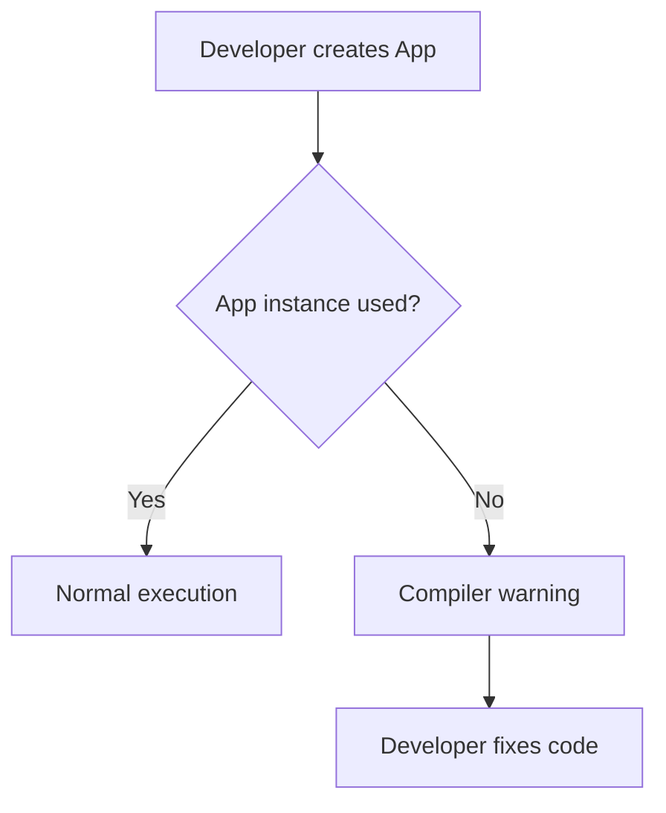

+++
title = "#20995 Gave bevy::app::App the must_use attribute"
date = "2025-09-14T00:00:00"
draft = false
template = "pull_request_page.html"
in_search_index = true

[taxonomies]
list_display = ["show"]

[extra]
current_language = "en"
available_languages = {"en" = { name = "English", url = "/pull_request/bevy/2025-09/pr-20995-en-20250914" }, "zh-cn" = { name = "中文", url = "/pull_request/bevy/2025-09/pr-20995-zh-cn-20250914" }}
labels = ["C-Usability", "A-App", "D-Straightforward"]
+++

# Gave bevy::app::App the must_use attribute

## Basic Information
- **Title**: Gave bevy::app::App the must_use attribute
- **PR Link**: https://github.com/bevyengine/bevy/pull/20995
- **Author**: shoobooshooboo
- **Status**: MERGED
- **Labels**: C-Usability, A-App, D-Straightforward, S-Needs-Review
- **Created**: 2025-09-13T00:18:47Z
- **Merged**: 2025-09-14T19:35:50Z
- **Merged By**: mockersf

## Description Translation
# Objective

Attempts #5386

## Solution

Added the `must_use` attribute to `bevy::app::App` 

## Testing

I tested it by linking the library to another cargo package and calling App::new() without using the return value.

(this is my first pr, so i just chose something very easy.)

## The Story of This Pull Request

This PR addresses a straightforward but important usability improvement in the Bevy engine. The core issue was that developers could create an `App` instance without using it, which would compile without warnings but represent a logical error in most cases.

The `App` struct in Bevy is the central component for building and running applications. Creating an instance without eventually calling methods like `run()` or using it to configure systems would be meaningless - the app wouldn't actually do anything. This is a common pitfall, especially for developers new to the framework.

The solution implemented here leverages Rust's built-in `#[must_use]` attribute. When applied to a type, this attribute generates compiler warnings when instances of that type are created but not used. This provides immediate feedback to developers who might have forgotten to properly utilize their App instance.

The implementation is minimal but effective - a single attribute addition that provides guardrails against a common mistake. This follows Rust's philosophy of catching errors at compile time rather than runtime.

From an engineering perspective, this change demonstrates good API design practice. It makes the framework more discoverable and helps prevent user errors without adding runtime overhead. The attribute is purely a compile-time check that doesn't affect the generated code or performance.

The testing approach described in the PR is practical and appropriate for this type of change. By creating a separate package that attempts to use App without storing the result, the author verified that the compiler would indeed generate the expected warning.

This change fits well within Bevy's focus on developer experience and follows established patterns in the Rust ecosystem. Many foundational types in standard library and popular crates use `must_use` to prevent similar classes of errors.

## Visual Representation



## Key Files Changed

**File: crates/bevy_app/src/app.rs**

This is the only file modified in the PR. The change adds the `#[must_use]` attribute to the App struct definition.

**Before:**
```rust
pub struct App {
    pub(crate) sub_apps: SubApps,
    /// The function that will manage the app's lifecycle.
    pub(crate) runner: Box<dyn AppRunner>,
    pub(crate) schedule: Schedule,
    // ... other fields
}
```

**After:**
```rust
#[must_use]
pub struct App {
    pub(crate) sub_apps: SubApps,
    /// The function that will manage the app's lifecycle.
    pub(crate) runner: Box<dyn AppRunner>,
    pub(crate) schedule: Schedule,
    // ... other fields
}
```

The change is minimal but significant - it adds compiler-enforced guidance that helps prevent a common class of user errors when working with Bevy's application framework.

## Further Reading

- [Rust Documentation: The must_use Attribute](https://doc.rust-lang.org/reference/attributes/diagnostics.html#the-must_use-attribute)
- [Rust API Guidelines: C-COMMON-TRAITS](https://rust-lang.github.io/api-guidelines/interoperability.html#types-eagerly-implement-common-traits-c-common-traits)
- [Bevy Engine Documentation: App](https://docs.rs/bevy/latest/bevy/app/struct.App.html)

# Full Code Diff
```diff
diff --git a/crates/bevy_app/src/app.rs b/crates/bevy_app/src/app.rs
index 6985d9169af32..5e0021afe43ce 100644
--- a/crates/bevy_app/src/app.rs
+++ b/crates/bevy_app/src/app.rs
@@ -77,6 +77,7 @@ pub(crate) enum AppError {
 ///    println!("hello world");
 /// }
 /// */
+#[must_use]
 pub struct App {
     pub(crate) sub_apps: SubApps,
     /// The function that will manage the app's lifecycle.
```