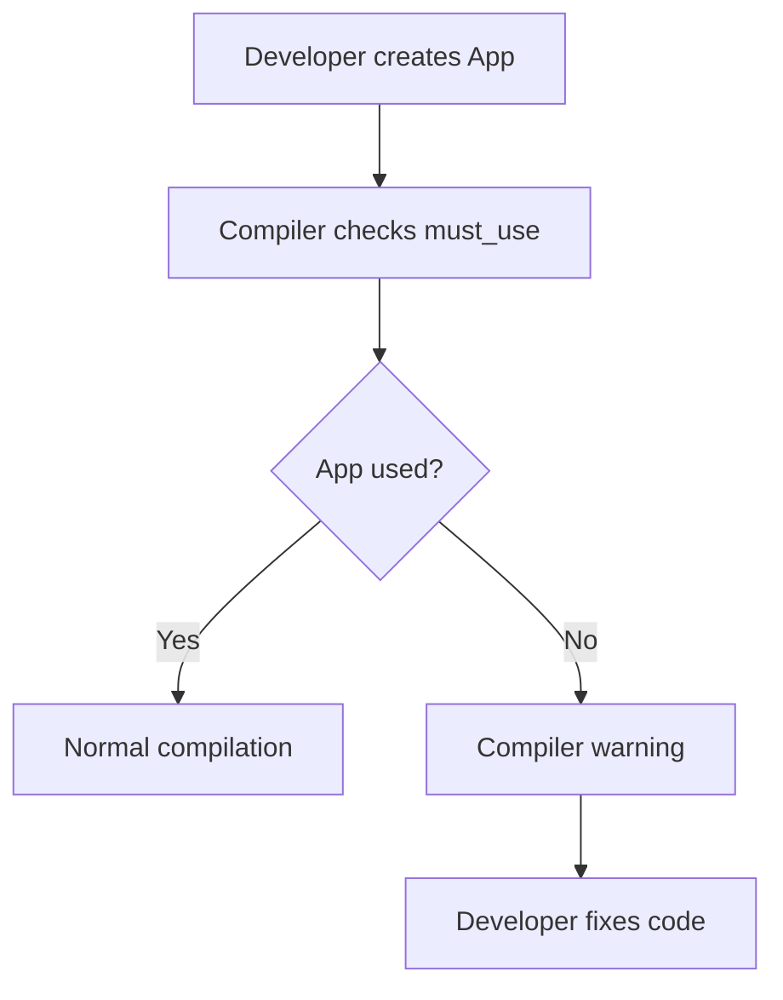

+++
title = "#20995 Gave bevy::app::App the must_use attribute"
date = "2025-09-14T00:00:00"
draft = false
template = "pull_request_page.html"
in_search_index = false

[extra]
current_language = "zh-cn"
available_languages = {"en" = { name = "English", url = "/pull_request/bevy/2025-09/pr-20995-en-20250914" }, "zh-cn" = { name = "中文", url = "/pull_request/bevy/2025-09/pr-20995-zh-cn-20250914" }}
labels = ["C-Usability", "A-App", "D-Straightforward"]
+++

# Gave bevy::app::App the must_use attribute

## Basic Information
- **Title**: Gave bevy::app::App the must_use attribute
- **PR Link**: https://github.com/bevyengine/bevy/pull/20995
- **Author**: shoobooshooboo
- **Status**: MERGED
- **Labels**: C-Usability, A-App, D-Straightforward, S-Needs-Review
- **Created**: 2025-09-13T00:18:47Z
- **Merged**: 2025-09-14T19:35:50Z
- **Merged By**: mockersf

## Description Translation
尝试解决 #5386

## 解决方案

为 `bevy::app::App` 添加了 `must_use` 属性

## 测试

我通过将库链接到另一个 cargo 包并调用 App::new() 而不使用返回值来测试它。

（这是我的第一个 PR，所以我选择了一个非常简单的任务。）

## The Story of This Pull Request

这个 PR 解决了一个简单的但重要的开发者体验问题。在 Bevy 引擎中，`App` 结构体是应用程序的核心入口点，开发者需要通过创建 App 实例并配置各种系统来构建应用程序。然而，在没有 `must_use` 属性的情况下，开发者可能会意外地创建 App 实例却不使用它，这会导致应用程序实际上不会运行。

问题的核心在于 Rust 编译器默认不会对未使用的值发出警告，特别是当这个值具有副作用时。对于 Bevy 的 `App` 类型来说，创建后不使用几乎总是一个错误，因为应用程序需要明确调用 `run()` 方法才能启动游戏循环。

解决方案直接而有效：在 `App` 结构体定义上方添加 `#[must_use]` 属性。这个属性会指示 Rust 编译器在遇到未使用的 `App` 实例时产生警告。这样开发者就能在编译阶段及时发现并纠正这个常见的错误模式。

从技术实现角度来看，这个更改非常简洁：

```rust
#[must_use]
pub struct App {
    pub(crate) sub_apps: SubApps,
    /// 将管理应用程序生命周期的函数。
    pub(crate) runner: Box<dyn AppRunner>,
    // ... 其他字段
}
```

这个更改的影响是立即且积极的：
1. 提高了代码安全性：防止了无意的应用程序初始化后不运行的情况
2. 改善了开发者体验：在编译时提供清晰的警告信息
3. 保持了向后兼容性：不改变任何现有 API，只是添加了编译器检查

这是一个典型的质量改进 PR，展示了如何通过最小的代码更改获得显著的用户体验提升。对于新手贡献者来说，这也是一个很好的入门级更改，既安全又有实际价值。

## Visual Representation



## Key Files Changed

**crates/bevy_app/src/app.rs** (+1/-0)
- 在 App 结构体定义前添加了 `#[must_use]` 属性
- 这个更改确保了未使用的 App 实例会在编译时产生警告

```rust
// 更改前:
pub struct App {
    // ... 字段定义
}

// 更改后:
#[must_use]
pub struct App {
    // ... 字段定义
}
```

## Further Reading

- [Rust must_use attribute documentation](https://doc.rust-lang.org/reference/attributes/diagnostics.html#the-must_use-attribute)
- [Bevy App documentation](https://docs.rs/bevy/latest/bevy/app/struct.App.html)
- [Rust Clippy lints for unused values](https://rust-lang.github.io/rust-clippy/master/index.html#/unused_io_amount)