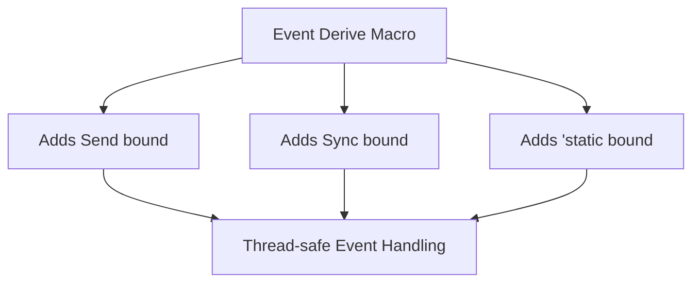

+++
title = "#20996 Automatically add Send + Sync + 'static bounds to Event / EntityEvent derives"
date = "2025-09-13T00:00:00"
draft = false
template = "pull_request_page.html"
in_search_index = true

[taxonomies]
list_display = ["show"]

[extra]
current_language = "en"
available_languages = {"en" = { name = "English", url = "/pull_request/bevy/2025-09/pr-20996-en-20250913" }, "zh-cn" = { name = "中文", url = "/pull_request/bevy/2025-09/pr-20996-zh-cn-20250913" }}
labels = ["A-ECS", "C-Usability"]
+++

# Automatically add Send + Sync + 'static bounds to Event / EntityEvent derives

## Basic Information
- **Title**: Automatically add Send + Sync + 'static bounds to Event / EntityEvent derives
- **PR Link**: https://github.com/bevyengine/bevy/pull/20996
- **Author**: cart
- **Status**: MERGED
- **Labels**: A-ECS, C-Usability, S-Ready-For-Final-Review
- **Created**: 2025-09-13T00:18:54Z
- **Merged**: 2025-09-13T01:04:40Z
- **Merged By**: alice-i-cecile

## Description Translation
# Objective

The Event derive used to add these bounds on behalf of developers, but the new macros in #20731 don't do that. This removed the need for developers to specify the bounds themselves for Events that use generics.

## Solution

Automatically add `Self: Send + Sync + 'static` bounds to the `Event` and `EntityEvent` derives

## The Story of This Pull Request

This PR addresses a regression introduced in PR #20731 where new macro implementations for Event and EntityEvent derives stopped automatically adding essential trait bounds. The problem was that events using generics would now require manual specification of Send, Sync, and 'static bounds, which was both error-prone and reduced developer productivity.

The solution was straightforward but critical: modify both the `derive_event` and `derive_entity_event` macros to automatically inject `Self: Send + Sync + 'static` bounds into the generated code. These bounds are non-negotiable requirements for Bevy's ECS system since events need to be safely shared across threads (Send/Sync) and have static lifetimes to be stored in the event system.

The implementation modifies the abstract syntax tree (AST) during macro expansion to add these bounds to the where clause of the generated implementation. If the type already satisfies these constraints, the bounds are harmless. If not, the compiler will provide clear error messages indicating why the type cannot be used as an event.

This change maintains backward compatibility while restoring the convenience that developers expected from the Event system. It eliminates a potential source of confusion where developers might encounter confusing compiler errors about missing trait bounds when using generic events.

## Visual Representation



## Key Files Changed

**File: `crates/bevy_ecs/macros/src/event.rs`**

This file contains the macro implementations for both `Event` and `EntityEvent` derives. The changes ensure that both macros automatically add the required trait bounds.

**Key changes in `derive_event` function:**
```rust
// Before:
let ast = parse_macro_input!(input as DeriveInput);

// After:
let mut ast = parse_macro_input!(input as DeriveInput);
ast.generics
    .make_where_clause()
    .predicates
    .push(parse_quote! { Self: Send + Sync + 'static });
```

**Key changes in `derive_entity_event` function:**
```rust
// Before:
let ast = parse_macro_input!(input as DeriveInput);

// After:
let mut ast = parse_macro_input!(input as DeriveInput);
ast.generics
    .make_where_clause()
    .predicates
    .push(parse_quote! { Self: Send + Sync + 'static });
```

These changes ensure that any type deriving `Event` or `EntityEvent` will automatically have the required bounds added to its where clause, eliminating the need for manual specification.

## Further Reading

- [Rust Send and Sync traits](https://doc.rust-lang.org/nomicon/send-and-sync.html)
- [Bevy Events documentation](https://docs.rs/bevy/latest/bevy/ecs/event/index.html)
- [Proc Macro Workshop](https://github.com/dtolnay/proc-macro-workshop) for understanding Rust procedural macros
- [Syn crate documentation](https://docs.rs/syn/latest/syn/) for parsing Rust code