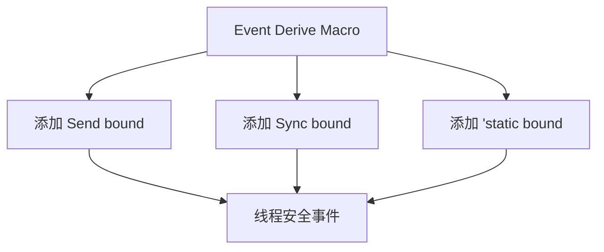

+++
title = "#20996 Automatically add Send + Sync + 'static bounds to Event / EntityEvent derives"
date = "2025-09-13T00:00:00"
draft = false
template = "pull_request_page.html"
in_search_index = false

[extra]
current_language = "zh-cn"
available_languages = {"en" = { name = "English", url = "/pull_request/bevy/2025-09/pr-20996-en-20250913" }, "zh-cn" = { name = "中文", url = "/pull_request/bevy/2025-09/pr-20996-zh-cn-20250913" }}
+++

# Automatically add Send + Sync + 'static bounds to Event / EntityEvent derives

## 基本信息
- **标题**: Automatically add Send + Sync + 'static bounds to Event / EntityEvent derives
- **PR链接**: https://github.com/bevyengine/bevy/pull/20996
- **作者**: cart
- **状态**: 已合并
- **标签**: A-ECS, C-Usability, S-Ready-For-Final-Review
- **创建时间**: 2025-09-13T00:18:54Z
- **合并时间**: 2025-09-13T01:04:40Z
- **合并者**: alice-i-cecile

## 描述翻译
**目标**

Event派生宏过去会代表开发者自动添加这些边界(bounds)，但在#20731中的新宏没有这样做。这消除了开发者需要为使用泛型的Events手动指定这些边界的需求。

**解决方案**

自动为`Event`和`EntityEvent`派生添加`Self: Send + Sync + 'static`边界

## 这个PR的故事

这个PR解决了一个向后兼容性问题，涉及到Bevy ECS系统中事件系统的宏实现。问题的核心在于确保使用泛型的事件类型能够自动获得必要的trait边界，而不需要开发者手动添加。

在Rust中，`Send`、`Sync`和`'static`这些trait边界对于多线程环境中的类型安全至关重要。`Send`确保类型可以安全地在线程间转移所有权，`Sync`确保类型可以安全地在线程间共享引用，而`'static`生命周期边界确保类型不包含非静态引用。

在之前的实现中，`Event`派生宏会自动为事件类型添加这些边界。然而，在PR #20731的重构中，这个功能被意外移除，导致使用泛型的事件类型需要开发者手动添加这些边界，这增加了使用负担并可能引入错误。

这个PR的解决方案很直接：在两个派生宏的实现中（`derive_event`和`derive_entity_event`），通过修改AST（抽象语法树）来自动向泛型约束中添加所需的predicate（谓词）。具体来说，代码使用`ast.generics.make_where_clause().predicates.push(parse_quote! { Self: Send + Sync + 'static })`来添加`Self: Send + Sync + 'static`约束。

这种实现方式有几个优点：
1. **保持向后兼容性**：恢复了之前的行为，确保现有代码不会破坏
2. **减少样板代码**：开发者不再需要手动为泛型事件添加这些常见边界
3. **类型安全**：确保所有事件类型都满足多线程安全的基本要求

从技术角度看，这个修改使用了Rust过程宏的常见模式：解析输入token stream为AST，修改AST，然后生成新的token stream。`parse_quote!`宏是syn库提供的工具，用于将Rust代码解析为语法树节点。

这个修改的影响范围相对较小，只影响到使用泛型的事件类型。对于不使用泛型的事件类型，这些边界本来就是自动满足的，所以不会产生任何行为变化。

## 可视化表示



## 关键文件更改

**crates/bevy_ecs/macros/src/event.rs** (+13/-2)

这个文件包含了事件系统派生宏的实现。主要修改是在两个派生宏函数中自动添加必要的trait边界。

```rust
// 修改前:
pub fn derive_event(input: TokenStream) -> TokenStream {
    let ast = parse_macro_input!(input as DeriveInput);
    let bevy_ecs_path: Path = crate::bevy_ecs_path();

    // ... 其余实现
}

// 修改后:
pub fn derive_event(input: TokenStream) -> TokenStream {
    let mut ast = parse_macro_input!(input as DeriveInput);
    let bevy_ecs_path: Path = crate::bevy_ecs_path();

    ast.generics
        .make_where_clause()
        .predicates
        .push(parse_quote! { Self: Send + Sync + 'static });

    // ... 其余实现
}
```

```rust
// 修改前:
pub fn derive_entity_event(input: TokenStream) -> TokenStream {
    let ast = parse_macro_input!(input as DeriveInput);
    
    // ... 其余实现
}

// 修改后:
pub fn derive_entity_event(input: TokenStream) -> TokenStream {
    let mut ast = parse_macro_input!(input as DeriveInput);

    ast.generics
        .make_where_clause()
        .predicates
        .push(parse_quote! { Self: Send + Sync + 'static });

    // ... 其余实现
}
```

这些修改确保了无论是常规事件还是实体事件，只要使用了泛型参数，都会自动获得必要的线程安全边界。

## 延伸阅读

- [Rust Send and Sync traits](https://doc.rust-lang.org/nomicon/send-and-sync.html) - 关于Rust中Send和Sync trait的官方文档
- [Bevy Events documentation](https://bevyengine.org/learn/books/introduction/events) - Bevy事件系统的官方文档
- [Proc Macro Workshop](https://github.com/dtolnay/proc-macro-workshop) - 学习Rust过程宏的实践项目

# 完整代码差异

```diff
diff --git a/crates/bevy_ecs/macros/src/event.rs b/crates/bevy_ecs/macros/src/event.rs
index 2adb910db3ea1..5137dfe6f408b 100644
--- a/crates/bevy_ecs/macros/src/event.rs
+++ b/crates/bevy_ecs/macros/src/event.rs
@@ -15,9 +15,14 @@ pub const TRIGGER: &str = "trigger";
 pub const EVENT_TARGET: &str = "event_target";
 
 pub fn derive_event(input: TokenStream) -> TokenStream {
-    let ast = parse_macro_input!(input as DeriveInput);
+    let mut ast = parse_macro_input!(input as DeriveInput);
     let bevy_ecs_path: Path = crate::bevy_ecs_path();
 
+    ast.generics
+        .make_where_clause()
+        .predicates
+        .push(parse_quote! { Self: Send + Sync + 'static });
+
     let mut processed_attrs = Vec::new();
     let mut trigger: Option<Type> = None;
 
@@ -55,7 +60,13 @@ pub fn derive_event(input: TokenStream) -> TokenStream {
 }
 
 pub fn derive_entity_event(input: TokenStream) -> TokenStream {
-    let ast = parse_macro_input!(input as DeriveInput);
+    let mut ast = parse_macro_input!(input as DeriveInput);
+
+    ast.generics
+        .make_where_clause()
+        .predicates
+        .push(parse_quote! { Self: Send + Sync + 'static });
+
     let mut auto_propagate = false;
     let mut propagate = false;
     let mut traversal: Option<Type> = None;
```