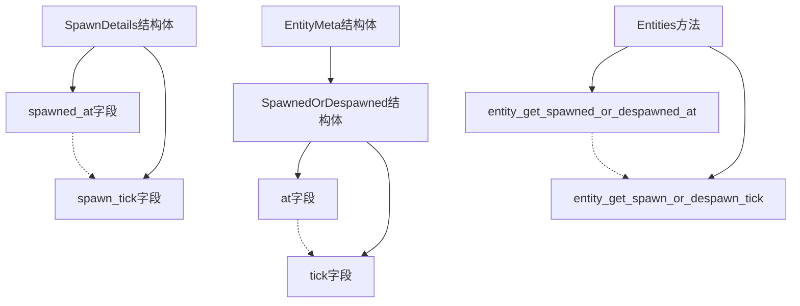

+++
title = "#20997 SpawnDetails::spawned_at -> spawn_tick"
date = "2025-09-13T00:00:00"
draft = false
template = "pull_request_page.html"
in_search_index = false

[extra]
current_language = "zh-cn"
available_languages = {"en" = { name = "English", url = "/pull_request/bevy/2025-09/pr-20997-en-20250913" }, "zh-cn" = { name = "中文", url = "/pull_request/bevy/2025-09/pr-20997-zh-cn-20250913" }}
+++

# SpawnDetails::spawned_at -> spawn_tick

## 基本信息
- **标题**: SpawnDetails::spawned_at -> spawn_tick
- **PR链接**: https://github.com/bevyengine/bevy/pull/20997
- **作者**: cart
- **状态**: 已合并
- **标签**: D-Trivial, A-ECS, C-Code-Quality, S-Ready-For-Final-Review
- **创建时间**: 2025-09-13T01:05:59Z
- **合并时间**: 2025-09-13T01:53:17Z
- **合并人**: alice-i-cecile

## 描述翻译
# Objective

我们在Bevy中通常不使用`spawned_at`命名约定（隐含的是`spawned_at_TICK`）。`spawned_at`违反了这个约定。

## Solution

将`spawned_at`重命名为`spawn_tick`，以及所有相关的getter和内部变量。我已经在当前编辑过程中更新了发布说明。

## 这个PR的故事

这个PR解决了一个简单的命名一致性问题。在Bevy的ECS（Entity Component System）中，存在一个命名约定：当需要表示某个操作发生的tick时，通常使用`_tick`后缀而不是`_at`。PR作者发现`spawned_at`这个命名违反了这一约定，需要进行修正。

问题源于Bevy代码库中的命名不一致性。虽然大多数类似情况都使用`_tick`后缀（如`spawn_tick`），但`SpawnDetails`结构体中的字段却使用了`spawned_at`。这种不一致可能导致开发者困惑，降低代码的可读性和维护性。

解决方案是进行系统性的重命名。这不是功能性的修改，而是一次代码质量改进。作者需要修改所有相关的字段名、方法名和内部变量名，确保整个代码库保持一致。

从技术实现角度看，这个修改涉及多个ECS核心模块。主要改动包括：

1. 将`SpawnedOrDespawned`结构体中的`at`字段重命名为`tick`
2. 将`SpawnDetails`结构体中的`spawned_at`字段重命名为`spawn_tick`
3. 更新所有相关的方法名，如`spawned_at()`改为`spawn_tick()`
4. 修改相应的getter方法和内部调用

这种重命名需要仔细处理，因为涉及多个文件和模块间的依赖关系。作者必须确保所有引用都正确更新，避免引入编译错误或逻辑错误。

修改的影响主要体现在代码一致性和可读性方面。虽然不改变功能行为，但使API更加一致，符合开发者的预期。这种一致性改进对于大型开源项目如Bevy来说很重要，因为它能降低新贡献者的学习成本，提高代码维护效率。

从工程实践角度看，这个PR展示了良好的代码质量管理。即使是很小的命名问题，也值得及时修复，以防止技术债务积累。同时，这种修改也体现了对项目编码规范的尊重和执行。

## 视觉表示



## 关键文件更改

### `crates/bevy_ecs/src/entity/mod.rs` (+13/-13)
这个文件包含了实体元数据管理的核心逻辑。主要修改是将`at`字段重命名为`tick`，并更新相关的方法名。

```rust
// 修改前:
meta.spawned_or_despawned = SpawnedOrDespawned { by, at };

// 修改后:
meta.spawned_or_despawned = SpawnedOrDespawned { by, tick };
```

```rust
// 修改前:
pub fn entity_get_spawned_or_despawned_at(&self, entity: Entity) -> Option<Tick> {
    self.entity_get_spawned_or_despawned(entity)
        .map(|spawned_or_despawned| spawned_or_despawned.at)
}

// 修改后:
pub fn entity_get_spawn_or_despawn_tick(&self, entity: Entity) -> Option<Tick> {
    self.entity_get_spawned_or_despawned(entity)
        .map(|spawned_or_despawned| spawned_or_despawned.tick)
}
```

### `crates/bevy_ecs/src/query/fetch.rs` (+7/-7)
这个文件定义了查询获取逻辑，包含`SpawnDetails`结构体的定义。

```rust
// 修改前:
pub struct SpawnDetails {
    spawned_by: MaybeLocation,
    spawned_at: Tick,
    last_run: Tick,
    this_run: Tick,
}

// 修改后:
pub struct SpawnDetails {
    spawned_by: MaybeLocation,
    spawn_tick: Tick,
    last_run: Tick,
    this_run: Tick,
}
```

```rust
// 修改前:
pub fn spawned_at(self) -> Tick {
    self.spawned_at
}

// 修改后:
pub fn spawn_tick(self) -> Tick {
    self.spawn_tick
}
```

### `crates/bevy_ecs/src/world/entity_ref.rs` (+15/-15)
这个文件包含实体引用的相关方法，需要更新方法名以保持一致性。

```rust
// 修改前:
pub fn spawned_at(&self) -> Tick {
    self.cell.spawned_at()
}

// 修改后:
pub fn spawn_tick(&self) -> Tick {
    self.cell.spawn_tick()
}
```

### `crates/bevy_ecs/src/world/mod.rs` (+4/-4)
这个世界模块的测试文件需要更新测试用例中的方法调用。

```rust
// 修改前:
assert_eq!(
    world.entities.entity_get_spawned_or_despawned_at(entity),
    Some(world.change_tick())
);

// 修改后:
assert_eq!(
    world.entities.entity_get_spawn_or_despawn_tick(entity),
    Some(world.change_tick())
);
```

### `crates/bevy_ecs/src/system/commands/mod.rs` (+1/-1)
命令系统中的测试也需要相应更新。

```rust
// 修改前:
assert_eq!(
    Some(expected),
    world.entities().entity_get_spawned_or_despawned_at(id)
);

// 修改后:
assert_eq!(
    Some(expected),
    world.entities().entity_get_spawn_or_despawn_tick(id)
);
```

## 扩展阅读

- [Bevy ECS 官方文档](https://bevyengine.org/learn/books/bevy-ecs/)
- [Rust 命名约定](https://rust-lang.github.io/api-guidelines/naming.html)
- [软件项目中的代码一致性重要性](https://medium.com/@kentbeck_7670/software-design-is-human-relationships-part-2-of-3-conventions-5f67a