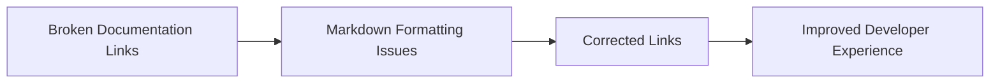

+++
title = "#21000 Fix links in observer_overhaul.md"
date = "2025-09-13T00:00:00"
draft = false
template = "pull_request_page.html"
in_search_index = true

[taxonomies]
list_display = ["show"]

[extra]
current_language = "en"
available_languages = {"en" = { name = "English", url = "/pull_request/bevy/2025-09/pr-21000-en-20250913" }, "zh-cn" = { name = "中文", url = "/pull_request/bevy/2025-09/pr-21000-zh-cn-20250913" }}
+++

# Fix links in observer_overhaul.md

## Basic Information
- **Title**: Fix links in observer_overhaul.md
- **PR Link**: https://github.com/bevyengine/bevy/pull/21000
- **Author**: akimakinai
- **Status**: MERGED
- **Labels**: S-Ready-For-Final-Review
- **Created**: 2025-09-13T05:36:14Z
- **Merged**: 2025-09-13T06:18:05Z
- **Merged By**: alice-i-cecile

## Description Translation
# Objective

- There are some dead links.
- Links with url enclosed by `` ` `` not interpreted as links (at least on GitHub)

## Solution

- Fixes them

## The Story of This Pull Request

This PR addresses documentation issues in Bevy's release notes. The problem was straightforward: several API documentation links in the observer_overhaul.md file were either broken or improperly formatted, preventing users from accessing the referenced documentation.

The author identified two specific issues:
1. Dead links that pointed to incorrect or non-existent documentation pages
2. Links wrapped in backticks (`https://...`) that GitHub's markdown parser doesn't recognize as clickable links

The solution involved systematically correcting all problematic links in the file. The changes required careful attention to detail since they involved both fixing URL paths and ensuring proper markdown formatting. For example, several links incorrectly pointed to `type` documentation pages when they should have pointed to `struct` pages, and many were wrapped in backticks that needed removal.

From an engineering perspective, this fix is crucial because documentation links serve as the primary pathway for developers to understand Bevy's API. Broken links create friction in the learning process and reduce the effectiveness of the documentation system. While the changes themselves are simple text edits, their impact on developer experience is significant.

The implementation was clean and focused - the author made precise surgical changes to exactly seven lines, each addressing a specific documentation link issue. The corrections maintain consistency with Bevy's documentation structure and ensure all referenced types and traits are properly linked.

## Visual Representation



## Key Files Changed

### `release-content/release-notes/observer_overhaul.md` (+7/-7)

This file contains release notes for Bevy's observer system overhaul. The changes fix documentation links that were either broken or improperly formatted.

**Key changes:**
1. Fixed struct name reference from `PropagatingEntityTrigger` to `PropagateEntityTrigger`
2. Removed backticks from URLs to make them properly render as links
3. Corrected documentation paths from `type` to `struct` where appropriate

```markdown
# Before:
This will set the [`Event`]'s [`Trigger`] to [`PropagatingEntityTrigger`].

[`Trigger`]: `https://dev-docs.bevy.org/bevy/ecs/event/trait.Trigger.html`
[`GlobalTrigger`]: `https://dev-docs.bevy.org/bevy/ecs/event/type.GlobalTrigger.html`
[`PropagatingEntityTrigger`]: `https://dev-docs.bevy.org/bevy/ecs/event/type.PropagatingEntityTrigger.html`

# After:
This will set the [`Event`]'s [`Trigger`] to [`PropagateEntityTrigger`].

[`Trigger`]: https://dev-docs.bevy.org/bevy/ecs/event/trait.Trigger.html
[`GlobalTrigger`]: https://dev-docs.bevy.org/bevy/ecs/event/struct.GlobalTrigger.html
[`PropagateEntityTrigger`]: https://dev-docs.bevy.org/bevy/ecs/event/struct.PropagateEntityTrigger.html
```

These changes ensure that all documentation references in the observer system overview are accurate and properly linked, making it easier for developers to navigate Bevy's API documentation.

## Further Reading

- [Markdown Link Syntax](https://www.markdownguide.org/basic-syntax/#links)
- [Bevy Documentation Guidelines](https://github.com/bevyengine/bevy/blob/main/docs/DEVELOPMENT.md#documentation)
- [Bevy Observer System](https://docs.rs/bevy/latest/bevy/ecs/event/index.html)