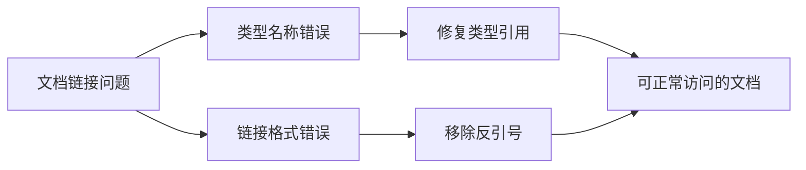

+++
title = "#21000 Fix links in observer_overhaul.md"
date = "2025-09-13T00:00:00"
draft = false
template = "pull_request_page.html"
in_search_index = false

[extra]
current_language = "zh-cn"
available_languages = {"en" = { name = "English", url = "/pull_request/bevy/2025-09/pr-21000-en-20250913" }, "zh-cn" = { name = "中文", url = "/pull_request/bevy/2025-09/pr-21000-zh-cn-20250913" }}
+++

# Fix links in observer_overhaul.md

## 基本信息
- **标题**: Fix links in observer_overhaul.md
- **PR链接**: https://github.com/bevyengine/bevy/pull/21000
- **作者**: akimakinai
- **状态**: 已合并
- **标签**: S-Ready-For-Final-Review
- **创建时间**: 2025-09-13T05:36:14Z
- **合并时间**: 2025-09-13T06:18:05Z
- **合并者**: alice-i-cecile

## 描述翻译
### 目标
- 修复一些失效链接
- 修复被 `` ` `` 包围的URL链接（至少在GitHub上）不被识别为链接的问题

### 解决方案
- 修复这些问题

## 这个Pull Request的故事

这个PR处理的是一个看似简单但很重要的文档维护问题。在Bevy引擎的观察者系统大改版发布说明文档中，存在一些技术文档常见的问题：链接失效和Markdown格式问题。

问题的核心在于文档中多个API引用链接存在两种类型的问题：首先是几个类型名称引用错误，比如将 `PropagateEntityTrigger` 误写为 `PropagatingEntityTrigger`，这会导致开发者查阅文档时找不到正确的API。其次是多个链接被反引号包围，这在Markdown中会导致链接无法正确渲染，用户看到的是代码格式的文本而不是可点击的链接。

从技术角度看，这类问题虽然不涉及核心代码逻辑，但对开发者体验影响很大。当开发者阅读发布说明时，如果遇到无法点击的链接或者指向错误API的引用，会大大降低文档的实用性和可信度。

akimakinai的解决方案非常直接有效：逐一检查并修复所有有问题的链接。这包括：
1. 修正错误拼写的类型名称（如 `PropagatingEntityTrigger` → `PropagateEntityTrigger`）
2. 移除不必要的反引号包围，让Mark链接能正常渲染
3. 确保所有API引用指向正确的类型和模块

这种修改虽然简单，但体现了良好的开源项目维护实践。文档质量直接影响开发者采用新特性的难易程度，特别是在Bevy 0.17引入的重大观察者系统变更背景下，准确的API文档显得尤为重要。

整个修复过程显示了开源社区如何通过小但重要的贡献来提升项目质量。从创建到合并只用了不到一小时，也反映了Bevy团队对文档质量的重视和高效的代码审查流程。

## 视觉表示



## 关键文件变更

### `release-content/release-notes/observer_overhaul.md` (+7/-7)

这个文件包含了Bevy观察者系统大改版的发布说明。修改主要修复了文档中的链接问题和类型引用错误。

**主要变更：**

1. 修正类型名称拼写错误：
```markdown
# 之前：
This will set the [`Event`]'s [`Trigger`] to [`PropagatingEntityTrigger`].

# 之后：
This will set the [`Event`]'s [`Trigger`] to [`PropagateEntityTrigger`].
```

2. 移除链接周围不必要的反引号：
```markdown
# 之前：
[`Trigger`]: `https://dev-docs.bevy.org/bevy/ecs/event/trait.Trigger.html`

# 之后：
[`Trigger`]: https://dev-docs.bevy.org/bevy/ecs/event/trait.Trigger.html
```

3. 统一类型引用格式：
```markdown
# 之前：
[`PropagatingEntityTrigger`]: `https://dev-docs.bevy.org/bevy/ecs/event/type.PropagatingEntityTrigger.html`

# 之后：
[`PropagateEntityTrigger`]: https://dev-docs.bevy.org/bevy/ecs/event/struct.PropagateEntityTrigger.html
```

这些修改确保了文档中的链接能够正确渲染并指向准确的API文档，提升了开发者的阅读体验。

## 延伸阅读

对于想深入了解相关内容的开发者，建议参考：

1. [Bevy官方文档](https://bevyengine.org/learn/) - Bevy引擎的完整文档
2. [Markdown链接语法](https://www.markdownguide.org/basic-syntax/#links) - 标准Markdown链接格式规范
3. [Bevy ECS事件系统](https://dev-docs.bevy.org/bevy/ecs/event/index.html) - Bevy实体组件系统的事件处理机制

# 完整代码差异

```diff
diff --git a/release-content/release-notes/observer_overhaul.md b/release-content/release-notes/observer_overhaul.md
index 30fa00e083184..de9b9464952af 100644
--- a/release-content/release-notes/observer_overhaul.md
+++ b/release-content/release-notes/observer_overhaul.md
@@ -135,7 +135,7 @@ struct Click {
 }
 ```
 
-This will set the [`Event`]'s [`Trigger`] to [`PropagatingEntityTrigger`].
+This will set the [`Event`]'s [`Trigger`] to [`PropagateEntityTrigger`].
 
 This enables access to "propagation" functionality like this:
 
@@ -148,7 +148,7 @@ world.add_observer(|mut click: On<Click>| {
 });
 ```
 
-Bevy's `Pointer` events have always tracked the "original target" that an "entity event" was targeting. This was handy! We've enabled this functionality for every [`EntityEvent`] with [`PropagatingEntityTrigger`]: simply call `On::original_event_target`.
+Bevy's `Pointer` events have always tracked the "original target" that an "entity event" was targeting. This was handy! We've enabled this functionality for every [`EntityEvent`] with [`PropagateEntityTrigger`]: simply call `On::original_event_target`.
 
 ## Component Lifecycle Events
 
@@ -232,13 +232,13 @@ In **Bevy 0.17**, [`Event`] is now _exclusively_ the name/trait for the concept
 It is still possible to support both contexts by implementing _both traits_, but we expect that to be significantly less common than just choosing one.
 
 [`Event`]: https://dev-docs.bevy.org/bevy/ecs/event/trait.Event.html
-[`Trigger`]: `https://dev-docs.bevy.org/bevy/ecs/event/trait.Trigger.html`
-[`GlobalTrigger`]: `https://dev-docs.bevy.org/bevy/ecs/event/type.GlobalTrigger.html`
+[`Trigger`]: https://dev-docs.bevy.org/bevy/ecs/event/trait.Trigger.html
+[`GlobalTrigger`]: https://dev-docs.bevy.org/bevy/ecs/event/struct.GlobalTrigger.html
 [`EntityEvent`]: https://dev-docs.bevy.org/bevy/ecs/event/trait.EntityEvent.html
 [`ChildOf`]: https://dev-docs.bevy.org/bevy/ecs/hierarchy/struct.ChildOf.html
-[`PropagatingEntityTrigger`]: `https://dev-docs.bevy.org/bevy/ecs/event/type.PropagatingEntityTrigger.html`
+[`PropagateEntityTrigger`]: https://dev-docs.bevy.org/bevy/ecs/event/struct.PropagateEntityTrigger.html
 [`Add`]: https://dev-docs.bevy.org/bevy/ecs/lifecycle/struct.Add.html
-[`EntityComponentsTrigger`]: `https://dev-docs.bevy.org/bevy/ecs/event/type.EntityComponentsTrigger.html`
+[`EntityComponentsTrigger`]: https://dev-docs.bevy.org/bevy/ecs/event/struct.EntityComponentsTrigger.html
 [`AnimationPlayer`]: https://dev-docs.bevy.org/bevy/animation/struct.AnimationPlayer.html
 [`AnimationEvent`]: https://dev-docs.bevy.org/bevy/animation/trait.AnimationEvent.html
-[`AnimationEventTrigger`]: https://dev-docs.bevy.org/bevy/animation/type.AnimationEventTrigger.html
+[`AnimationEventTrigger`]: https://dev-docs.bevy.org/bevy/animation/struct.AnimationEventTrigger.html
```