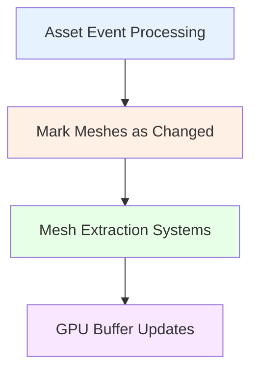

+++
title = "#21002 Mark meshes as changed *after* AssetEvents are processed."
date = "2025-09-13T00:00:00"
draft = false
template = "pull_request_page.html"
in_search_index = true

[taxonomies]
list_display = ["show"]

[extra]
current_language = "en"
available_languages = {"en" = { name = "English", url = "/pull_request/bevy/2025-09/pr-21002-en-20250913" }, "zh-cn" = { name = "中文", url = "/pull_request/bevy/2025-09/pr-21002-zh-cn-20250913" }}
labels = ["C-Bug", "A-Rendering", "A-Assets"]
+++

# Mark meshes as changed *after* AssetEvents are processed.

## Basic Information
- **Title**: Mark meshes as changed *after* AssetEvents are processed.
- **PR Link**: https://github.com/bevyengine/bevy/pull/21002
- **Author**: mrtracy
- **Status**: MERGED
- **Labels**: C-Bug, A-Rendering, A-Assets
- **Created**: 2025-09-13T06:09:23Z
- **Merged**: 2025-09-13T08:04:51Z
- **Merged By**: james7132

## Description Translation
Whenever a Mesh asset is modified, bevy needs to mark entities which include a matching `Mesh3D` component as Changed.  The need for this is explained on the comment for system `mark_3d_meshes_as_changed_if_their_assets_changed`, which performs this action:

> This is needed because the systems that extract meshes, such as
> `extract_meshes_for_gpu_building`, write some metadata about the mesh (like
> the location within each slab) into the GPU structures that they build that
> needs to be kept up to date if the contents of the mesh change.

However, this system use EventReader<AssetEvent<Mesh>> to detect this, but was scheduled *before* AssetEvents are processed for the frame. This created a one-frame delay in the update, which was causing the "mesh flickering" in #19409 - a result of using the previous model's vertex and index offsets against the newly updated mesh buffers.


# Objective

- Fixes #19409

## Solution

- Fix is to schedule this system *after* AssetEvents are processed for the frame.

## Testing

- Had a perfectly consistent graphical reproduction of the situation: Updating a mesh which is being displayed by an entity, and making it significantly *larger* in vertex count, triggers this reliably - the mesh will be significantly *underdrawn* for one frame.

## The Story of This Pull Request

This PR addresses a synchronization issue in Bevy's mesh asset handling system. The problem manifested as mesh flickering (#19409) when mesh assets were modified at runtime. The root cause was a timing mismatch between asset event processing and mesh change detection.

The core issue was in the scheduling order of the `mark_3d_meshes_as_changed_if_their_assets_changed` system. This system uses `EventReader<AssetEvent<Mesh>>` to detect when mesh assets change and marks corresponding entities as changed. However, it was scheduled before the `AssetEventSystems`, which meant it was reading asset events from the previous frame while trying to process changes for the current frame.

This created a one-frame delay where the mesh extraction systems would use outdated metadata (like vertex and index buffer offsets) with newly updated mesh data. The result was graphical artifacts where meshes would be underdrawn or incorrectly rendered for one frame before correcting themselves.

The fix is straightforward but critical: reschedule the system to run after `AssetEventSystems`. This ensures that asset events for the current frame have been fully processed before the system attempts to detect mesh changes. The mesh extraction systems can then work with synchronized data, preventing the one-frame rendering artifacts.

This change demonstrates the importance of precise system ordering in ECS architectures, particularly when dealing with asset pipelines where timing dependencies between asset loading, event processing, and rendering systems are crucial for correct behavior.

## Visual Representation



## Key Files Changed

### `crates/bevy_mesh/src/lib.rs`
This file contains the plugin definition for Bevy's mesh functionality. The change modifies the scheduling order of the mesh change detection system.

**Before:**
```rust
.add_systems(
    PostUpdate,
    mark_3d_meshes_as_changed_if_their_assets_changed.before(AssetEventSystems),
);
```

**After:**
```rust
.add_systems(
    PostUpdate,
    mark_3d_meshes_as_changed_if_their_assets_changed.after(AssetEventSystems),
);
```

The change moves the system from running before asset event processing to after it, ensuring mesh changes are detected only after current frame asset events have been processed.

## Further Reading

- [Bevy ECS System Ordering](https://bevyengine.org/learn/books/the-bevy-book/0.14/programming/ecs/system-order/)
- [Asset System Documentation](https://bevyengine.org/learn/books/the-bevy-book/0.14/assets/)
- [Original Issue #19409](https://github.com/bevyengine/bevy/issues/19409)