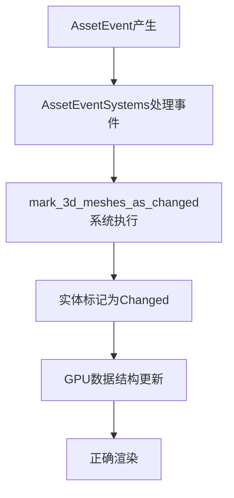

+++
title = "#21002 Mark meshes as changed *after* AssetEvents are processed."
date = "2025-09-13T00:00:00"
draft = false
template = "pull_request_page.html"
in_search_index = false

[extra]
current_language = "zh-cn"
available_languages = {"en" = { name = "English", url = "/pull_request/bevy/2025-09/pr-21002-en-20250913" }, "zh-cn" = { name = "中文", url = "/pull_request/bevy/2025-09/pr-21002-zh-cn-20250913" }}
+++

# Title

## 基本信息
- **标题**: Mark meshes as changed *after* AssetEvents are processed.
- **PR链接**: https://github.com/bevyengine/bevy/pull/21002
- **作者**: mrtracy
- **状态**: 已合并
- **标签**: C-Bug, A-Rendering, A-Assets
- **创建时间**: 2025-09-13T06:09:23Z
- **合并时间**: 2025-09-13T08:04:51Z
- **合并者**: james7132

## 描述翻译
当Mesh资源被修改时，bevy需要将包含匹配`Mesh3D`组件的实体标记为Changed。这在系统`mark_3d_meshes_as_changed_if_their_assets_changed`的注释中进行了解释，该系统执行此操作：

> 这是必需的，因为提取网格的系统（例如`extract_meshes_for_gpu_building`）会将有关网格的一些元数据（如每个slab中的位置）写入它们构建的GPU结构中，如果网格内容发生变化，这些元数据需要保持最新。

然而，此系统使用EventReader<AssetEvent<Mesh>>来检测此情况，但被安排在AssetEvents处理之前执行。这造成了更新的一帧延迟，导致#19409中的"mesh flickering"问题 - 使用先前模型的顶点和索引偏移与新更新的网格缓冲区不匹配的结果。

# 目标

- 修复#19409

## 解决方案

- 修复方法是将此系统安排在AssetEvents处理之后执行。

## 测试

- 有一个完全一致的图形重现场景：更新一个正在被实体显示的网格，并使其顶点数量显著增加，这会可靠地触发此问题 - 网格将在一帧内被显著欠绘制。

## 这个PR的故事

这个PR解决了一个在Bevy渲染管线中出现的时序问题。问题的核心在于系统执行顺序的不匹配，导致网格资源更新与实体状态更新之间存在一帧的延迟。

当开发者在Bevy中修改一个Mesh资源时，引擎需要通知所有使用该Mesh的实体，以便它们可以更新相关的GPU数据结构。这是通过`mark_3d_meshes_as_changed_if_their_assets_changed`系统完成的，该系统监听`AssetEvent<Mesh>`事件。

问题出现在这个系统的执行时机上。原本它被安排在`AssetEventSystems`之前运行：

```rust
// 之前：
mark_3d_meshes_as_changed_if_their_assets_changed.before(AssetEventSystems)
```

这意味着当这个系统读取AssetEvent时，这些事件还没有被当前帧处理。结果是，网格资源的更新要等到下一帧才会反映到使用这些资源的实体上。

这种一帧的延迟导致了#19409中报告的网格闪烁问题。具体来说，当网格的顶点数量发生变化时（例如变得更大），系统会在一帧内使用旧的顶点/索引偏移信息来绘制新的网格缓冲区，导致渲染错误。

解决方案很简单但很有效：将系统的执行顺序调整为在`AssetEventSystems`之后：

```rust
// 之后：
mark_3d_meshes_as_changed_if_their_assets_changed.after(AssetEventSystems)
```

这样确保了当`mark_3d_meshes_as_changed_if_their_assets_changed`系统运行时，所有的AssetEvent都已经被当前帧处理完毕，实体能够立即获得网格更新的通知。

这个修复展示了在游戏引擎开发中，系统执行顺序的重要性。即使是微小的时序差异，也可能导致明显的视觉问题。Bevy的ECS架构通过明确的系统排序约束，使得这类问题能够被精确地定位和修复。

## 可视化表示



## 关键文件更改

**crates/bevy_mesh/src/lib.rs** (+1/-1)

这个文件包含了MeshPlugin的定义，负责设置网格相关的系统和资源。

**变更内容：**
```rust
// 之前：
add_systems(
    PostUpdate,
    mark_3d_meshes_as_changed_if_their_assets_changed.before(AssetEventSystems),
);

// 之后：
add_systems(
    PostUpdate,
    mark_3d_meshes_as_changed_if_their_assets_changed.after(AssetEventSystems),
);
```

这个变更调整了系统执行顺序，确保网格资源变化的事件在处理完毕后，才执行标记实体为changed的系统。这解决了网格更新延迟一帧的问题。

## 进一步阅读

- [Bevy ECS系统排序文档](https://bevyengine.org/learn/books/the-bevy-book/ecs/system-ordering/)
- [Bevy资源系统工作原理](https://bevyengine.org/learn/books/the-bevy-book/assets/)
- [GitHub Issue #19409 - 网格闪烁问题](https://github.com/bevyengine/bevy/issues/19409)

# 完整代码差异
```diff
diff --git a/crates/bevy_mesh/src/lib.rs b/crates/bevy_mesh/src/lib.rs
index 6cb0fbe402b88..5741f874fdb4e 100644
--- a/crates/bevy_mesh/src/lib.rs
+++ b/crates/bevy_mesh/src/lib.rs
@@ -54,7 +54,7 @@ impl Plugin for MeshPlugin {
             .register_asset_reflect::<Mesh>()
             .add_systems(
                 PostUpdate,
-                mark_3d_meshes_as_changed_if_their_assets_changed.before(AssetEventSystems),
+                mark_3d_meshes_as_changed_if_their_assets_changed.after(AssetEventSystems),
             );
     }
 }
```