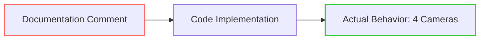

+++
title = "#21005 Update documentation to reflect four cameras in split screen"
date = "2025-09-13T00:00:00"
draft = false
template = "pull_request_page.html"
in_search_index = true

[taxonomies]
list_display = ["show"]

[extra]
current_language = "en"
available_languages = {"en" = { name = "English", url = "/pull_request/bevy/2025-09/pr-21005-en-20250913" }, "zh-cn" = { name = "中文", url = "/pull_request/bevy/2025-09/pr-21005-zh-cn-20250913" }}
labels = ["C-Docs", "D-Trivial", "C-Examples"]
+++

# Update documentation to reflect four cameras in split screen

## Basic Information
- **Title**: Update documentation to reflect four cameras in split screen
- **PR Link**: https://github.com/bevyengine/bevy/pull/21005
- **Author**: rlneumiller
- **Status**: MERGED
- **Labels**: C-Docs, D-Trivial, C-Examples
- **Created**: 2025-09-13T10:38:13Z
- **Merged**: 2025-09-13T21:53:30Z
- **Merged By**: james7132

## Description Translation
Doc comment at the top of the file states that the example renders two cameras but the code renders four cameras.

# Objective

- Update doc comment to reflect the actual implementation

## Solution

- Update doc comment to reflect the actual implementation

## Testing
- cargo run --example split_screen
- cargo doc --examples --open

## The Story of This Pull Request

This PR addresses a straightforward but important documentation discrepancy in Bevy's split screen example. The issue was discovered during routine code review or testing - the top-level documentation comment claimed the example rendered two cameras, while the actual implementation clearly configured and used four cameras.

The problem was simple: inaccurate documentation that could mislead developers studying the example. When engineers examine examples, they rely on comments to understand the intended behavior before diving into implementation details. A mismatch between documentation and code creates confusion and reduces the educational value of the example.

The solution approach was minimal and surgical: update the single incorrect comment line to reflect reality. The developer didn't need to modify any functional code since the implementation was already correct. This demonstrates the importance of maintaining documentation accuracy even in small examples, as they serve as learning resources for the community.

The testing procedure was appropriate for this type of change: running the example to verify it still works correctly (`cargo run --example split_screen`) and checking the generated documentation (`cargo doc --examples --open`) to confirm the fix appears properly.

This change highlights an important aspect of software maintenance: documentation is part of the codebase and requires the same attention to accuracy as functional code. While trivial in scope, this fix improves the developer experience by ensuring the documentation truthfully represents the code behavior.

## Visual Representation



The diagram shows the relationship between documentation and implementation. The documentation (red outline) was incorrectly stating "2 cameras" while the actual implementation correctly produced 4 cameras (green outline). The PR fixed this mismatch.

## Key Files Changed

**File**: `examples/3d/split_screen.rs`

**Change**: Updated the top-level documentation comment to correctly state that the example renders four cameras instead of two.

**Before**:
```rust
//! Renders two cameras to the same window to accomplish "split screen".
```

**After**:
```rust
//! Renders four cameras to the same window to accomplish "split screen".
```

This change is minimal but important for accuracy. The comment now correctly describes what the example actually does, preventing confusion for developers studying this code.

## Further Reading

- [Bevy Camera Systems Documentation](https://bevyengine.org/learn/books/introduction/3d-camera/) - Official guide to Bevy's camera systems
- [Rust Documentation Comments](https://doc.rust-lang.org/rustdoc/how-to-write-documentation.html) - How to write effective documentation in Rust
- [Bevy Examples Directory](https://github.com/bevyengine/bevy/tree/main/examples) - Other Bevy examples that demonstrate various engine features

## Full Code Diff
```diff
diff --git a/examples/3d/split_screen.rs b/examples/3d/split_screen.rs
index 1a5d830e299bc..60f581ec457fe 100644
--- a/examples/3d/split_screen.rs
+++ b/examples/3d/split_screen.rs
@@ -1,4 +1,4 @@
-//! Renders two cameras to the same window to accomplish "split screen".
+//! Renders four cameras to the same window to accomplish "split screen".
 
 use std::f32::consts::PI;
 
```