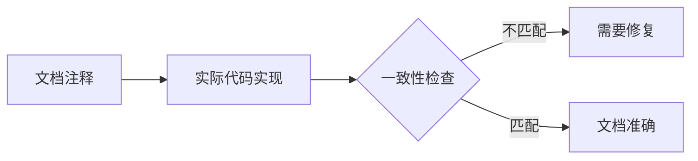

+++
title = "#21005 Update documentation to reflect four cameras in split screen"
date = "2025-09-13T00:00:00"
draft = false
template = "pull_request_page.html"
in_search_index = false

[extra]
current_language = "zh-cn"
available_languages = {"en" = { name = "English", url = "/pull_request/bevy/2025-09/pr-21005-en-20250913" }, "zh-cn" = { name = "中文", url = "/pull_request/bevy/2025-09/pr-21005-zh-cn-20250913" }}
+++

# Update documentation to reflect four cameras in split screen

## 基本信息
- **标题**: Update documentation to reflect four cameras in split screen
- **PR链接**: https://github.com/bevyengine/bevy/pull/21005
- **作者**: rlneumiller
- **状态**: 已合并
- **标签**: C-Docs, D-Trivial, C-Examples
- **创建时间**: 2025-09-13T10:38:13Z
- **合并时间**: 2025-09-13T21:53:30Z
- **合并者**: james7132

## 描述翻译
文件顶部的文档注释说明该示例渲染两个摄像头，但代码实际渲染了四个摄像头。

# 目标

- 更新文档注释以反映实际实现

## 解决方案

- 更新文档注释以反映实际实现

## 测试
- cargo run --example split_screen
- cargo doc --examples --open

## 本次PR的技术分析

这是一个典型的文档维护案例，展示了即使是最小的代码文档不匹配也可能导致用户困惑。PR #21005 解决了一个简单的但重要的问题：示例代码中的文档注释与实际实现不一致。

问题的核心在于 `examples/3d/split_screen.rs` 文件顶部的注释错误地声称该示例渲染两个摄像头，而实际上代码创建并渲染了四个摄像头。这种不一致性可能会误导开发者学习Bevy引擎的多摄像头功能。

从技术角度来看，这个问题的根本原因是代码演进过程中文档没有同步更新。当示例从最初的两个摄像头扩展到四个摄像头时，开发人员可能忽略了更新对应的文档注释。这种小疏忽在实际开发中很常见，但重要的是能够及时发现并修复。

解决方案非常直接：将文档注释中的 "two cameras" 改为 "four cameras"。这个修改虽然简单，但对于维护代码库的准确性和可读性至关重要。准确的文档能够帮助开发者正确理解示例的功能，避免基于错误信息进行开发。

测试方案也很合理：通过运行示例确认功能正常，并通过生成文档验证修改正确生效。这种验证方式确保了修改不会引入回归问题。

从工程实践角度看，这个PR体现了良好的代码维护习惯：
1. 及时发现问题并修复
2. 修改精确且最小化
3. 包含适当的验证步骤
4. 标签分类准确（文档、简单修改、示例相关）

虽然这个修改本身很小，但它反映了对代码质量细节的关注。在大型开源项目中，保持文档与代码同步是维护项目健康的重要环节。

## 可视化表示



## 关键文件变更

**examples/3d/split_screen.rs** (+1/-1)

这个文件是Bevy引擎的3D分屏示例代码。修改内容仅限于顶部的文档注释，将原本错误的摄像头数量描述从"两个"更正为"四个"。

```rust
// 修改前:
//! Renders two cameras to the same window to accomplish "split screen".

// 修改后:
//! Renders four cameras to the same window to accomplish "split screen".
```

这个修改确保了文档注释准确反映了代码的实际行为。虽然只是一个单词的更改，但对于依赖这些文档学习的开发者来说具有重要意义。

## 延伸阅读

对于想深入了解Bevy摄像头系统和示例用法的开发者，建议参考：

1. [Bevy官方文档 - Camera组件](https://docs.rs/bevy/latest/bevy/prelude/struct.Camera.html)
2. [Bevy示例代码库](https://github.com/bevyengine/bevy/tree/main/examples)
3. [Bevy Cheatbook - 多摄像头章节](https://bevy-cheatbook.github.io/features/cameras/multiple-cameras.html)

# 完整代码差异
```diff
diff --git a/examples/3d/split_screen.rs b/examples/3d/split_screen.rs
index 1a5d830e299bc..60f581ec457fe 100644
--- a/examples/3d/split_screen.rs
+++ b/examples/3d/split_screen.rs
@@ -1,4 +1,4 @@
-//! Renders two cameras to the same window to accomplish "split screen".
+//! Renders four cameras to the same window to accomplish "split screen".
 
 use std::f32::consts::PI;
```