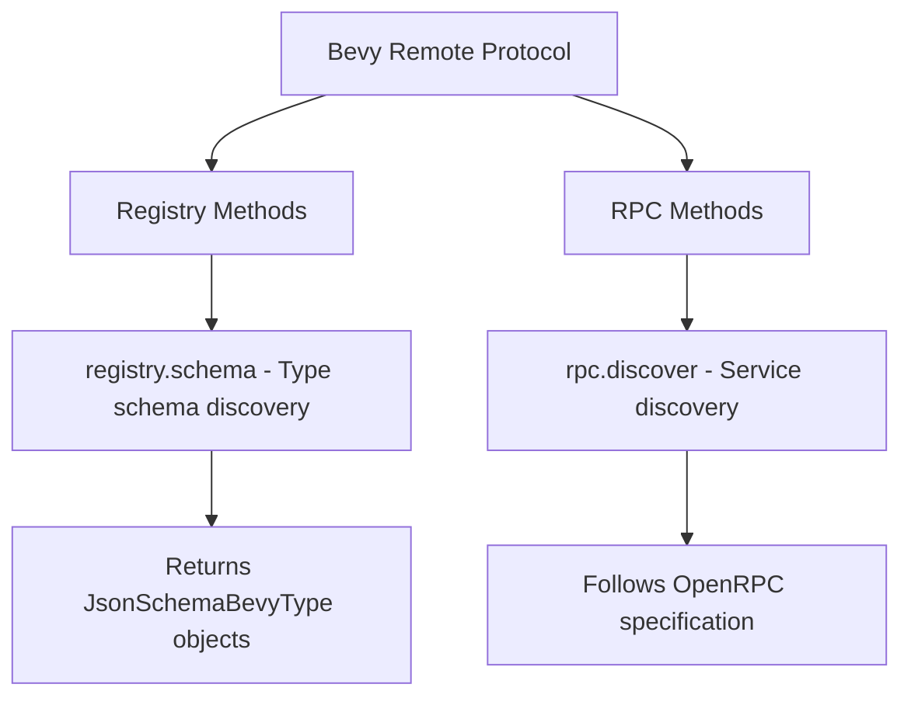

+++
title = "#21007 Document missing brp methods"
date = "2025-09-17T00:00:00"
draft = false
template = "pull_request_page.html"
in_search_index = true

[taxonomies]
list_display = ["show"]

[extra]
current_language = "en"
available_languages = {"en" = { name = "English", url = "/pull_request/bevy/2025-09/pr-21007-en-20250917" }, "zh-cn" = { name = "中文", url = "/pull_request/bevy/2025-09/pr-21007-zh-cn-20250917" }}
labels = ["C-Docs", "D-Trivial", "A-Editor"]
+++

# Title
Document missing brp methods

## Basic Information
- **Title**: Document missing brp methods
- **PR Link**: https://github.com/bevyengine/bevy/pull/21007
- **Author**: MarcGuiselin
- **Status**: MERGED
- **Labels**: C-Docs, D-Trivial, S-Ready-For-Final-Review, A-Editor
- **Created**: 2025-09-13T13:25:34Z
- **Merged**: 2025-09-17T21:21:51Z
- **Merged By**: alice-i-cecile

## Description Translation
# Objective

Document missing brp methods:
- `registry.schema`
- `rpc.discover`

## Solution

- Update crate-level documentation

## Testing

- `cargo doc -p bevy_remote`

## The Story of This Pull Request

This PR addresses a documentation gap in Bevy's remote protocol (BRP) implementation. The bevy_remote crate provides functionality for remote procedure calls between Bevy applications, but two key methods were missing from the comprehensive documentation: `registry.schema` and `rpc.discover`.

The problem was straightforward but important for developer experience. Without proper documentation, users of the remote protocol wouldn't know these methods existed or how to use them effectively. This could lead to duplicated effort as developers might try to implement similar functionality themselves, or simply miss out on powerful features of the remote protocol.

The solution approach was minimal and surgical - update the existing crate-level documentation to include these two missing methods. The author didn't need to modify any functionality, just document what was already implemented but not properly exposed in the docs.

Looking at the implementation, we can see the changes follow the existing documentation pattern established in the file. The `registry.schema` method allows clients to retrieve schema information about registered types in the Bevy app's type registry, which is crucial for understanding the structure of types available remotely. The documentation clearly explains the optional parameters: `with_crates`, `without_crates`, and `type_limit` constraints, and specifies that it returns a map of fully-qualified type names to `JsonSchemaBevyType` objects.

The `rpc.discover` method follows the OpenRPC specification for service discovery, providing a standardized way for clients to discover available remote methods and server information. This is particularly valuable for tooling and automated clients that need to dynamically understand what capabilities are available.

A minor but thoughtful change was the correction of a documentation header level - changing `### Example` to `#### Example` to maintain proper heading hierarchy within the documentation structure.

The impact of these changes is improved developer experience and better discoverability of the remote protocol's capabilities. Developers can now easily understand and utilize these methods without needing to dig through source code or guess at their functionality.

## Visual Representation



## Key Files Changed

**crates/bevy_remote/src/lib.rs** (+27/-1)

This file contains the main documentation for the Bevy Remote Protocol. The changes add comprehensive documentation for two previously undocumented methods.

Key modifications:

```rust
// Before:
// (No documentation for registry.schema or rpc.discover methods)

// After:
// ### `registry.schema`
//
// Retrieve schema information about registered types in the Bevy app's type registry.
//
// `params` (optional):
// - `with_crates`: An array of crate names to include in the results. When empty or omitted, types from all crates will be included.
// - `without_crates`: An array of crate names to exclude from the results. When empty or omitted, no crates will be excluded.
// - `type_limit`: Additional type constraints:
//   - `with`: An array of [fully-qualified type names] that must be present for a type to be included
//   - `without`: An array of [fully-qualified type names] that must not be present for a type to be excluded
//
// `result`: A map associating each type's [fully-qualified type name] to a [`JsonSchemaBevyType`](crate::schemas::json_schema::JsonSchemaBevyType).
// This contains schema information about that type, including field definitions, type information, reflect type information, and other metadata
// helpful for understanding the structure of the type.
//
// ### `rpc.discover`
//
// Discover available remote methods and server information. This follows the [`OpenRPC` specification for service discovery](https://spec.open-rpc.org/#service-discovery-method).
//
// This method takes no parameters.
//
// `result`: An `OpenRPC` document containing:
// - Information about all available remote methods
// - Server connection information (when using HTTP transport)
// - `OpenRPC` specification version
```

Additionally, a minor header level correction:
```rust
// Before:
// ### Example

// After:
// #### Example
```

These changes complete the documentation coverage for the Bevy Remote Protocol methods, ensuring developers have full visibility into all available functionality.

## Further Reading

- [OpenRPC Specification](https://spec.open-rpc.org/) - The specification that defines the service discovery method implemented by `rpc.discover`
- [Bevy Reflection Documentation](https://bevyengine.org/learn/books/introduction/reflection/) - For understanding how type registration and reflection work in Bevy
- [JSON Schema Specification](https://json-schema.org/) - Relevant for understanding the schema information returned by `registry.schema`