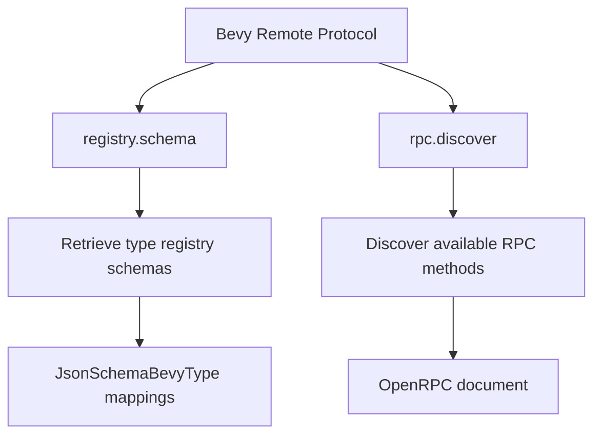

+++
title = "#21007 Document missing brp methods"
date = "2025-09-17T00:00:00"
draft = false
template = "pull_request_page.html"
in_search_index = false

[extra]
current_language = "zh-cn"
available_languages = {"en" = { name = "English", url = "/pull_request/bevy/2025-09/pr-21007-en-20250917" }, "zh-cn" = { name = "中文", url = "/pull_request/bevy/2025-09/pr-21007-zh-cn-20250917" }}
labels = ["C-Docs", "D-Trivial", "A-Editor"]
+++

# Document missing brp methods

## Basic Information
- **Title**: Document missing brp methods
- **PR Link**: https://github.com/bevyengine/bevy/pull/21007
- **Author**: MarcGuiselin
- **Status**: MERGED
- **Labels**: C-Docs, D-Trivial, S-Ready-For-Final-Review, A-Editor
- **Created**: 2025-09-13T13:25:34Z
- **Merged**: 2025-09-17T21:21:51Z
- **Merged By**: alice-i-cecile

## Description Translation
# Objective

为缺失的 brp 方法添加文档：
- `registry.schema`
- `rpc.discover`

## Solution

- 更新 crate 级别的文档

## Testing

- `cargo doc -p bevy_remote`

## The Story of This Pull Request

这个 PR 解决了一个直接的文档完整性问题。Bevy Remote Protocol (BRP) 是 Bevy 引擎的远程过程调用协议，但有两个重要的方法缺少正式文档：`registry.schema` 和 `rpc.discover`。对于开发者来说，这意味着他们无法通过官方文档了解这些方法的功能、参数和返回值。

问题在于，没有文档的方法会增加开发者的学习成本和使用难度。开发者可能需要通过阅读源代码或尝试错误来理解这些方法，这降低了开发效率并增加了出错的可能性。

解决方案很直接：在 `crates/bevy_remote/src/lib.rs` 文件中为这两个方法添加详细的文档说明。作者采用了标准的 Rust 文档格式，清晰地描述了每个方法的用途、参数选项和返回值类型。

对于 `registry.schema` 方法，文档详细说明了它用于检索 Bevy 应用类型注册表中已注册类型的模式信息。文档列出了可选的过滤参数：
- `with_crates`: 指定要包含的 crate 名称数组
- `without_crates`: 指定要排除的 crate 名称数组  
- `type_limit`: 额外的类型约束条件

返回值是一个映射，将每个类型的完全限定名称关联到对应的 `JsonSchemaBevyType`，包含字段定义、类型信息和其他有用的元数据。

对于 `rpc.discover` 方法，文档说明它遵循 OpenRPC 规范的服务发现标准，用于发现可用的远程方法和服务器信息。这个方法不需要参数，返回一个包含所有可用远程方法信息、服务器连接信息和 OpenRPC 规范版本的 OpenRPC 文档。

这些文档更新虽然看似简单，但对开发者体验有实质性改善。现在开发者可以通过标准的 `cargo doc` 命令生成完整的 API 文档，无需猜测或查阅源代码就能理解这些方法的使用方式。

从技术角度看，这个 PR 展示了良好的文档实践：为每个方法提供清晰的用途说明、参数描述和返回值解释。这种文档风格符合 Rust 生态系统的标准，有助于维护代码库的长期可维护性。

## Visual Representation



## Key Files Changed

### `crates/bevy_remote/src/lib.rs` (+27/-1)

这个文件包含了 Bevy Remote Protocol 的主要文档。修改内容是在现有的方法文档中添加了两个缺失的方法说明。

**主要修改：**

```rust
// 在原有文档基础上添加了两个新章节：

// ### `registry.schema`
//
// Retrieve schema information about registered types in the Bevy app's type registry.
//
// `params` (optional):
// - `with_crates`: An array of crate names to include in the results. When empty or omitted, types from all crates will be included.
// - `without_crates`: An array of crate names to exclude from the results. When empty or omitted, no crates will be excluded.
// - `type_limit`: Additional type constraints:
//   - `with`: An array of [fully-qualified type names] that must be present for a type to be included
//   - `without`: An array of [fully-qualified type names] that must not be present for a type to be excluded
//
// `result`: A map associating each type's [fully-qualified type name] to a [`JsonSchemaBevyType`](crate::schemas::json_schema::JsonSchemaBevyType).
// This contains schema information about that type, including field definitions, type information, reflect type information, and other metadata
// helpful for understanding the structure of the type.
//
// ### `rpc.discover`
//
// Discover available remote methods and server information. This follows the [`OpenRPC` specification for service discovery](https://spec.open-rpc.org/#service-discovery-method).
//
// This method takes no parameters.
//
// `result`: An `OpenRPC` document containing:
// - Information about all available remote methods
// - Server connection information (when using HTTP transport)
// - `OpenRPC` specification version
```

此外还有一个小的格式修正：
```rust
// 将 ### Example 改为 #### Example 以保持标题层级的正确性
- //! ### Example
+ //! #### Example
```

这些修改完善了 BRP 的文档覆盖，使开发者能够全面了解所有可用的远程方法。

## Further Reading

- [OpenRPC 规范](https://spec.open-rpc.org/) - BRP 遵循的远程过程调用规范
- [Rust 文档注释指南](https://doc.rust-lang.org/rustdoc/how-to-write-documentation.html) - 学习如何编写有效的 Rust 文档
- [Bevy 类型注册表文档](https://docs.rs/bevy/latest/bevy/reflect/struct.TypeRegistry.html) - 了解 Bevy 的类型注册机制
- [JSON Schema 规范](https://json-schema.org/) - `JsonSchemaBevyType` 基于的规范标准

# Full Code Diff
```diff
diff --git a/crates/bevy_remote/src/lib.rs b/crates/bevy_remote/src/lib.rs
index b8e5813177067..9c5a4fbc498df 100644
--- a/crates/bevy_remote/src/lib.rs
+++ b/crates/bevy_remote/src/lib.rs
@@ -153,7 +153,7 @@
 //! - `has`: A map associating each type name from `has` to a boolean value indicating whether or not the
 //!   entity has that component. If `has` was empty or omitted, this key will be omitted in the response.
 //!
-//! ### Example
+//! #### Example
 //! To use the query API and retrieve Transform data for all entities that have a Transform
 //! use this query:
 //!
@@ -455,6 +455,32 @@
 //!
 //! `result`: An array of [fully-qualified type names] of registered resource types.
 //!
+//! ### `registry.schema`
+//!
+//! Retrieve schema information about registered types in the Bevy app's type registry.
+//!
+//! `params` (optional):
+//! - `with_crates`: An array of crate names to include in the results. When empty or omitted, types from all crates will be included.
+//! - `without_crates`: An array of crate names to exclude from the results. When empty or omitted, no crates will be excluded.
+//! - `type_limit`: Additional type constraints:
+//!   - `with`: An array of [fully-qualified type names] that must be present for a type to be included
+//!   - `without`: An array of [fully-qualified type names] that must not be present for a type to be excluded
+//!
+//! `result`: A map associating each type's [fully-qualified type name] to a [`JsonSchemaBevyType`](crate::schemas::json_schema::JsonSchemaBevyType).
+//! This contains schema information about that type, including field definitions, type information, reflect type information, and other metadata
+//! helpful for understanding the structure of the type.
+//!
+//! ### `rpc.discover`
+//!
+//! Discover available remote methods and server information. This follows the [`OpenRPC` specification for service discovery](https://spec.open-rpc.org/#service-discovery-method).
+//!
+//! This method takes no parameters.
+//!
+//! `result`: An `OpenRPC` document containing:
+//! - Information about all available remote methods
+//! - Server connection information (when using HTTP transport)
+//! - `OpenRPC` specification version
+//!
 //! ## Custom methods
 //!
 //! In addition to the provided methods, the Bevy Remote Protocol can be extended to include custom
```