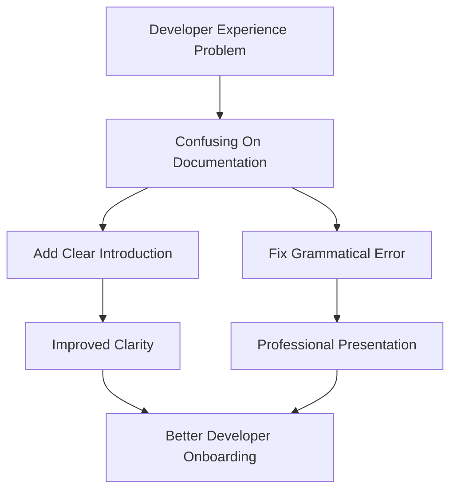

+++
title = "#21009 Make `On` documentation more friendly"
date = "2025-09-13T00:00:00"
draft = false
template = "pull_request_page.html"
in_search_index = true

[taxonomies]
list_display = ["show"]

[extra]
current_language = "en"
available_languages = {"en" = { name = "English", url = "/pull_request/bevy/2025-09/pr-21009-en-20250913" }, "zh-cn" = { name = "中文", url = "/pull_request/bevy/2025-09/pr-21009-zh-cn-20250913" }}
labels = ["C-Docs", "A-ECS"]
+++

# Make `On` documentation more friendly

## Basic Information
- **Title**: Make `On` documentation more friendly
- **PR Link**: https://github.com/bevyengine/bevy/pull/21009
- **Author**: greeble-dev
- **Status**: MERGED
- **Labels**: C-Docs, A-ECS
- **Created**: 2025-09-13T15:00:34Z
- **Merged**: 2025-09-13T21:52:39Z
- **Merged By**: james7132

## Description Translation
While updating a crate to Bevy 0.17 I found myself confused about how to use the `On` system parameter - the documentation seemed a bit low-level, and I didn't realise that there were examples behind some links.

This PR adds a brief description and explicitly links to examples. It also fixes what looks like an editing error:

```diff
-/// The generic `B: Bundle` is used to modify the further specialize the events that this observer is interested in.
+/// The generic `B: Bundle` is used to further specialize the events that this observer is interested in.
```


## The Story of This Pull Request

When updating to Bevy 0.17, the PR author encountered confusion around the `On` system parameter's documentation. The existing docs were too technical and didn't clearly indicate where developers could find practical examples. This is a common issue in documentation where API references focus on low-level details without providing clear guidance for practical usage.

The solution involved two key improvements to the documentation. First, the PR adds a clear introductory sentence that immediately establishes `On` as a system parameter and directs users to relevant examples. This addresses the core issue by making the purpose and usage context immediately apparent:

```rust
/// A [system parameter] used by an observer to process events. See [`Observer`] and [`Event`] for examples.
```

Second, the PR fixes a grammatical error in the existing documentation by removing the redundant word "modify" from the sentence about the generic `B: Bundle` parameter. This small but important change improves readability and professionalism:

```diff
-/// The generic `B: Bundle` is used to modify the further specialize the events...
+/// The generic `B: Bundle` is used to further specialize the events...
```

The changes maintain all existing technical details about event triggering and propagation control while making the documentation more accessible. The PR also adds an explicit link to the system parameter concept, helping users understand where `On` fits within Bevy's architecture.

These improvements demonstrate good documentation practices: starting with a clear, high-level explanation before diving into technical details, providing explicit links to examples, and ensuring grammatical correctness for professional presentation.

## Visual Representation



## Key Files Changed

**File: `crates/bevy_ecs/src/observer/systemparam.rs`**
- **Changes**: Documentation improvements for the `On` system parameter
- **Purpose**: Make the `On` parameter documentation more user-friendly and fix grammatical errors

```rust
// Before:
/// Type containing triggered [`Event`] information for a given run of an [`Observer`]. This contains the
/// [`Event`] data itself. It also provides access to the [`Trigger`](crate::event::Trigger), which for things like
/// [`EntityEvent`] with a [`PropagateEntityTrigger`], includes control over event propagation.
///
/// The generic `B: Bundle` is used to modify the further specialize the events that this observer is interested in.

// After:
/// A [system parameter] used by an observer to process events. See [`Observer`] and [`Event`] for examples.
///
/// `On` contains the triggered [`Event`] data for a given run of an `Observer`. It also provides access to the
/// [`Trigger`](crate::event::Trigger), which for things like [`EntityEvent`] with a [`PropagateEntityTrigger`],
/// includes control over event propagation.
///
/// The generic `B: Bundle` is used to further specialize the events that this observer is interested in.
///
/// [system parameter]: crate::system::SystemParam
```

## Further Reading

- [Bevy Engine Documentation Guidelines](https://github.com/bevyengine/bevy/blob/main/docs/plugins_guidelines.md#documentation)
- [Rust API Guidelines on Documentation](https://rust-lang.github.io/api-guidelines/documentation.html)
- [Bevy Events Documentation](https://docs.rs/bevy/latest/bevy/event/index.html)
- [Bevy System Parameters](https://docs.rs/bevy/latest/bevy/ecs/system/trait.SystemParam.html)