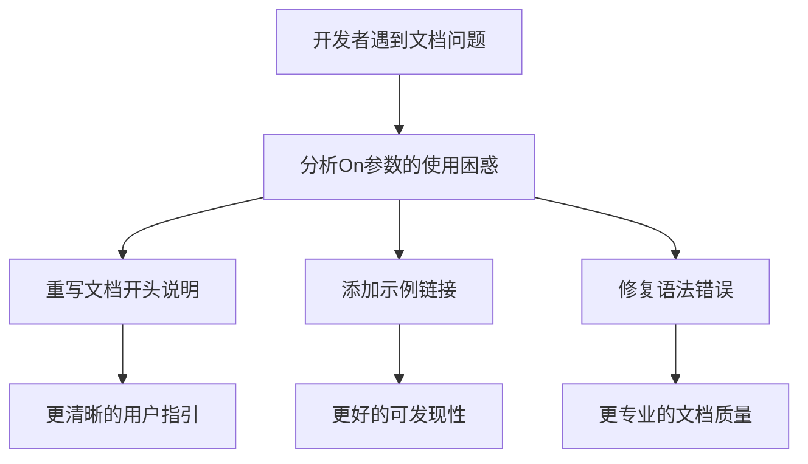

+++
title = "#21009"
date = "2025-09-13T00:00:00"
draft = false
template = "pull_request_page.html"
in_search_index = false

[extra]
current_language = "zh-cn"
available_languages = {"en" = { name = "English", url = "/pull_request/bevy/2025-09/pr-21009-en-20250913" }, "zh-cn" = { name = "中文", url = "/pull_request/bevy/2025-09/pr-21009-zh-cn-20250913" }}
+++

# Make `On` documentation more friendly

## 基本信息
- **Title**: Make `On` documentation more friendly
- **PR Link**: https://github.com/bevyengine/bevy/pull/21009
- **Author**: greeble-dev
- **Status**: MERGED
- **Labels**: C-Docs, A-ECS
- **Created**: 2025-09-13T15:00:34Z
- **Merged**: 2025-09-13T21:52:39Z
- **Merged By**: james7132

## 描述翻译
在将crate更新到Bevy 0.17时，我发现自己对如何使用`On`系统参数感到困惑——文档看起来有点底层，而且我没有意识到有些链接后面有示例。

这个PR添加了一个简短的描述并明确链接到示例。它还修复了一个看起来像是编辑错误的地方：

```diff
-/// The generic `B: Bundle` is used to modify the further specialize the events that this observer is interested in.
+/// The generic `B: Bundle` is used to further specialize the events that this observer is interested in.
```


## 这个PR的故事

这个PR源于开发者在实际使用Bevy 0.17时遇到的具体问题。当作者greeble-dev尝试升级自己的crate到新版本时，发现`On`系统参数的文档不够清晰，导致使用上的困惑。这是一个典型的文档可用性问题——虽然技术细节存在，但缺乏对初学者的友好引导。

问题的核心在于原有文档过于技术化，没有明确说明`On`的基本用途和使用场景。更重要的是，文档中没有明显地指出存在相关示例，这使得开发者需要额外花费时间寻找使用方法。这种体验问题在API文档中很常见，特别是对于相对复杂的ECS系统参数。

作者采取的解决方案直接而有效：首先重写文档开头部分，用更清晰的语言说明`On`的作用和定位。新的文档开头明确将其标识为"system parameter"，并直接指向相关的示例链接，这对于初次接触该功能的开发者非常有帮助。

同时，作者还修复了一个语法错误："modify the further specialize"被修正为"further specialize"。虽然这是一个小改动，但体现了对文档质量的重视，避免了读者可能产生的困惑。

从技术角度看，这个PR展示了良好的文档实践：
1. 优先说明核心概念（system parameter用于observer处理事件）
2. 提供具体的使用指引（参见Observer和Event的示例）
3. 保持技术准确性同时提高可读性
4. 修复语言错误以保持专业性

这种改进虽然看似简单，但对开发者体验有实质性提升。清晰的文档可以减少新用户的学习曲线，避免不必要的困惑和错误使用。

## 视觉表示



## 关键文件更改

- `crates/bevy_ecs/src/observer/system_param.rs` (+8/-4)

### 更改说明
这个文件包含了`On`系统参数的文档注释改进。主要更改包括重写开头的描述使其更友好，添加示例链接，以及修复语法错误。

```rust
// 修改前：
/// Type containing triggered [`Event`] information for a given run of an [`Observer`]. This contains the
/// [`Event`] data itself. It also provides access to the [`Trigger`](crate::event::Trigger), which for things like
/// [`EntityEvent`] with a [`PropagateEntityTrigger`], includes control over event propagation.
///
/// The generic `B: Bundle` is used to modify the further specialize the events that this observer is interested in.

// 修改后：
/// A [system parameter] used by an observer to process events. See [`Observer`] and [`Event`] for examples.
///
/// `On` contains the triggered [`Event`] data for a given run of an `Observer`. It also provides access to the
/// [`Trigger`](crate::event::Trigger), which for things like [`EntityEvent`] with a [`PropagateEntityTrigger`],
/// includes control over event propagation.
///
/// The generic `B: Bundle` is used to further specialize the events that this observer is interested in.
/// ...
/// [system parameter]: crate::system::SystemParam
```

## 进一步阅读
- [Bevy官方文档](https://docs.rs/bevy/latest/bevy/)
- [Bevy观察者示例](https://github.com/bevyengine/bevy/blob/main/examples/ecs/observer.rs)
- [Rust文档编写指南](https://doc.rust-lang.org/rustdoc/how-to-write-documentation.html)