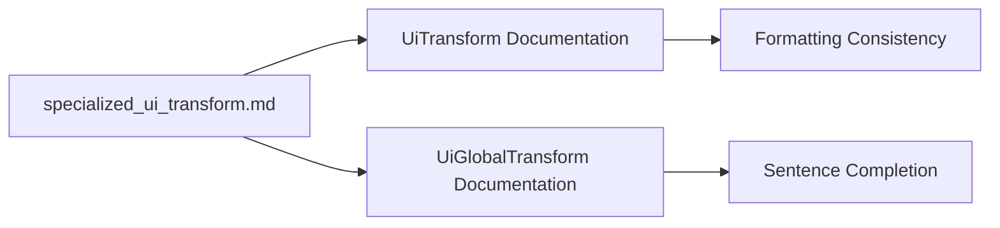

+++
title = "#21010 Fix typo in specialized_ui_transform.md"
date = "2025-09-13T00:00:00"
draft = false
template = "pull_request_page.html"
in_search_index = true

[taxonomies]
list_display = ["show"]

[extra]
current_language = "en"
available_languages = {"en" = { name = "English", url = "/pull_request/bevy/2025-09/pr-21010-en-20250913" }, "zh-cn" = { name = "中文", url = "/pull_request/bevy/2025-09/pr-21010-zh-cn-20250913" }}
labels = ["C-Docs", "D-Trivial", "A-Transform"]
+++

# Fix typo in specialized_ui_transform.md

## Basic Information
- **Title**: Fix typo in specialized_ui_transform.md
- **PR Link**: https://github.com/bevyengine/bevy/pull/21010
- **Author**: IQuick143
- **Status**: MERGED
- **Labels**: C-Docs, D-Trivial, S-Ready-For-Final-Review, A-Transform, X-Uncontroversial
- **Created**: 2025-09-13T15:13:37Z
- **Merged**: 2025-09-13T17:18:52Z
- **Merged By**: mockersf

## Description Translation
# Objective

I think the code block should be closed, the sentence probably too.

## The Story of This Pull Request

This PR addresses a straightforward documentation issue in Bevy's migration guide for specialized UI transforms. The problem was a simple typographical error in the `specialized_ui_transform.md` file where a sentence was missing its closing period and had inconsistent formatting.

The issue occurred in the migration guide documentation where the description of `UiTransform` and `UiGlobalTransform` components was incomplete. The original text had an unclosed sentence that described how `UiGlobalTransform` newtypes `Affine2` and is updated in the `ui_layout_system`, but lacked proper punctuation and formatting.

The solution was minimal and precise: add the missing period at the end of the sentence and properly format the first occurrence of `UiTransform` with backticks for consistency with the rest of the documentation. This change ensures that the documentation maintains professional standards and readability.

From a technical perspective, this fix demonstrates the importance of attention to detail in documentation. While the change itself is trivial, it contributes to the overall quality and professionalism of the Bevy engine's documentation. Well-maintained documentation helps developers understand migration requirements more effectively, reducing potential confusion when upgrading between versions.

The implementation required only a single character change (adding the period) and one formatting adjustment (adding backticks around the first `UiTransform` reference). This minor correction aligns with Bevy's commitment to maintaining high-quality documentation alongside its codebase.

## Visual Representation



## Key Files Changed

**File: `release-content/migration-guides/specialized_ui_transform.md`**

Changes made:
1. Added backticks around the first `UiTransform` reference for consistent formatting
2. Added a period at the end of the sentence to properly terminate it

Code diff:
```markdown
# Before:
UiTransform is a 2d-only equivalent of Transform with a responsive translation in `Val`s. `UiGlobalTransform` newtypes `Affine2` and is updated in `ui_layout_system

# After:
`UiTransform` is a 2D-only equivalent of Transform with a responsive translation in `Val`s. `UiGlobalTransform` newtypes `Affine2` and is updated in `ui_layout_system`.
```

## Further Reading

- [Bevy UI Documentation](https://bevyengine.org/learn/books/introduction/ui/)
- [Markdown Formatting Guide](https://www.markdownguide.org/basic-syntax/)
- [Bevy Migration Guides](https://bevyengine.org/learn/migration-guides/)