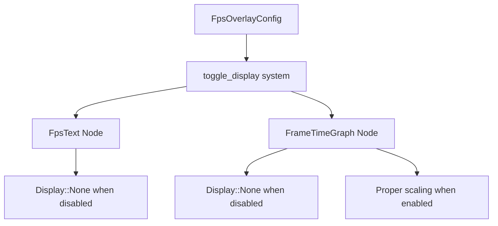

+++
title = "#21015 fps overlay: text node display none if disable"
date = "2025-09-15T00:00:00"
draft = false
template = "pull_request_page.html"
in_search_index = true

[taxonomies]
list_display = ["show"]

[extra]
current_language = "en"
available_languages = {"en" = { name = "English", url = "/pull_request/bevy/2025-09/pr-21015-en-20250915" }, "zh-cn" = { name = "中文", url = "/pull_request/bevy/2025-09/pr-21015-zh-cn-20250915" }}
labels = ["C-Bug", "A-UI"]
+++

# FPS Overlay: Text Node Display None If Disabled

## Basic Information
- **Title**: fps overlay: text node display none if disable
- **PR Link**: https://github.com/bevyengine/bevy/pull/21015
- **Author**: torsteingrindvik
- **Status**: MERGED
- **Labels**: C-Bug, A-UI, S-Ready-For-Final-Review
- **Created**: 2025-09-13T16:32:44Z
- **Merged**: 2025-09-15T22:26:18Z
- **Merged By**: alice-i-cecile

## Description Translation
Fixes https://github.com/bevyengine/bevy/issues/21003

# Objective

Make sure the FPS overlay properly removes node footprint when not enabled.

## Solution

Hide the text node like the graph node does. The text node was currently using visibility, which doesn't change the node footprint.

## Testing

My project works as expected now, buttons no longer exhibit strange picking bugs.

## Showcase

https://github.com/user-attachments/assets/8562af43-c12d-42e0-a2db-19ae49b85d24

Notice unlike the linked issue the outline of the FPS overlay completely disappears now when disabled.

## The Story of This Pull Request

The issue emerged when users reported UI interaction problems in areas where the FPS overlay was positioned. Even when disabled, the overlay's text node continued to occupy layout space, blocking interactions with underlying UI elements like buttons. This occurred because the text node used `Visibility::Hidden` instead of proper layout removal.

The developer identified the root cause: while the frame time graph node correctly used `Display::None` to remove itself from layout calculations, the text node relied on visibility changes that only affected rendering, not layout. This inconsistency created a situation where disabled overlay elements still impacted UI layout and interaction.

The solution involved standardizing the approach across both overlay components. The implementation refactored the `toggle_display` system to:

1. Use targeted queries with `Single` to efficiently access both text and graph nodes
2. Apply `Display::None` consistently to both components when disabled
3. Maintain proper scaling behavior for the graph when enabled

Key technical considerations included:
- The difference between `Visibility` (affects rendering only) and `Display` (affects layout)
- Using `Single` queries with filter tuples for precise component access
- Preserving the graph scaling logic when the overlay is enabled

The changes ensure that when the FPS overlay is disabled, both text and graph nodes are completely removed from layout calculations, eliminating any footprint they previously occupied. This fixes UI interaction issues while maintaining the overlay's functionality when enabled.

## Visual Representation



## Key Files Changed

### `crates/bevy_dev_tools/src/fps_overlay.rs` (+16/-21)

This file contains the core logic for the FPS overlay functionality. The changes focused on the `toggle_display` system to fix layout issues when the overlay is disabled.

**Key changes:**
1. Removed unnecessary imports (`Visibility`, `DetectChangesMut`)
2. Added targeted queries using `Single` with filter tuples
3. Replaced visibility-based hiding with display-based layout removal

```rust
// Before:
fn toggle_display(
    overlay_config: Res<FpsOverlayConfig>,
    mut query: Query<&mut Visibility, With<FpsText>>,
    mut graph_style: Query<&mut Node, With<FrameTimeGraph>>,
) {
    for mut visibility in &mut query {
        visibility.set_if_neq(match overlay_config.enabled {
            true => Visibility::Visible,
            false => Visibility::Hidden,
        });
    }
    
    // ... graph handling code
}

// After:
fn toggle_display(
    overlay_config: Res<FpsOverlayConfig>,
    mut text_node: Single<&mut Node, (With<FpsText>, Without<FrameTimeGraph>)>,
    mut graph_node: Single<&mut Node, (With<FrameTimeGraph>, Without<FpsText>)>,
) {
    if overlay_config.enabled {
        text_node.display = bevy_ui::Display::DEFAULT;
    } else {
        text_node.display = bevy_ui::Display::None;
    }
    
    // ... simplified graph handling code
}
```

The changes ensure both text and graph nodes use consistent display management, completely removing them from layout when disabled rather than just hiding them visually.

## Further Reading

- [Bevy UI Documentation](https://bevyengine.org/learn/books/introduction/ui)
- [CSS Display vs Visibility (similar concepts)](https://developer.mozilla.org/en-US/docs/Web/CSS/display)
- [Bevy ECS Query System](https://bevyengine.org/learn/books/introduction/ecs#queries)