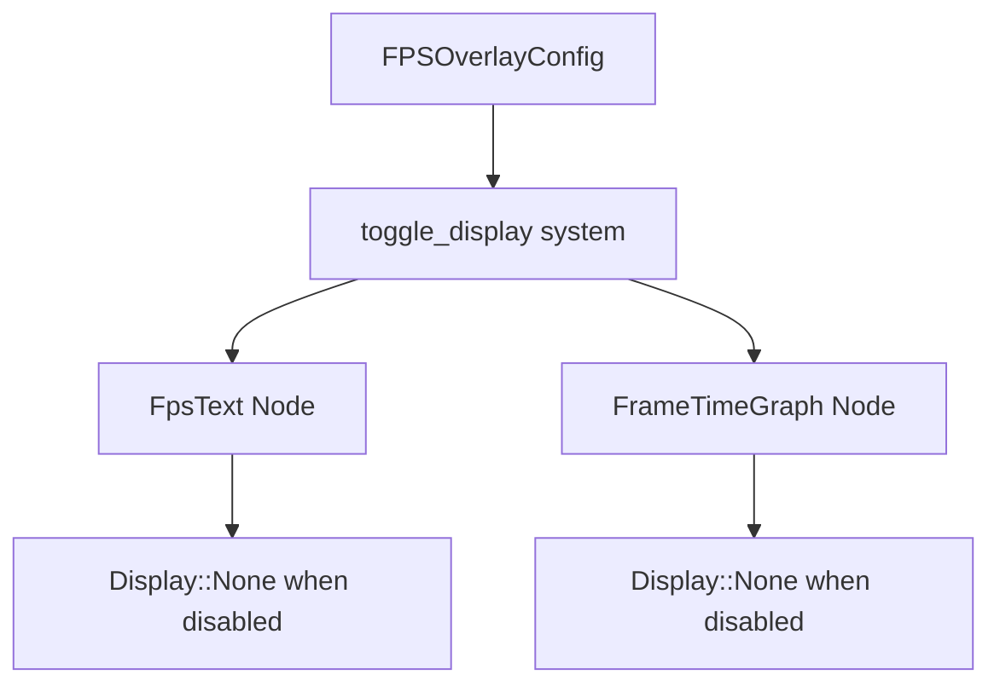

+++
title = "#21015 fps overlay: text node display none if disable"
date = "2025-09-15T00:00:00"
draft = false
template = "pull_request_page.html"
in_search_index = false

[extra]
current_language = "zh-cn"
available_languages = {"en" = { name = "English", url = "/pull_request/bevy/2025-09/pr-21015-en-20250915" }, "zh-cn" = { name = "中文", url = "/pull_request/bevy/2025-09/pr-21015-zh-cn-20250915" }}
labels = ["C-Bug", "A-UI"]
+++

# Title

## Basic Information
- **Title**: fps overlay: text node display none if disable
- **PR Link**: https://github.com/bevyengine/bevy/pull/21015
- **Author**: torsteingrindvik
- **Status**: MERGED
- **Labels**: C-Bug, A-UI, S-Ready-For-Final-Review
- **Created**: 2025-09-13T16:32:44Z
- **Merged**: 2025-09-15T22:26:18Z
- **Merged By**: alice-i-cecile

## Description Translation
修复 https://github.com/bevyengine/bevy/issues/21003

# 目标

确保 FPS 叠加层在禁用时正确移除节点占用空间。

## 解决方案

像图形节点那样隐藏文本节点。文本节点当前使用的是 visibility，这不会改变节点占用空间。

## 测试

我的项目现在按预期工作，按钮不再出现奇怪的拾取 bug。

## 展示

https://github.com/user-attachments/assets/8562af43-c12d-42e0-a2db-19ae49b85d24

注意与链接的问题不同，禁用时 FPS 叠加层的轮廓现在完全消失了。

## The Story of This Pull Request

这个 PR 解决了一个 UI 交互问题，当 FPS 叠加层被禁用时，其文本节点仍然在布局中占用空间，导致下方的 UI 元素（如按钮）出现异常的拾取行为。

问题的核心在于 Bevy UI 系统中 `Visibility` 和 `Display` 属性的区别。`Visibility::Hidden` 只会隐藏元素但仍保留其布局空间，而 `Display::None` 会完全从布局流中移除元素。原来的实现对文本节点使用了错误的隐藏方式。

开发者通过修改 `toggle_display` 函数来解决这个问题。关键变化包括：

1. 使用更精确的查询来分别获取文本节点和图形节点
2. 将文本节点的隐藏方式从 `Visibility::Hidden` 改为 `Display::None`
3. 简化了图形节点的显示控制逻辑

```rust
// 修改前：
for mut visibility in &mut query {
    visibility.set_if_neq(match overlay_config.enabled {
        true => Visibility::Visible,
        false => Visibility::Hidden,
    });
}

// 修改后：
if overlay_config.enabled {
    text_node.display = bevy_ui::Display::DEFAULT;
} else {
    text_node.display = bevy_ui::Display::None;
}
```

这个修改确保了当 FPS 叠加层被禁用时，文本节点完全从布局中移除，不再影响其他 UI 元素的交互。图形节点的处理逻辑也进行了类似的简化，使其更加清晰和一致。

从工程角度看，这个修复展示了 UI 系统中显示控制机制的正确用法，提醒开发者注意 `Visibility` 和 `Display` 属性在不同场景下的适用性。对于需要完全移除布局占用的场景，应该使用 `Display::None` 而不是 `Visibility::Hidden`。

## Visual Representation



## Key Files Changed

### `crates/bevy_dev_tools/src/fps_overlay.rs` (+16/-21)

主要修改了 `toggle_display` 函数，改进 FPS 叠加层的显示控制逻辑：

```rust
// 修改前：
fn toggle_display(
    overlay_config: Res<FpsOverlayConfig>,
    mut query: Query<&mut Visibility, With<FpsText>>,
    mut graph_style: Query<&mut Node, With<FrameTimeGraph>>,
) {
    for mut visibility in &mut query {
        visibility.set_if_neq(match overlay_config.enabled {
            true => Visibility::Visible,
            false => Visibility::Hidden,
        });
    }

    if let Ok(mut graph_style) = graph_style.single_mut() {
        if overlay_config.frame_time_graph_config.enabled {
            // Scale the frame time graph based on the font size of the overlay
            let font_size = overlay_config.text_config.font_size;
            graph_style.width = Val::Px(font_size * FRAME_TIME_GRAPH_WIDTH_SCALE);
            graph_style.height = Val::Px(font_size * FRAME_TIME_GRAPH_HEIGHT_SCALE);

            graph_style.display = bevy_ui::Display::DEFAULT;
        } else {
            graph_style.display = bevy_ui::Display::None;
        }
    }
}

// 修改后：
fn toggle_display(
    overlay_config: Res<FpsOverlayConfig>,
    mut text_node: Single<&mut Node, (With<FpsText>, Without<FrameTimeGraph>)>,
    mut graph_node: Single<&mut Node, (With<FrameTimeGraph>, Without<FpsText>)>,
) {
    if overlay_config.enabled {
        text_node.display = bevy_ui::Display::DEFAULT;
    } else {
        text_node.display = bevy_ui::Display::None;
    }

    if overlay_config.frame_time_graph_config.enabled {
        // Scale the frame time graph based on the font size of the overlay
        let font_size = overlay_config.text_config.font_size;
        graph_node.width = Val::Px(font_size * FRAME_TIME_GRAPH_WIDTH_SCALE);
        graph_node.height = Val::Px(font_size * FRAME_TIME_GRAPH_HEIGHT_SCALE);

        graph_node.display = bevy_ui::Display::DEFAULT;
    } else {
        graph_node.display = bevy_ui::Display::None;
    }
}
```

这些修改确保了：
1. 文本节点在禁用时使用 `Display::None` 而不是 `Visibility::Hidden`
2. 使用更精确的查询来分别处理文本节点和图形节点
3. 简化了图形节点的显示控制逻辑

## Further Reading

- [Bevy UI 系统文档](https://docs.rs/bevy_ui/latest/bevy_ui/)
- [CSS Display 属性参考](https://developer.mozilla.org/en-US/docs/Web/CSS/display) - 了解显示控制的基本概念
- [Bevy ECS 查询系统](https://bevy-cheatbook.github.io/programming/queries.html) - 理解如何使用查询系统访问组件