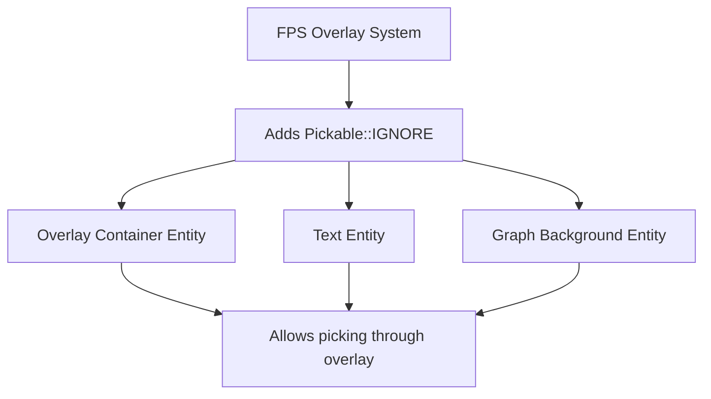

+++
title = "#21016 fps overlay: allow picking through"
date = "2025-09-13T00:00:00"
draft = false
template = "pull_request_page.html"
in_search_index = true

[taxonomies]
list_display = ["show"]

[extra]
current_language = "en"
available_languages = {"en" = { name = "English", url = "/pull_request/bevy/2025-09/pr-21016-en-20250913" }, "zh-cn" = { name = "中文", url = "/pull_request/bevy/2025-09/pr-21016-zh-cn-20250913" }}
labels = ["D-Trivial", "A-UI", "C-Usability", "A-Dev-Tools"]
+++

# fps overlay: allow picking through

## Basic Information
- **Title**: fps overlay: allow picking through
- **PR Link**: https://github.com/bevyengine/bevy/pull/21016
- **Author**: torsteingrindvik
- **Status**: MERGED
- **Labels**: D-Trivial, A-UI, C-Usability, A-Dev-Tools
- **Created**: 2025-09-13T16:44:12Z
- **Merged**: 2025-09-13T21:55:28Z
- **Merged By**: james7132

## Description Translation
# Objective

The current FPS overlay does not allow users to pick through it.
Since the FPS overlay is absolutely positioned it's likely it will be on top of other UI, which can create problems.

## Solution

Ignore picking for the FPS overlay on the assumption it's more likely users want to click things _under_ it.

## Testing

See showcase.

## Showcase

https://github.com/user-attachments/assets/87b3a6b2-4745-4fb7-a846-2edb96ff97d7

## The Story of This Pull Request

The FPS overlay in Bevy's developer tools was causing usability issues by blocking interaction with UI elements positioned beneath it. Since the overlay uses absolute positioning and renders on top of other UI components, users couldn't click through it to interact with underlying interface elements. This created a practical problem for developers who needed to monitor performance metrics while simultaneously interacting with their application's UI.

The solution implemented was straightforward and targeted: add the `Pickable::IGNORE` component to all entities comprising the FPS overlay. This approach leverages Bevy's existing picking system to allow mouse events to pass through the overlay transparently, reaching whatever UI elements or game objects are positioned behind it.

The implementation required minimal changes, adding just three lines of code across two entity spawns in the overlay setup function. The first addition prevents picking on the main overlay container, while the second ensures the text elements within the overlay also ignore picking events. This comprehensive approach ensures that no part of the FPS overlay will block interaction with underlying elements.

From a technical perspective, this change demonstrates Bevy's component-based architecture effectively. By simply adding the `Pickable::IGNORE` component, the overlay entities are excluded from the picking system without affecting their visual rendering or other functionality. This is a clean solution that maintains separation of concerns while solving the usability issue.

The impact of this change is immediately beneficial for developers using the FPS overlay tool. They can now interact with UI elements positioned beneath the overlay without needing to temporarily disable or move the performance monitoring tool. This improves the developer experience and workflow efficiency when debugging performance issues.

## Visual Representation



## Key Files Changed

- `crates/bevy_dev_tools/src/fps_overlay.rs` (+4/-0)

The changes add `Pickable::IGNORE` components to the FPS overlay entities to allow mouse interactions to pass through to underlying UI elements.

```rust
// File: crates/bevy_dev_tools/src/fps_overlay.rs
// Before:
        .spawn((
            Node {
                // ... existing node configuration
            },
            // Render overlay on top of everything
            GlobalZIndex(FPS_OVERLAY_ZINDEX),
        ))

// After:
        .spawn((
            Node {
                // ... existing node configuration
            },
            // Render overlay on top of everything
            GlobalZIndex(FPS_OVERLAY_ZINDEX),
            Pickable::IGNORE,
        ))
```

```rust
// File: crates/bevy_dev_tools/src/fps_overlay.rs
// Before:
            p.spawn((
                TextBundle::default(),
                overlay_config.text_config.clone(),
                TextColor(overlay_config.text_color),
                FpsText,
            ))

// After:
            p.spawn((
                TextBundle::default(),
                overlay_config.text_config.clone(),
                TextColor(overlay_config.text_color),
                FpsText,
                Pickable::IGNORE,
            ))
```

```rust
// File: crates/bevy_dev_tools/src/fps_overlay.rs
// Before:
                MaterialNode::from(frame_time_graph_materials.add(FrametimeGraphMaterial {
                    // ... material configuration
                }),

// After:
                MaterialNode::from(frame_time_graph_materials.add(FrametimeGraphMaterial {
                    // ... material configuration
                }),
                Pickable::IGNORE,
```

## Further Reading

- [Bevy UI Documentation](https://bevyengine.org/learn/books/introduction/11-ui/)
- [Bevy Picking System](https://github.com/bevyengine/bevy/tree/main/crates/bevy_picking)
- [Component-Based Architecture Patterns](https://gameprogrammingpatterns.com/component.html)

# Full Code Diff
```diff
diff --git a/crates/bevy_dev_tools/src/fps_overlay.rs b/crates/bevy_dev_tools/src/fps_overlay.rs
index c3b22e8b02da2..3c573611f70b3 100644
--- a/crates/bevy_dev_tools/src/fps_overlay.rs
+++ b/crates/bevy_dev_tools/src/fps_overlay.rs
@@ -15,6 +15,7 @@ use bevy_ecs::{
     schedule::{common_conditions::resource_changed, IntoScheduleConfigs},
     system::{Commands, Query, Res, ResMut},
 };
+use bevy_picking::Pickable;
 use bevy_render::storage::ShaderStorageBuffer;
 use bevy_text::{Font, TextColor, TextFont, TextSpan};
 use bevy_time::Time;
@@ -166,6 +167,7 @@ fn setup(
             },
             // Render overlay on top of everything
             GlobalZIndex(FPS_OVERLAY_ZINDEX),
+            Pickable::IGNORE,
         ))
         .with_children(|p| {
             p.spawn((
@@ -173,6 +175,7 @@ fn setup(
                 overlay_config.text_config.clone(),
                 TextColor(overlay_config.text_color),
                 FpsText,
+                Pickable::IGNORE,
             ))
             .with_child((TextSpan::default(), overlay_config.text_config.clone()));
 
@@ -188,6 +191,7 @@ fn setup(
                     },
                     ..Default::default()
                 },
+                Pickable::IGNORE,
                 MaterialNode::from(frame_time_graph_materials.add(FrametimeGraphMaterial {
                     values: buffers.add(ShaderStorageBuffer {
                         // Initialize with dummy data because the default (`data: None`) will
```