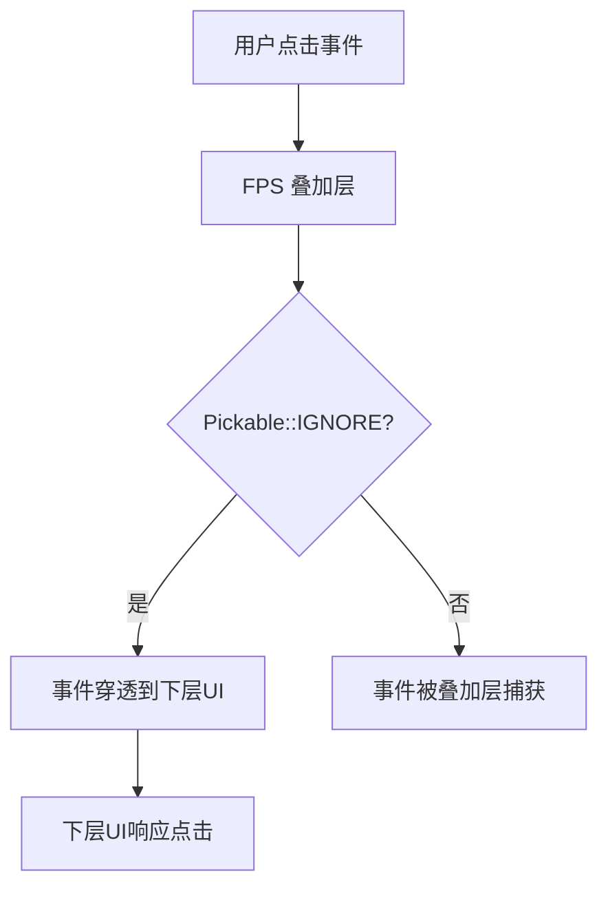

+++
title = "#21016 fps overlay: allow picking through"
date = "2025-09-13T00:00:00"
draft = false
template = "pull_request_page.html"
in_search_index = false

[extra]
current_language = "zh-cn"
available_languages = {"en" = { name = "English", url = "/pull_request/bevy/2025-09/pr-21016-en-20250913" }, "zh-cn" = { name = "中文", url = "/pull_request/bevy/2025-09/pr-21016-zh-cn-20250913" }}
labels = ["D-Trivial", "A-UI", "C-Usability", "A-Dev-Tools"]
+++

# Title

## Basic Information
- **Title**: fps overlay: allow picking through
- **PR Link**: https://github.com/bevyengine/bevy/pull/21016
- **Author**: torsteingrindvik
- **Status**: MERGED
- **Labels**: D-Trivial, A-UI, C-Usability, A-Dev-Tools
- **Created**: 2025-09-13T16:44:12Z
- **Merged**: 2025-09-13T21:55:28Z
- **Merged By**: james7132

## Description Translation
**目标 (Objective)**

当前的 FPS 叠加层不允许用户穿透点击。
由于 FPS 叠加层采用绝对定位，它很可能位于其他 UI 元素之上，这可能会产生问题。

**解决方案 (Solution)**

忽略 FPS 叠加层的点击检测，基于用户更可能想要点击其下方内容的假设。

**测试 (Testing)**

参见展示视频。

**展示 (Showcase)**

https://github.com/user-attachments/assets/87b3a6b2-4745-4fb7-a846-2edb96ff97d7

## The Story of This Pull Request

这个 PR 解决了一个实际的用户体验问题。在 Bevy 游戏引擎中，FPS 叠加层是一个开发工具，用于实时显示帧率信息。由于它采用绝对定位并置于其他 UI 元素之上，导致用户无法与下方的 UI 元素进行交互。

问题的核心在于 Bevy 的 picking（拾取）系统默认会处理所有 UI 元素的点击事件。当 FPS 叠加层覆盖在其他 UI 元素上时，它会拦截所有的点击事件，即使用户真正想要交互的是下方的按钮或其他控件。

解决方案非常直接且有效：在 FPS 叠加层及其子元素上添加 `Pickable::IGNORE` 组件。这个组件来自 Bevy 的 `bevy_picking` 模块，它告诉拾取系统忽略这些实体的点击检测，让事件能够穿透到下方的 UI 元素。

从技术实现角度来看，这个修改体现了几个重要的设计原则：

1. **最小化修改**：只添加了必要的组件，没有改变现有的布局或渲染逻辑
2. **向后兼容**：不影响现有功能，只是改变了交互行为
3. **符合用户预期**：开发工具不应该干扰正常的用户交互

实现细节上，在 `setup` 函数中创建 FPS 叠加层时，为父节点和文本节点都添加了 `Pickable::IGNORE`：

```rust
// 父节点添加 Pickable::IGNORE
GlobalZIndex(FPS_OVERLAY_ZINDEX),
Pickable::IGNORE,
```

```rust
// 文本节点也添加 Pickable::IGNORE
FpsText,
Pickable::IGNORE,
```

这种双重保障确保无论用户点击叠加层的哪个部分，事件都能正确穿透。

这个修改虽然简单，但解决了实际开发中的一个痛点。现在开发者可以在不关闭 FPS 显示的情况下与界面其他部分交互，提高了开发效率和工作流程的顺畅度。

## Visual Representation



## Key Files Changed

### `crates/bevy_dev_tools/src/fps_overlay.rs` (+4/-0)

这个文件包含了 FPS 叠加层的实现逻辑。修改主要在 `setup` 函数中，为 FPS 叠加层实体添加了点击忽略功能。

**关键修改：**

```rust
// 修改前：
GlobalZIndex(FPS_OVERLAY_ZINDEX),
))

// 修改后：
GlobalZIndex(FPS_OVERLAY_ZINDEX),
Pickable::IGNORE,
))
```

```rust
// 修改前：
FpsText,
))

// 修改后：
FpsText,
Pickable::IGNORE,
))
```

这些修改确保了 FPS 叠加层不会拦截鼠标点击事件，让用户能够与叠加层下方的 UI 元素交互。

## Further Reading

- [Bevy Picking System Documentation](https://docs.rs/bevy_picking/latest/bevy_picking/) - 了解 Bevy 的拾取系统如何工作
- [Bevy UI System Guide](https://bevyengine.org/learn/books/introduction/ui/) - 学习 Bevy UI 系统的基本概念
- [Interaction Components in Bevy](https://docs.rs/bevy/latest/bevy/ui/entity/struct.Interaction.html) - 深入了解 Bevy 的交互组件

# Full Code Diff
```diff
diff --git a/crates/bevy_dev_tools/src/fps_overlay.rs b/crates/bevy_dev_tools/src/fps_overlay.rs
index c3b22e8b02da2..3c573611f70b3 100644
--- a/crates/bevy_dev_tools/src/fps_overlay.rs
+++ b/crates/bevy_dev_tools/src/fps_overlay.rs
@@ -15,6 +15,7 @@ use bevy_ecs::{
     schedule::{common_conditions::resource_changed, IntoScheduleConfigs},
     system::{Commands, Query, Res, ResMut},
 };
+use bevy_picking::Pickable;
 use bevy_render::storage::ShaderStorageBuffer;
 use bevy_text::{Font, TextColor, TextFont, TextSpan};
 use bevy_time::Time;
@@ -166,6 +167,7 @@ fn setup(
             },
             // Render overlay on top of everything
             GlobalZIndex(FPS_OVERLAY_ZINDEX),
+            Pickable::IGNORE,
         ))
         .with_children(|p| {
             p.spawn((
@@ -173,6 +175,7 @@ fn setup(
                 overlay_config.text_config.clone(),
                 TextColor(overlay_config.text_color),
                 FpsText,
+                Pickable::IGNORE,
             ))
             .with_child((TextSpan::default(), overlay_config.text_config.clone()));
 
@@ -188,6 +191,7 @@ fn setup(
                     },
                     ..Default::default()
                 },
+                Pickable::IGNORE,
                 MaterialNode::from(frame_time_graph_materials.add(FrametimeGraphMaterial {
                     values: buffers.add(ShaderStorageBuffer {
                         // Initialize with dummy data because the default (`data: None`) will
```