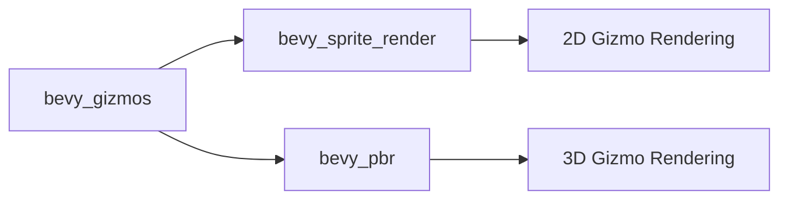

+++
title = "#21018 fix sprite gizmo feature"
date = "2025-09-14T00:00:00"
draft = false
template = "pull_request_page.html"
in_search_index = true

[taxonomies]
list_display = ["show"]

[extra]
current_language = "en"
available_languages = {"en" = { name = "English", url = "/pull_request/bevy/2025-09/pr-21018-en-20250914" }, "zh-cn" = { name = "中文", url = "/pull_request/bevy/2025-09/pr-21018-zh-cn-20250914" }}
labels = ["A-Rendering", "A-Gizmos"]
+++

# Title
fix sprite gizmo feature

## Basic Information
- **Title**: fix sprite gizmo feature
- **PR Link**: https://github.com/bevyengine/bevy/pull/21018
- **Author**: atlv24
- **Status**: MERGED
- **Labels**: A-Rendering, S-Ready-For-Final-Review, A-Gizmos
- **Created**: 2025-09-13T18:12:19Z
- **Merged**: 2025-09-14T20:20:24Z
- **Merged By**: alice-i-cecile

## Description Translation
# Objective

- Fix #21008

## Solution

- I missed this during review of the sprite render split, bevy_gizmos should only care about bevy_sprite_render's presence.

## Testing

- repro in linked issue

## The Story of This Pull Request

This PR addresses a build breakage that occurred after a recent architectural change in Bevy's rendering system. The core issue was that the gizmos system was incorrectly checking for the presence of the `bevy_sprite` feature when it should have been checking for `bevy_sprite_render` instead.

The problem stemmed from a previous sprite render split where the rendering functionality was separated from the broader sprite system. During this split, the gizmos system needed to be updated to depend on the new `bevy_sprite_render` component rather than the full `bevy_sprite` module, but this dependency was missed during review.

The fix involved updating multiple locations where feature flags and conditional compilation were checking for the wrong module. The changes ensure that:

1. The dependency on `bevy_sprite` is completely removed from the gizmos system
2. All feature conditionals now correctly check for `bevy_sprite_render` instead of `bevy_sprite`
3. Warning messages and documentation are updated to reference the correct plugin (`SpriteRenderPlugin` instead of `SpritePlugin`)

This is a straightforward but important fix that maintains the architectural separation established by the sprite render split while ensuring the gizmos system continues to work correctly with both 2D and 3D rendering pipelines.

## Visual Representation



## Key Files Changed

### `crates/bevy_gizmos/Cargo.toml`
Removed the unnecessary dependency on `bevy_sprite`:
```toml
# Before:
bevy_sprite = { path = "../bevy_sprite", version = "0.17.0-dev", optional = true }

# After:
# (dependency removed entirely)
```

### `crates/bevy_gizmos/src/config.rs`
Updated feature conditionals to use `bevy_sprite_render`:
```rust
// Before:
#[cfg(all(
    feature = "bevy_render",
    any(feature = "bevy_pbr", feature = "bevy_sprite")
))]

// After:
#[cfg(all(
    feature = "bevy_render",
    any(feature = "bevy_pbr", feature = "bevy_sprite_render")
))]
```

### `crates/bevy_gizmos/src/lib.rs`
Multiple updates to feature flags and plugin detection:
```rust
// Before:
#[cfg(feature = "bevy_sprite")]

// After:
#[cfg(feature = "bevy_sprite_render")]
```

Updated plugin detection and warning message:
```rust
// Before:
if app.is_plugin_added::<bevy_sprite::SpritePlugin>() {
    // ...
} else {
    tracing::warn!("bevy_sprite feature is enabled but bevy_sprite::SpritePlugin was not detected");
}

// After:
if app.is_plugin_added::<bevy_sprite_render::SpriteRenderPlugin>() {
    // ...
} else {
    tracing::warn!("bevy_sprite_render feature is enabled but bevy_sprite_render::SpriteRenderPlugin was not detected");
}
```

### `crates/bevy_internal/Cargo.toml`
Updated feature dependencies:
```toml
// Before:
bevy_sprite = ["dep:bevy_sprite", "bevy_camera", "bevy_gizmos?/bevy_sprite"]

// After:
bevy_sprite = ["dep:bevy_sprite", "bevy_camera"]
```

## Further Reading

- [Bevy Gizmos Documentation](https://docs.rs/bevy_gizmos/latest/bevy_gizmos/)
- [Conditional Compilation in Rust](https://doc.rust-lang.org/reference/conditional-compilation.html)
- [Bevy's Render Graph Architecture](https://bevyengine.org/learn/architecture/render-graph/)