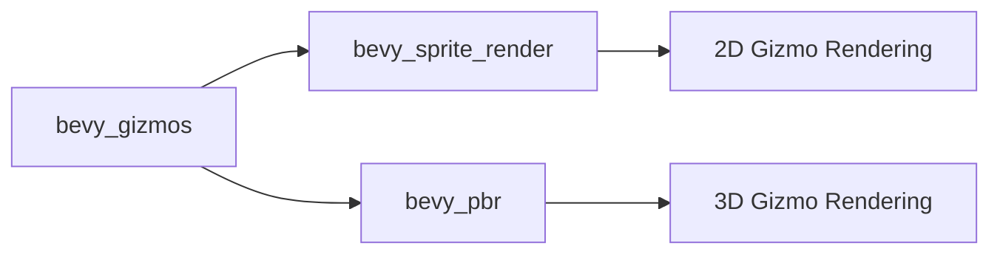

+++
title = "#21018 fix sprite gizmo feature"
date = "2025-09-14T00:00:00"
draft = false
template = "pull_request_page.html"
in_search_index = false

[extra]
current_language = "zh-cn"
available_languages = {"en" = { name = "English", url = "/pull_request/bevy/2025-09/pr-21018-en-20250914" }, "zh-cn" = { name = "中文", url = "/pull_request/bevy/2025-09/pr-21018-zh-cn-20250914" }}
+++

# fix sprite gizmo feature

## 基本信息
- **标题**: fix sprite gizmo feature
- **PR链接**: https://github.com/bevyengine/bevy/pull/21018
- **作者**: atlv24
- **状态**: 已合并
- **标签**: A-Rendering, S-Ready-For-Final-Review, A-Gizmos
- **创建时间**: 2025-09-13T18:12:19Z
- **合并时间**: 2025-09-14T20:20:24Z
- **合并者**: alice-i-cecile

## 描述翻译
# Objective (目标)

- 修复 #21008

## Solution (解决方案)

- 在sprite渲染拆分审查期间我漏掉了这一点，bevy_gizmos应该只关心bevy_sprite_render的存在。

## Testing (测试)

- 在链接的issue中复现

## 这个PR的故事

这个PR解决了一个条件编译依赖的问题，是在Bevy引擎的sprite渲染系统重构后出现的。问题的核心在于`bevy_gizmos`模块错误地依赖了完整的`bevy_sprite`模块，而实际上它只需要依赖新拆分出来的`bevy_sprite_render`模块。

在Bevy的架构中，sprite系统最近被拆分为两个部分：`bevy_sprite`（处理逻辑和组件）和`bevy_sprite_render`（专门处理渲染）。这种拆分是为了更好地分离关注点，让渲染相关的代码更加模块化。

问题出现在`bevy_gizmos`模块中，它需要根据不同的渲染后端（2D或3D）来条件编译不同的功能。在sprite拆分之前，gizmo系统正确地依赖`bevy_sprite`特性来启用2D gizmo渲染。但在拆分后，这个依赖关系应该调整为只依赖渲染部分，即`bevy_sprite_render`。

这个错误导致了编译问题：当用户启用了gizmo的sprite相关功能但没有正确配置新的渲染依赖时，构建会失败。具体来说，issue #21008中报告的问题就是由此引起的。

解决方案相当直接但需要全面：在整个`bevy_gizmos`模块中，将所有对`bevy_sprite`特性的引用替换为对`bevy_sprite_render`特性的引用。这涉及到多个文件和多个条件编译块。

从技术角度看，这个修复展示了Bevy中条件编译和特性标志的正确用法。条件编译在游戏引擎中很重要，因为它允许根据用户的需求包含或排除特定功能，从而优化二进制大小和编译时间。

这个修改的影响是恢复了sprite gizmo功能的正常工作，确保2D调试图形能够正确渲染。虽然修改看起来简单，但它涉及到多个文件的一致性变更，这强调了在大型代码库中进行重构时需要全面检查所有依赖关系的重要性。

## 可视化表示



## 关键文件变更

### `crates/bevy_gizmos/src/lib.rs` (+13/-13)
这是主要的修改文件，包含了最多的变更。修改涉及将所有的`bevy_sprite`特性条件编译替换为`bevy_sprite_render`。

```rust
// 修改前:
#[cfg(feature = "bevy_sprite")]

// 修改后:
#[cfg(feature = "bevy_sprite_render")]
```

```rust
// 修改前:
if app.is_plugin_added::<bevy_sprite::SpritePlugin>()

// 修改后:
if app.is_plugin_added::<bevy_sprite_render::SpriteRenderPlugin>()
```

### `crates/bevy_gizmos/src/config.rs` (+2/-2)
配置文件中的条件编译标志也需要更新以保持一致性。

```rust
// 修改前:
any(feature = "bevy_pbr", feature = "bevy_sprite")

// 修改后:
any(feature = "bevy_pbr", feature = "bevy_sprite_render")
```

### `crates/bevy_gizmos/src/retained.rs` (+1/-1)
保留的gizmo系统中也需要相应的条件编译更新。

```rust
// 修改前:
#[cfg(any(feature = "bevy_pbr", feature = "bevy_sprite"))]

// 修改后:
#[cfg(any(feature = "bevy_pbr", feature = "bevy_sprite_render"))]
```

### `crates/bevy_gizmos/Cargo.toml` (+0/-1)
移除了对`bevy_sprite`的直接依赖，因为现在通过`bevy_sprite_render`间接依赖。

```toml
// 移除的行:
bevy_sprite = { path = "../bevy_sprite", version = "0.17.0-dev", optional = true }
```

### `crates/bevy_internal/Cargo.toml` (+1/-1)
更新了内部Cargo配置，移除了不必要的gizmo特性依赖。

```toml
// 修改前:
bevy_sprite = ["dep:bevy_sprite", "bevy_camera", "bevy_gizmos?/bevy_sprite"]

// 修改后:
bevy_sprite = ["dep:bevy_sprite", "bevy_camera"]
```

## 延伸阅读

- [Bevy条件编译文档](https://doc.rust-lang.org/cargo/reference/features.html)
- [Bevy渲染架构](https://bevyengine.org/learn/architecture/)
- [Rust特性标志最佳实践](https://doc.rust-lang.org/cargo/reference/features.html)

# 完整代码差异
```diff
diff --git a/crates/bevy_gizmos/Cargo.toml b/crates/bevy_gizmos/Cargo.toml
index 1c2f5324855cd..d163450ed272b 100644
--- a/crates/bevy_gizmos/Cargo.toml
+++ b/crates/bevy_gizmos/Cargo.toml
@@ -16,7 +16,6 @@ bevy_render = ["dep:bevy_render", "bevy_core_pipeline"]
 [dependencies]
 # Bevy
 bevy_pbr = { path = "../bevy_pbr", version = "0.17.0-dev", optional = true }
-bevy_sprite = { path = "../bevy_sprite", version = "0.17.0-dev", optional = true }
 bevy_sprite_render = { path = "../bevy_sprite_render", version = "0.17.0-dev", optional = true }
 bevy_app = { path = "../bevy_app", version = "0.17.0-dev" }
 bevy_camera = { path = "../bevy_camera", version = "0.17.0-dev" }
diff --git a/crates/bevy_gizmos/src/config.rs b/crates/bevy_gizmos/src/config.rs
index 3fcc45deb440c..256847691d68a 100644
--- a/crates/bevy_gizmos/src/config.rs
+++ b/crates/bevy_gizmos/src/config.rs
@@ -4,7 +4,7 @@ pub use bevy_gizmos_macros::GizmoConfigGroup;
 
 #[cfg(all(
     feature = "bevy_render",
-    any(feature = "bevy_pbr", feature = "bevy_sprite")
+    any(feature = "bevy_pbr", feature = "bevy_sprite_render")
 ))]
 use {crate::GizmoAsset, bevy_asset::Handle, bevy_ecs::component::Component};
 
@@ -246,7 +246,7 @@ impl Default for GizmoLineConfig {
 
 #[cfg(all(
     feature = "bevy_render",
-    any(feature = "bevy_pbr", feature = "bevy_sprite")
+    any(feature = "bevy_pbr", feature = "bevy_sprite_render")
 ))]
 #[derive(Component)]
 pub(crate) struct GizmoMeshConfig {
diff --git a/crates/bevy_gizmos/src/lib.rs b/crates/bevy_gizmos/src/lib.rs
index ecc8ee0e48c03..6eda35ee41df5 100755
--- a/crates/bevy_gizmos/src/lib.rs
+++ b/crates/bevy_gizmos/src/lib.rs
@@ -26,7 +26,7 @@ extern crate self as bevy_gizmos;
 #[derive(SystemSet, Clone, Debug, Hash, PartialEq, Eq)]
 pub enum GizmoRenderSystems {
     /// Adds gizmos to the [`Transparent2d`](bevy_core_pipeline::core_2d::Transparent2d) render phase
-    #[cfg(feature = "bevy_sprite")]
+    #[cfg(feature = "bevy_sprite_render")]
     QueueLineGizmos2d,
     /// Adds gizmos to the [`Transparent3d`](bevy_core_pipeline::core_3d::Transparent3d) render phase
     #[cfg(feature = "bevy_pbr")]
@@ -54,7 +54,7 @@ pub mod rounded_box;
 #[cfg(all(feature = "bevy_pbr", feature = "bevy_render"))]
 pub mod light;
 
-#[cfg(all(feature = "bevy_sprite", feature = "bevy_render"))]
+#[cfg(all(feature = "bevy_sprite_render", feature = "bevy_render"))]
 mod pipeline_2d;
 #[cfg(all(feature = "bevy_pbr", feature = "bevy_render"))]
 mod pipeline_3d;
@@ -93,7 +93,7 @@ use bevy_reflect::TypePath;
 
 #[cfg(all(
     feature = "bevy_render",
-    any(feature = "bevy_pbr", feature = "bevy_sprite")
+    any(feature = "bevy_pbr", feature = "bevy_sprite_render")
 ))]
 use {crate::config::GizmoMeshConfig, bevy_mesh::VertexBufferLayout};
 
@@ -131,7 +131,7 @@ use {
 
 #[cfg(all(
     feature = "bevy_render",
-    any(feature = "bevy_pbr", feature = "bevy_sprite"),
+    any(feature = "bevy_pbr", feature = "bevy_sprite_render"),
 ))]
 use bevy_render::render_resource::{VertexAttribute, VertexStepMode};
 use bevy_time::Fixed;
@@ -146,7 +146,7 @@ use light::LightGizmoPlugin;
 
 /// A [`Plugin`] that provides an immediate mode drawing api for visual debugging.
 ///
-/// Requires to be loaded after [`PbrPlugin`](bevy_pbr::PbrPlugin) or [`SpritePlugin`](bevy_sprite::SpritePlugin).
+/// Requires to be loaded after [`PbrPlugin`](bevy_pbr::PbrPlugin) or [`SpriteRenderPlugin`](bevy_sprite_render::SpriteRenderPlugin).
 #[derive(Default)]
 pub struct GizmoPlugin;
 
@@ -183,11 +183,11 @@ impl Plugin for GizmoPlugin {
 
             render_app.add_systems(ExtractSchedule, (extract_gizmo_data, extract_linegizmos));
 
-            #[cfg(feature = "bevy_sprite")]
-            if app.is_plugin_added::<bevy_sprite::SpritePlugin>() {
+            #[cfg(feature = "bevy_sprite_render")]
+            if app.is_plugin_added::<bevy_sprite_render::SpriteRenderPlugin>() {
                 app.add_plugins(pipeline_2d::LineGizmo2dPlugin);
             } else {
-                tracing::warn!("bevy_sprite feature is enabled but bevy_sprite::SpritePlugin was not detected. Are you sure you loaded GizmoPlugin after SpritePlugin?");
+                tracing::warn!("bevy_sprite_render feature is enabled but bevy_sprite_render::SpriteRenderPlugin was not detected. Are you sure you loaded GizmoPlugin after SpriteRenderPlugin?");
             }
             #[cfg(feature = "bevy_pbr")]
             if app.is_plugin_added::<bevy_pbr::PbrPlugin>() {
@@ -469,7 +469,7 @@ fn extract_gizmo_data(
                 #[cfg(feature = "webgl")]
                 _padding: Default::default(),
             },
-            #[cfg(any(feature = "bevy_pbr", feature = "bevy_sprite"))]
+            #[cfg(any(feature = "bevy_pbr", feature = "bevy_sprite_render"))]
             GizmoMeshConfig {
                 line_perspective: config.line.perspective,
                 line_style: config.line.style,
@@ -651,7 +651,7 @@ impl<const I: usize, P: PhaseItem> RenderCommand<P> for SetLineGizmoBindGroup<I>
 struct DrawLineGizmo<const STRIP: bool>;
 #[cfg(all(
     feature = "bevy_render",
-    any(feature = "bevy_pbr", feature = "bevy_sprite")
+    any(feature = "bevy_pbr", feature = "bevy_sprite_render")
 ))]
 impl<P: PhaseItem, const STRIP: bool> RenderCommand<P> for DrawLineGizmo<STRIP> {
     type Param = SRes<RenderAssets<GpuLineGizmo>>;
@@ -714,7 +714,7 @@ impl<P: PhaseItem, const STRIP: bool> RenderCommand<P> for DrawLineGizmo<STRIP>
 struct DrawLineJointGizmo;
 #[cfg(all(
     feature = "bevy_render",
-    any(feature = "bevy_pbr", feature = "bevy_sprite")
+    any(feature = "bevy_pbr", feature = "bevy_sprite_render")
 ))]
 impl<P: PhaseItem> RenderCommand<P> for DrawLineJointGizmo {
     type Param = SRes<RenderAssets<GpuLineGizmo>>;
@@ -787,7 +787,7 @@ impl<P: PhaseItem> RenderCommand<P> for DrawLineJointGizmo {
 
 #[cfg(all(
     feature = "bevy_render",
-    any(feature = "bevy_pbr", feature = "bevy_sprite")
+    any(feature = "bevy_pbr", feature = "bevy_sprite_render")
 ))]
 fn line_gizmo_vertex_buffer_layouts(strip: bool) -> Vec<VertexBufferLayout> {
     use VertexFormat::*;
@@ -845,7 +845,7 @@ fn line_gizmo_vertex_buffer_layouts(strip: bool) -> Vec<VertexBufferLayout> {
 
 #[cfg(all(
     feature = "bevy_render",
-    any(feature = "bevy_pbr", feature = "bevy_sprite")
+    any(feature = "bevy_pbr", feature = "bevy_sprite_render")
 ))]
 fn line_joint_gizmo_vertex_buffer_layouts() -> Vec<VertexBufferLayout> {
     use VertexFormat::*;
diff --git a/crates/bevy_gizmos/src/retained.rs b/crates/bevy_gizmos/src/retained.rs
index 2046c7a268fa6..16b60db7d3a61 100644
--- a/crates/bevy_gizmos/src/retained.rs
+++ b/crates/bevy_gizmos/src/retained.rs
@@ -145,7 +145,7 @@ pub(crate) fn extract_linegizmos(
                 #[cfg(feature = "webgl")]
                 _padding: Default::default(),
             },
-            #[cfg(any(feature = "bevy_pbr", feature = "bevy_sprite"))]
+            #[cfg(any(feature = "bevy_pbr", feature = "bevy_sprite_render"))]
             crate::config::GizmoMeshConfig {
                 line_perspective: gizmo.line_config.perspective,
                 line_style: gizmo.line_config.style,
diff --git a/crates/bevy_internal/Cargo.toml b/crates/bevy_internal/Cargo.toml
index 536e56fb7f59e..cf5bbfaabe83a 100644
--- a/crates/bevy_internal/Cargo.toml
+++ b/crates/bevy_internal/Cargo.toml
@@ -211,7 +211,7 @@ animation = [
 
 bevy_shader = ["dep:bevy_shader"]
 bevy_image = ["dep:bevy_image", "bevy_color", "bevy_asset"]
-bevy_sprite = ["dep:bevy_sprite", "bevy_camera", "bevy_gizmos?/bevy_sprite"]
+bevy_sprite = ["dep:bevy_sprite", "bevy_camera"]
 bevy_text = [
   "dep:bevy_text",
   "bevy_image",
```