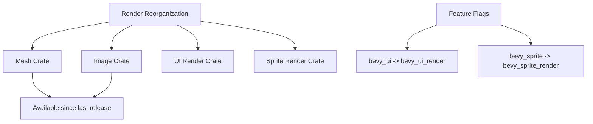

+++
title = "#21019 Improve render migration guide"
date = "2025-09-14T00:00:00"
draft = false
template = "pull_request_page.html"
in_search_index = true

[taxonomies]
list_display = ["show"]

[extra]
current_language = "en"
available_languages = {"en" = { name = "English", url = "/pull_request/bevy/2025-09/pr-21019-en-20250914" }, "zh-cn" = { name = "中文", url = "/pull_request/bevy/2025-09/pr-21019-zh-cn-20250914" }}
labels = ["A-Rendering"]
+++

# Improve render migration guide

## Basic Information
- **Title**: Improve render migration guide
- **PR Link**: https://github.com/bevyengine/bevy/pull/21019
- **Author**: atlv24
- **Status**: MERGED
- **Labels**: A-Rendering, S-Ready-For-Final-Review
- **Created**: 2025-09-13T18:49:38Z
- **Merged**: 2025-09-14T20:20:24Z
- **Merged By**: alice-i-cecile

## Description Translation
# Objective

- call out some feature semantic changes
- clarify mesh and image actually landed last release, just without migration guide because of re-exports making it a transparent change

## Solution

- 

## Testing

- 

## The Story of This Pull Request

This PR addresses documentation gaps in Bevy's render migration guide following a significant module reorganization. The core issue was that while the `bevy_mesh` and `bevy_image` crates were technically introduced in the previous release, their presence was transparent due to re-exports from `bevy_render`. With these re-exports now removed, users needed clear guidance on the new import patterns.

The changes also address semantic changes in feature flags. Previously, enabling "bevy_ui" or "bevy_sprite" features would include rendering functionality, but after the reorganization, rendering components were moved to separate crates requiring explicit feature enabling. This was a breaking change that needed clear documentation to prevent user confusion.

The implementation approach was straightforward - adding clarifying notes to the existing migration guide. The changes provide historical context about when crates were actually introduced and specify the new feature requirements for accessing rendering functionality. This helps users understand why their existing code might break and how to properly migrate.

These documentation updates prevent common migration pitfalls by explicitly calling out:
1. The actual release timeline for mesh and image crates
2. Required feature flag changes for UI and sprite rendering
3. Specific rendering features affected (like 2D gizmos)

The changes are minimal but impactful, ensuring users can successfully migrate their projects without unnecessary debugging of import or feature issues.

## Visual Representation



## Key Files Changed

- `release-content/migration-guides/bevy_render_reorganization.md` (+4/-2)

The migration guide was updated with crucial clarifications:

```markdown
# Before:
Mesh types such as `Mesh`, `Mesh3d`, `Mesh2d`, `MorphWeights`, `MeshBuilder`, and `Meshable` have been moved to a new crate, `bevy_mesh`.
Import them directly or from `bevy::mesh` now.

Image types such as `Image`, `ImagePlugin`, `ImageFormat`, `ImageSampler`, `ImageAddressMode`, `ImageSamplerDescriptor`, `ImageCompareFunction`, and `ImageSamplerBorderColor` have been moved to a new crate, `bevy_image`.
Import them directly or from `bevy::image` now.

# After:
Mesh types such as `Mesh`, `Mesh3d`, `Mesh2d`, `MorphWeights`, `MeshBuilder`, and `Meshable` have been moved to a new crate, `bevy_mesh`.
Import them directly or from `bevy::mesh` now. This crate is actually present in the previous release, but its `bevy_render` re-exports have now been removed.

Image types such as `Image`, `ImagePlugin`, `ImageFormat`, `ImageSampler`, `ImageAddressMode`, `ImageSamplerDescriptor`, `ImageCompareFunction`, and `ImageSamplerBorderColor` have been moved to a new crate, `bevy_image`. This crate is actually present in the previous release, but its `bevy_render` re-exports have now been removed.
Import them directly or from `bevy::image` now.
```

Additional feature flag guidance was added:

```markdown
# New content added:
If you were manually enabling "bevy_ui" feature on bevy, you probably want to enable "bevy_ui_render" feature instead now if you are using rendering features.

If you were manually enabling "bevy_sprite" feature on bevy, you probably want to enable "bevy_sprite_render" feature instead now if you are using rendering features such as 2d gizmos.
```

## Further Reading

- Bevy's official migration guide: https://bevyengine.org/learn/migration-guides/
- Bevy's feature flag documentation: https://github.com/bevyengine/bevy/blob/main/docs/plugins_guidelines.md#features
- Semantic versioning and breaking changes: https://semver.org/

# Full Code Diff
```diff
diff --git a/release-content/migration-guides/bevy_render_reorganization.md b/release-content/migration-guides/bevy_render_reorganization.md
index d634bf333e020..1cfa7604d4caf 100644
--- a/release-content/migration-guides/bevy_render_reorganization.md
+++ b/release-content/migration-guides/bevy_render_reorganization.md
@@ -18,17 +18,19 @@ Light types such `AmbientLight`, `PointLight`, `SpotLight`, `DirectionalLight`,
 Import them directly or from `bevy::light` now.
 
 Mesh types such as `Mesh`, `Mesh3d`, `Mesh2d`, `MorphWeights`, `MeshBuilder`, and `Meshable` have been moved to a new crate, `bevy_mesh`.
-Import them directly or from `bevy::mesh` now.
+Import them directly or from `bevy::mesh` now. This crate is actually present in the previous release, but its `bevy_render` re-exports have now been removed.
 
-Image types such as `Image`, `ImagePlugin`, `ImageFormat`, `ImageSampler`, `ImageAddressMode`, `ImageSamplerDescriptor`, `ImageCompareFunction`, and `ImageSamplerBorderColor` have been moved to a new crate, `bevy_image`.
+Image types such as `Image`, `ImagePlugin`, `ImageFormat`, `ImageSampler`, `ImageAddressMode`, `ImageSamplerDescriptor`, `ImageCompareFunction`, and `ImageSamplerBorderColor` have been moved to a new crate, `bevy_image`. This crate is actually present in the previous release, but its `bevy_render` re-exports have now been removed.
 Import them directly or from `bevy::image` now.
 
 Ui rendering types such as `MaterialNode`, `UiMaterial`, `UiMaterialKey`, and modules `bevy_ui::render` and `bevy_ui::ui_material` have been moved to a new crate, `bevy_ui_render`.
 Import them directly or from `bevy::ui_render` now.
 Furthermore, `UiPlugin` no longer has any fields. To control whether or not UI is rendered, enable or disable `UiRenderPlugin`, which is included in the DefaultPlugins.
+If you were manually enabling "bevy_ui" feature on bevy, you probably want to enable "bevy_ui_render" feature instead now if you are using rendering features.
 
 Sprite rendering types such as `Material2d`, `Material2dPlugin`, `MeshMaterial2d`, `AlphaMode2d`, `Wireframe2d`, `TileData`, `TilemapChunk`, and `TilemapChunkTileData` have been moved to a new crate, `bevy_sprite_render`.
 Import them directly or from `bevy::sprite_render` now.
+If you were manually enabling "bevy_sprite" feature on bevy, you probably want to enable "bevy_sprite_render" feature instead now if you are using rendering features such as 2d gizmos.
 
 `RenderAssetUsages` is no longer re-exported by `bevy_render`.
 Import it from `bevy_asset` or `bevy::asset` instead.
```