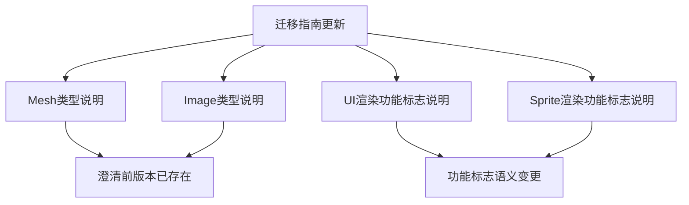

+++
title = "#21019 Improve render migration guide"
date = "2025-09-14T00:00:00"
draft = false
template = "pull_request_page.html"
in_search_index = false

[extra]
current_language = "zh-cn"
available_languages = {"en" = { name = "English", url = "/pull_request/bevy/2025-09/pr-21019-en-20250914" }, "zh-cn" = { name = "中文", url = "/pull_request/bevy/2025-09/pr-21019-zh-cn-20250914" }}
labels = ["A-Rendering"]
+++

# Improve render migration guide

## Basic Information
- **Title**: Improve render migration guide
- **PR Link**: https://github.com/bevyengine/bevy/pull/21019
- **Author**: atlv24
- **Status**: MERGED
- **Labels**: A-Rendering, S-Ready-For-Final-Review
- **Created**: 2025-09-13T18:49:38Z
- **Merged**: 2025-09-14T20:20:24Z
- **Merged By**: alice-i-cecile

## Description Translation
# Objective

- 指出一些功能语义变更
- 澄清 mesh 和 image 实际上在上个版本已经落地，只是因为重新导出使其成为透明变更，所以迁移指南没有更新

## Solution

- 

## Testing

- 

## The Story of This Pull Request

这个PR主要解决渲染迁移指南中的信息缺失问题。在Bevy的渲染模块重组过程中，mesh和image相关的类型实际上在前一个版本已经迁移到了新的crate中，但由于保留了bevy_render的重新导出，对用户来说这个变更是透明的，因此当时的迁移指南没有包含这些信息。

现在重新导出被移除，用户需要明确知道这些类型已经移动到了新的crate中。PR作者在迁移指南中添加了说明，明确指出mesh和image crate实际上在前一个版本就已经存在，只是现在移除了重新导出。

此外，PR还添加了关于功能标志（feature flags）的重要说明。对于手动启用"bevy_ui"功能的用户，如果他们使用渲染功能，现在可能需要启用"bevy_ui_render"功能。同样，对于使用2d gizmos等渲染功能的用户，如果之前手动启用"bevy_sprite"功能，现在可能需要启用"bevy_sprite_render"功能。

这些变更确保了迁移指南的准确性和完整性，帮助用户更好地理解渲染模块重组带来的影响，特别是那些直接使用功能标志进行自定义构建的用户。

## Visual Representation



## Key Files Changed

### `release-content/migration-guides/bevy_render_reorganization.md` (+4/-2)

这个文件是渲染模块重组的迁移指南，主要变更包括：

1. 为mesh和image类型添加说明，指出它们实际上在前一个版本就已经存在
2. 为UI和sprite渲染添加功能标志变更的说明

```markdown
# 变更前：
Mesh types such as `Mesh`, `Mesh3d`, `Mesh2d`, `MorphWeights`, `MeshBuilder`, and `Meshable` have been moved to a new crate, `bevy_mesh`.
Import them directly or from `bevy::mesh` now.

Image types such as `Image`, `ImagePlugin`, `ImageFormat`, `ImageSampler`, `ImageAddressMode`, `ImageSamplerDescriptor`, `ImageCompareFunction`, and `ImageSamplerBorderColor` have been moved to a new crate, `bevy_image`.
Import them directly or from `bevy::image` now.

# 变更后：
Mesh types such as `Mesh`, `Mesh3d`, `Mesh2d`, `MorphWeights`, `MeshBuilder`, and `Meshable` have been moved to a new crate, `bevy_mesh`.
Import them directly or from `bevy::mesh` now. This crate is actually present in the previous release, but its `bevy_render` re-exports have now been removed.

Image types such as `Image`, `ImagePlugin`, `ImageFormat`, `ImageSampler`, `ImageAddressMode`, `ImageSamplerDescriptor`, `ImageCompareFunction`, and `ImageSamplerBorderColor` have been moved to a new crate, `bevy_image`. This crate is actually present in the previous release, but its `bevy_render` re-exports have now been removed.
Import them directly or from `bevy::image` now.
```

```markdown
# 新增内容：
Ui rendering types section新增：
If you were manually enabling "bevy_ui" feature on bevy, you probably want to enable "bevy_ui_render" feature instead now if you are using rendering features.

Sprite rendering types section新增：
If you were manually enabling "bevy_sprite" feature on bevy, you probably want to enable "bevy_sprite_render" feature instead now if you are using rendering features such as 2d gizmos.
```

## Further Reading

- [Bevy官方文档 - 迁移指南](https://bevyengine.org/learn/migration-guides/)
- [Cargo功能标志文档](https://doc.rust-lang.org/cargo/reference/features.html)
- [Rust模块系统](https://doc.rust-lang.org/book/ch07-02-defining-modules-to-control-scope-and-privacy.html)

# Full Code Diff
```diff
diff --git a/release-content/migration-guides/bevy_render_reorganization.md b/release-content/migration-guides/bevy_render_reorganization.md
index d634bf333e020..1cfa7604d4caf 100644
--- a/release-content/migration-guides/bevy_render_reorganization.md
+++ b/release-content/migration-guides/bevy_render_reorganization.md
@@ -18,17 +18,19 @@ Light types such `AmbientLight`, `PointLight`, `SpotLight`, `DirectionalLight`,
 Import them directly or from `bevy::light` now.
 
 Mesh types such as `Mesh`, `Mesh3d`, `Mesh2d`, `MorphWeights`, `MeshBuilder`, and `Meshable` have been moved to a new crate, `bevy_mesh`.
-Import them directly or from `bevy::mesh` now.
+Import them directly or from `bevy::mesh` now. This crate is actually present in the previous release, but its `bevy_render` re-exports have now been removed.
 
-Image types such as `Image`, `ImagePlugin`, `ImageFormat`, `ImageSampler`, `ImageAddressMode`, `ImageSamplerDescriptor`, `ImageCompareFunction`, and `ImageSamplerBorderColor` have been moved to a new crate, `bevy_image`.
+Image types such as `Image`, `ImagePlugin`, `ImageFormat`, `ImageSampler`, `ImageAddressMode`, `ImageSamplerDescriptor`, `ImageCompareFunction`, and `ImageSamplerBorderColor` have been moved to a new crate, `bevy_image`. This crate is actually present in the previous release, but its `bevy_render` re-exports have now been removed.
 Import them directly or from `bevy::image` now.
 
 Ui rendering types such as `MaterialNode`, `UiMaterial`, `UiMaterialKey`, and modules `bevy_ui::render` and `bevy_ui::ui_material` have been moved to a new crate, `bevy_ui_render`.
 Import them directly or from `bevy::ui_render` now.
 Furthermore, `UiPlugin` no longer has any fields. To control whether or not UI is rendered, enable or disable `UiRenderPlugin`, which is included in the DefaultPlugins.
+If you were manually enabling "bevy_ui" feature on bevy, you probably want to enable "bevy_ui_render" feature instead now if you are using rendering features.
 
 Sprite rendering types such as `Material2d`, `Material2dPlugin`, `MeshMaterial2d`, `AlphaMode2d`, `Wireframe2d`, `TileData`, `TilemapChunk`, and `TilemapChunkTileData` have been moved to a new crate, `bevy_sprite_render`.
 Import them directly or from `bevy::sprite_render` now.
+If you were manually enabling "bevy_sprite" feature on bevy, you probably want to enable "bevy_sprite_render" feature instead now if you are using rendering features such as 2d gizmos.
 
 `RenderAssetUsages` is no longer re-exported by `bevy_render`.
 Import it from `bevy_asset` or `bevy::asset` instead.
```