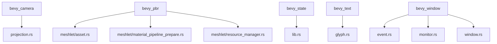

+++
title = "#21023 More doc link tidy up"
date = "2025-09-14T00:00:00"
draft = false
template = "pull_request_page.html"
in_search_index = true

[taxonomies]
list_display = ["show"]

[extra]
current_language = "en"
available_languages = {"en" = { name = "English", url = "/pull_request/bevy/2025-09/pr-21023-en-20250914" }, "zh-cn" = { name = "中文", url = "/pull_request/bevy/2025-09/pr-21023-zh-cn-20250914" }}
labels = ["C-Docs", "D-Trivial"]
+++

# More doc link tidy up

## Basic Information
- **Title**: More doc link tidy up
- **PR Link**: https://github.com/bevyengine/bevy/pull/21023
- **Author**: ickshonpe
- **Status**: MERGED
- **Labels**: C-Docs, D-Trivial, S-Ready-For-Final-Review
- **Created**: 2025-09-13T23:04:28Z
- **Merged**: 2025-09-14T22:16:51Z
- **Merged By**: alice-i-cecile

## Description Translation
# Objective

Tidy up some more doc links.

## The Story of This Pull Request

This PR addresses a common documentation maintenance issue: ensuring consistent and functional intra-doc links throughout the Bevy codebase. The problem was straightforward - several documentation comments used incorrect markdown syntax for Rustdoc links, which would either break documentation generation or produce incorrect links in the final documentation.

The solution approach was systematic: identify all instances of malformed intra-doc links and correct them to use proper Rustdoc syntax. The changes follow Rust's official intra-doc linking conventions, ensuring that when documentation is generated, these links will correctly resolve to their intended targets.

The implementation involved correcting link syntax across multiple crates in the Bevy engine. The changes are purely documentation-focused and don't affect any runtime code or functionality. Each correction follows the pattern of changing from incorrect bracket-based syntax to proper parentheses-based link syntax.

From a technical perspective, this PR demonstrates the importance of maintaining consistent documentation practices in large codebases. While individual link fixes might seem trivial, collectively they significantly improve the developer experience by ensuring documentation navigation works correctly. The changes also make the codebase more maintainable by establishing consistent patterns for future documentation.

The impact of these changes is improved documentation quality and navigability. Developers reading the source code will encounter working links that correctly point to related types and modules, reducing friction when understanding how different components relate to each other.

## Visual Representation



## Key Files Changed

### `crates/bevy_pbr/src/meshlet/material_pipeline_prepare.rs` (+6/-6)
This file contained multiple incorrect doc link formats. The changes ensure proper linking between meshlet-related components.

**Before:**
```rust
/// A list of `(Material ID, Pipeline, BindGroup)` for a view for use in [`super::MeshletMainOpaquePass3dNode`].
```

**After:**
```rust
/// A list of `(Material ID, Pipeline, BindGroup)` for a view for use in [`MeshletMainOpaquePass3dNode`](`super::MeshletMainOpaquePass3dNode`).
```

### `crates/bevy_pbr/src/meshlet/asset.rs` (+3/-3)
Corrected links related to meshlet mesh assets and their material restrictions.

**Before:**
```rust
/// There are restrictions on the [`crate::Material`] functionality that can be used with this type of mesh.
```

**After:**
```rust
/// There are restrictions on the [`Material`](`crate::Material`) functionality that can be used with this type of mesh.
```

### `crates/bevy_window/src/window.rs` (+3/-3)
Fixed monitor and video mode selection documentation links.

**Before:**
```rust
/// Uses a given [`crate::monitor::Monitor`] entity.
```

**After:**
```rust
/// Uses a given [`Monitor`](`crate::monitor::Monitor`) entity.
```

### `crates/bevy_camera/src/projection.rs` (+1/-1)
Corrected a trait documentation link.

**Before:**
```rust
/// A wrapper trait to make it possible to implement Clone for boxed [`CameraProjection`][`super::CameraProjection`]
```

**After:**
```rust
/// A wrapper trait to make it possible to implement Clone for boxed [`CameraProjection`](`super::CameraProjection`)
```

### `crates/bevy_pbr/src/meshlet/resource_manager.rs` (+1/-1)
Fixed a plugin reference in documentation.

**Before:**
```rust
/// Manages per-view and per-cluster GPU resources for [`super::MeshletPlugin`].
```

**After:**
```rust
/// Manages per-view and per-cluster GPU resources for [`MeshletPlugin`](`super::MeshletPlugin`).
```

## Further Reading

- [Rustdoc Documentation](https://doc.rust-lang.org/rustdoc/how-to-write-documentation.html)
- [Intra-doc Links RFC](https://rust-lang.github.io/rfcs/1946-intra-rustdoc-links.html)
- [Bevy Documentation Guidelines](https://github.com/bevyengine/bevy/blob/main/docs/plugins_guidelines.md#documentation)