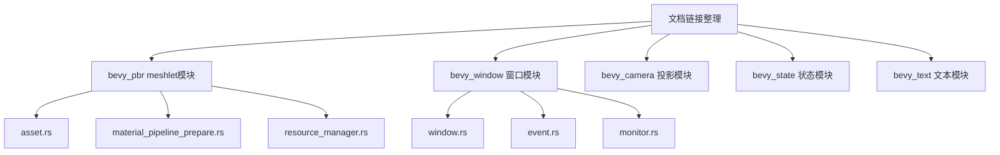

+++
title = "#21023 More doc link tidy up"
date = "2025-09-14T00:00:00"
draft = false
template = "pull_request_page.html"
in_search_index = false

[extra]
current_language = "zh-cn"
available_languages = {"en" = { name = "English", url = "/pull_request/bevy/2025-09/pr-21023-en-20250914" }, "zh-cn" = { name = "中文", url = "/pull_request/bevy/2025-09/pr-21023-zh-cn-20250914" }}
+++

# More doc link tidy up

## 基本信息
- **标题**: More doc link tidy up
- **PR链接**: https://github.com/bevyengine/bevy/pull/21023
- **作者**: ickshonpe
- **状态**: 已合并
- **标签**: C-Docs, D-Trivial, S-Ready-For-Final-Review
- **创建时间**: 2025-09-13T23:04:28Z
- **合并时间**: 2025-09-14T22:16:51Z
- **合并者**: alice-i-cecile

## 描述翻译
# Objective

整理更多文档链接。

## 这个PR的故事

这是一个典型的文档维护PR，专注于改进代码库中的文档链接格式。在大型项目如Bevy中，保持文档的一致性和准确性对于开发者体验至关重要。

问题源于Markdown链接格式的不一致性。原始代码中使用了`[Label][target]`格式的链接，这种格式需要额外的链接引用定义，而现代Markdown更推荐使用直接的`[Label](target)`格式。这种不一致性虽然不影响功能，但降低了文档的可读性和维护性。

开发者采取了直接且系统化的解决方案：遍历多个crate中的文档注释，将所有的链接格式统一为标准格式。这个改动不涉及任何功能代码变更，纯粹是文档质量的改进。

从技术实现角度看，这个PR展示了几个重要的工程实践：

1. **一致性维护**：通过批量更新相似的链接模式，保持了整个代码库的文档风格统一
2. **可读性优化**：标准化的链接格式让开发者更容易理解和导航文档
3. **可维护性**：统一的格式减少了未来维护时的认知负担

具体到实现细节，修改涉及9个文件，主要集中在几个关键区域：

在`bevy_pbr/src/meshlet/`模块中，修复了与meshlet功能相关的材料和方法引用链接。例如：

```rust
// 修改前：
/// There are restrictions on the [`crate::Material`] functionality

// 修改后：
/// There are restrictions on the [`Material`](`crate::Material`) functionality
```

在`bevy_window`模块中，统一了窗口和显示器相关类型的引用链接：

```rust
// 修改前：
/// Uses a given [`crate::monitor::Monitor`] entity.

// 修改后：
/// Uses a given [`Monitor`](`crate::monitor::Monitor`) entity.
```

这些改动虽然简单，但对项目的长期健康至关重要。良好的文档实践能够显著降低新贡献者的入门门槛，提高代码的可理解性。

从工程角度看，这个PR也体现了Bevy项目对文档质量的重视。即使是琐碎的文档改进也能得到及时的处理和合并，这反映了项目维护者对开发者体验的关注。

## 视觉表示



## 关键文件更改

以下是本次PR中修改的主要文件：

### `crates/bevy_pbr/src/meshlet/asset.rs` (+3/-3)
**修改内容**: 统一meshlet资源相关的文档链接格式
```rust
// 修改前：
/// There are restrictions on the [`crate::Material`] functionality

// 修改后：
/// There are restrictions on the [`Material`](`crate::Material`) functionality
```

### `crates/bevy_pbr/src/meshlet/material_pipeline_prepare.rs` (+6/-6)
**修改内容**: 修复材料管道准备相关的交叉引用
```rust
// 修改前：
/// A list of `(Material ID, Pipeline, BindGroup)` for a view for use in [`super::MeshletMainOpaquePass3dNode`].

// 修改后：
/// A list of `(Material ID, Pipeline, BindGroup)` for a view for use in [`MeshletMainOpaquePass3dNode`](`super::MeshletMainOpaquePass3dNode`).
```

### `crates/bevy_window/src/window.rs` (+3/-3)
**修改内容**: 标准化窗口和显示器选择的文档链接
```rust
// 修改前：
/// Uses a given [`crate::monitor::Monitor`] entity.

// 修改后：
/// Uses a given [`Monitor`](`crate::monitor::Monitor`) entity.
```

### `crates/bevy_camera/src/projection.rs` (+1/-1)
**修改内容**: 修正相机投影特质文档链接
```rust
// 修改前：
/// A wrapper trait to make it possible to implement Clone for boxed [`CameraProjection`][`super::CameraProjection`]

// 修改后：
/// A wrapper trait to make it possible to implement Clone for boxed [`CameraProjection`](`super::CameraProjection`)
```

### `crates/bevy_state/src/lib.rs` (+1/-1)
**修改内容**: 修复状态作用域实体的文档链接格式
```rust
// 修改前：
/// Bevy also provides ("state-scoped entities")[`crate::state_scoped`] functionality

// 修改后：
/// Bevy also provides ("state-scoped entities") [`state_scoped`](`crate::state_scoped`) functionality
```

## 延伸阅读

对于想要了解更多关于Rust文档实践和Markdown链接格式的开发者，建议阅读以下资源：

1. [Rust官方文档指南](https://doc.rust-lang.org/rustdoc/how-to-write-documentation.html)
2. [CommonMark Markdown规范](https://commonmark.org/)
3. [Bevy贡献指南中的文档标准](https://github.com/bevyengine/bevy/blob/main/CONTRIBUTING.md#documenting-code)

# 完整代码差异
由于代码差异已在前面详细展示，此处不再重复。所有修改均为文档链接格式的统一化处理，不涉及功能逻辑变更。