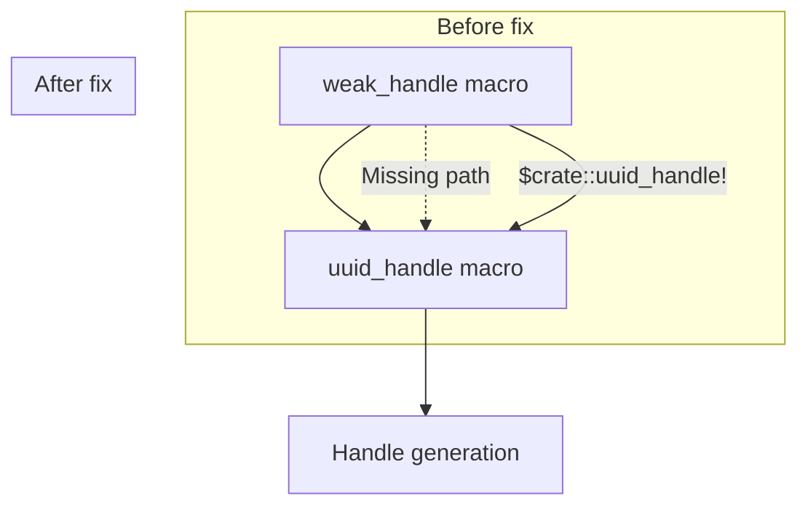

+++
title = "#21029 Add `$crate` in weak_handle macro"
date = "2025-09-14T00:00:00"
draft = false
template = "pull_request_page.html"
in_search_index = true

[taxonomies]
list_display = ["show"]

[extra]
current_language = "en"
available_languages = {"en" = { name = "English", url = "/pull_request/bevy/2025-09/pr-21029-en-20250914" }, "zh-cn" = { name = "中文", url = "/pull_request/bevy/2025-09/pr-21029-zh-cn-20250914" }}
labels = ["C-Bug", "A-Assets", "D-Macros"]
+++

# Add `$crate` in weak_handle macro

## Basic Information
- **Title**: Add `$crate` in weak_handle macro
- **PR Link**: https://github.com/bevyengine/bevy/pull/21029
- **Author**: akimakinai
- **Status**: MERGED
- **Labels**: C-Bug, A-Assets, S-Ready-For-Final-Review, D-Macros
- **Created**: 2025-09-14T12:09:18Z
- **Merged**: 2025-09-14T20:14:47Z
- **Merged By**: alice-i-cecile

## Description Translation
# Objective

- `weak_handle` macro causes ``error: cannot find macro `uuid_handle` in this scope``.

## Solution

- Add `$crate::` prefix to `uuid_handle!`.

## Testing

- Compiling usage of `weak_handle` with this change

## The Story of This Pull Request

This PR addresses a straightforward but important macro scoping issue in Bevy's asset handling system. The problem occurred when developers used the `weak_handle` macro, which would fail to compile with the error "cannot find macro `uuid_handle` in this scope."

The root cause was that the `weak_handle` macro was trying to call the `uuid_handle` macro without specifying its full path. In Rust, macros need explicit path qualification when they're called from outside their defining module. Without the `$crate::` prefix, the compiler couldn't locate the `uuid_handle` macro when `weak_handle` was used in different contexts.

The solution was simple but effective: adding `$crate::` before the `uuid_handle!` call within the `weak_handle` macro definition. This ensures that the macro always resolves to the correct path within the current crate, regardless of where `weak_handle` is invoked from.

This fix follows Rust's best practices for macro design, where internal macro calls should use `$crate::` to ensure proper scoping and avoid import issues. The change is minimal but crucial for maintaining the usability of Bevy's asset system macros across different modules and contexts.

## Visual Representation



## Key Files Changed

### `crates/bevy_asset/src/handle.rs` (+1/-1)

This file contains the macro definitions for asset handle generation. The change ensures proper macro path resolution.

**Before:**
```rust
#[macro_export]
macro_rules! weak_handle {
    ($uuid:expr) => {
        uuid_handle!($uuid)
    };
}
```

**After:**
```rust
#[macro_export]
macro_rules! weak_handle {
    ($uuid:expr) => {
        $crate::uuid_handle!($uuid)
    };
}
```

The change adds the `$crate::` prefix to the `uuid_handle!` macro call, ensuring it resolves correctly regardless of where `weak_handle` is used.

## Further Reading

- [Rust Macros: $crate](https://doc.rust-lang.org/reference/macros-by-example.html#the-crate-metavariable)
- [The Little Book of Rust Macros](https://veykril.github.io/tlborm/)
- [Bevy Asset System Documentation](https://docs.rs/bevy_asset/latest/bevy_asset/)

## Full Code Diff
```diff
diff --git a/crates/bevy_asset/src/handle.rs b/crates/bevy_asset/src/handle.rs
index 838c618d8ed1b..8924bf87de850 100644
--- a/crates/bevy_asset/src/handle.rs
+++ b/crates/bevy_asset/src/handle.rs
@@ -506,7 +506,7 @@ macro_rules! uuid_handle {
 #[macro_export]
 macro_rules! weak_handle {
     ($uuid:expr) => {
-        uuid_handle!($uuid)
+        $crate::uuid_handle!($uuid)
     };
 }
 
```