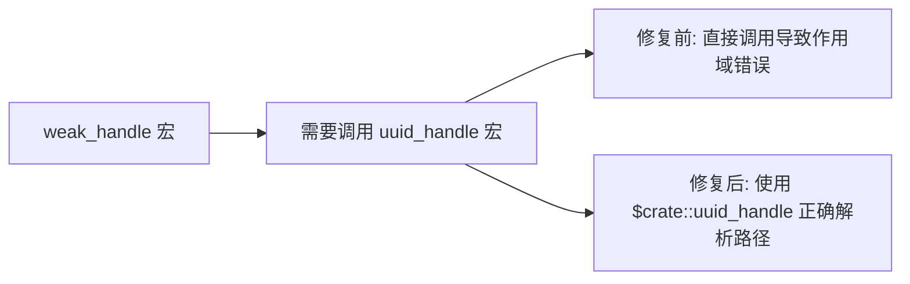

+++
title = "#21029 Add `$crate` in weak_handle macro"
date = "2025-09-14T00:00:00"
draft = false
template = "pull_request_page.html"
in_search_index = false

[extra]
current_language = "zh-cn"
available_languages = {"en" = { name = "English", url = "/pull_request/bevy/2025-09/pr-21029-en-20250914" }, "zh-cn" = { name = "中文", url = "/pull_request/bevy/2025-09/pr-21029-zh-cn-20250914" }}
+++

# Add `$crate` in weak_handle macro

## 基本信息
- **标题**: Add `$crate` in weak_handle macro
- **PR链接**: https://github.com/bevyengine/bevy/pull/21029  
- **作者**: akimakinai
- **状态**: 已合并
- **标签**: C-Bug, A-Assets, S-Ready-For-Review, D-Macros
- **创建时间**: 2025-09-14T12:09:18Z
- **合并时间**: 2025-09-14T20:14:47Z
- **合并人**: alice-i-cecile

## 描述翻译
### Objective
- `weak_handle` 宏导致错误：``error: cannot find macro `uuid_handle` in this scope``

### Solution
- 为 `uuid_handle!` 添加 `$crate::` 前缀

### Testing
- 使用此更改编译 `weak_handle` 的使用情况

## PR 故事

这个 PR 解决了一个具体的宏作用域问题。当开发者在其他 crate 中使用 `weak_handle` 宏时，会遇到编译错误，因为 Rust 的宏系统无法在当前作用域中找到 `uuid_handle` 宏。

问题的根源在于宏的路径解析。在 Rust 中，当宏在另一个宏内部被调用时，默认情况下它们会在调用宏的位置查找，而不是在定义宏的位置查找。这导致了跨 crate 使用时的作用域问题。

解决方案很直接：在 `weak_handle` 宏内部使用 `$crate::` 前缀来明确指定 `uuid_handle` 宏的路径。`$crate` 是一个特殊的元变量，它总是指向定义当前宏的 crate 的根模块，确保无论在哪里使用宏，都能正确解析内部宏的路径。

这个修改虽然很小，但很重要，因为它修复了跨 crate 使用 `weak_handle` 宏时的编译错误。这种问题在使用宏进行代码生成时很常见，特别是在像 Bevy 这样的大型项目中，不同的模块和 crate 之间会有复杂的依赖关系。

从工程角度来看，这个修复体现了良好的宏编程实践：总是使用 `$crate` 来引用同一 crate 中的其他宏，确保宏的可移植性和可靠性。

## 可视化表示



## 关键文件更改

### `crates/bevy_asset/src/handle.rs` (+1/-1)

这个文件包含了资产句柄相关的实现，包括 `weak_handle` 宏的定义。修改很简单但重要：

```rust
// 修改前:
macro_rules! weak_handle {
    ($uuid:expr) => {
        uuid_handle!($uuid)  // 直接调用，可能导致作用域问题
    };
}

// 修改后:
macro_rules! weak_handle {
    ($uuid:expr) => {
        $crate::uuid_handle!($uuid)  // 使用 $crate:: 确保正确路径解析
    };
}
```

这个修改确保了无论在哪里使用 `weak_handle` 宏，都能正确找到同一 crate 中的 `uuid_handle` 宏，解决了跨 crate 使用时的编译错误。

## 延伸阅读

- [Rust 宏指南 - $crate 的作用](https://doc.rust-lang.org/reference/macros-by-example.html#the-crate-metavariable)
- [Rust 宏中的卫生性(Hygiene)概念](https://doc.rust-lang.org/reference/macros.html#hygiene)
- [Bevy 资产系统文档](https://docs.rs/bevy_asset/latest/bevy_asset/)

# 完整代码差异
```diff
diff --git a/crates/bevy_asset/src/handle.rs b/crates/bevy_asset/src/handle.rs
index 838c618d8ed1b..8924bf87de850 100644
--- a/crates/bevy_asset/src/handle.rs
+++ b/crates/bevy_asset/src/handle.rs
@@ -506,7 +506,7 @@ macro_rules! uuid_handle {
 #[macro_export]
 macro_rules! weak_handle {
     ($uuid:expr) => {
-        uuid_handle!($uuid)
+        $crate::uuid_handle!($uuid)
     };
 }
 
```